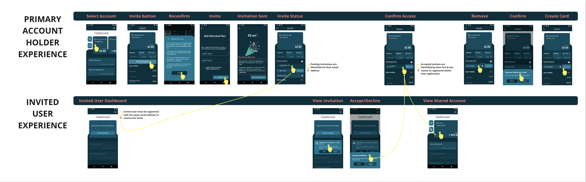
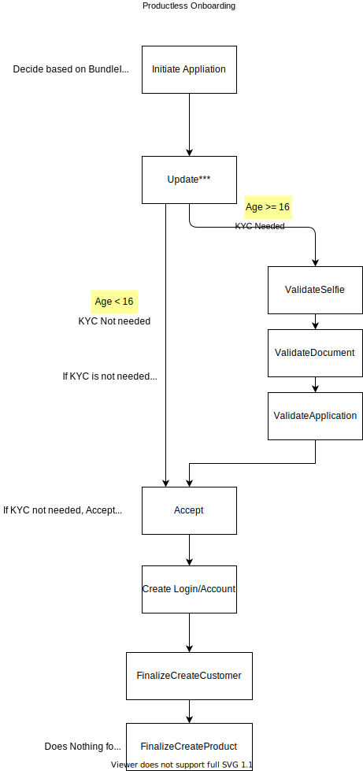

# Authorized User Overview

Welcome to Finaptic's Authorized User Service. We make it simple to share your account and finances with family members, loved ones and employees; and all done digitally. This documentation includes comprehensive information to arm you with an understanding of Finaptic's Authorized User offering.

#### **Guide Purpose**

**This guide will**

1. Educate you on Finaptic's Authorized User Service
2. Guide you on Experience

**Links to related Authorized User topics**

1. [Onboarding Sequence Diagram](/../../Implementation-Guide/Onboarding/OnboardingSequenceDoc/)
2. [Onboarding Overview](/../../Implementation-Guide/Onboarding/OnboardingDocumentation/)
3. [Productless Onboarding Architecture](/../../Implementation-Guide/Onboarding/ProductlessOnboardingDoc/) to Onboard an Authorized User

----

#### What is an Authorized User?

An Authorized User is a person allowed to manage your account.
For Deposit accounts, Authorized Users are usually family members, such as a child or a spouse and they do not have account decision making permissions.
They can use another person's account but aren’t legally responsible for paying bills associated with the account.
Authorized Users **are not** Primary Account Holders and their Account level privileges differ.

#### Onboarding of an Authorized User

KYC/AML regulations guide the onboarding of an Authorized User with 2 variables that influence the Onboarding Experience of an Authorized User:

1. Product-type they are being added to as an Authorized User

2. Their age at time of being added as an Authorized User

##### Onboarding an Authorized User by Product-type

| Product Type                           | ID Verify an Authorized User   |
|:-------------------------------------- |:------------------------------:|
| **Deposit** *Non-Interest Earning* | Yes for anybody aged 16 & over |
| **Deposit** *Interest Earning*     | Yes for anybody aged 16 & over |
| **Credit Card**                        | No                             |

##### Onboarding an Authorized User by Age

| **Age Brackets**         | **FINTRAC Requirement**            | **Finaptic Technology Policy**                                                                                                                                                                                                               | Available |
| ------------------------ | ---------------------------------- | -------------------------------------------------------------------------------------------------------------------------------------------------------------------------------------------------------------------------------------------- | --------- |
| **0 - 11 years of age**  | ID Verification is <u>Optional</u> | Don't ID Verify Child  Must ID Verify Parent/Guardian  <u>Details below</u>: Parent/Guardian ID must be verified *(ID does not be re-verified if on file but parent/guardian should be authenticated or provide acknowledgment)* | **Yes**   |
| **12 - 15 years of age** | ID Verification is <u>Optional</u> | Same as above; *0-11 years of age*                                                                                                                                                                                                           | **Yes**   |
| **16+ years of age**     | ID Verification is <u>Required</u> | Must ID Verify like an Adult                                                                                                                                                                                                                 | **No**    |

##### List of fields to collect when Onboarding an Authorized User aged 15 years of age & younger

| CATEGORIES   | RATIONALE                                                                | FIELDS                                                                    | APPLIES TO                           |
| ------------ | ------------------------------------------------------------------------ | ------------------------------------------------------------------------- | ------------------------------------ |
| **PERSONAL** | Collect basic applicant information for communication & vetting purposes | - Full Legal Name - Middle Name *(optional)* - Email Address  | All Product-types All age groups |

#### Account Privileges by Relationship Type

|                                         | PRIVILEGES                                                   | A PRIMARY ACCOUNT HOLDER CAN | AN AUTHORIZED USER CAN |
|:--------------------------------------- | ------------------------------------------------------------ |:----------------------------:|:----------------------:|
| **Add, Remove or View Account Holders** | **Add or Remove an Authorized User**                         | **YES**                      | **YES**                |
|                                         | **View a list of other Account Holders**                     | **YES**                      | **YES**                |
| **Statements & Transactions**           | **View other Account Holders Transactions**                  | **YES**                      | **YES**                |
|                                         | **Receive Transactions Alerts**                              | **YES**                      | -                      |
| **Move Money**                          | **Send or Receive Money using Interac**                      | **YES**                      | **YES**                |
|                                         | **Move Money (Between Accounts they have access to)**        | **YES**                      | **YES**                |
|                                         | **Add, Remove or Change other account holders auto-deposit** | **YES**                      | **YES**                |

----

#### Visualizing the Authorized User Architecture

#### Visualizing the Experience of Inviting, Adding & Onboarding an Authorized User

[View it in Miro](https://miro.com/app/board/uXjVOMPHP5M=/?invite_link_id=7415608430)

#### Onboarding without a Product

An Authorized User is onboarded to the platform via the Productless Onboarding Flow; Technical Implementation below.

A detailed overview of our Productless Onboarding can be found in the [Productless Onboarding](/../../Implementation-Guide/Onboarding/ProductlessOnboardingDoc/) section. 

---

#### API Overview

There are over 50 Onboarding API types which are discoverable on the [Onboarding API Specification](/../../API-Specifications/onboarding/) section. 
