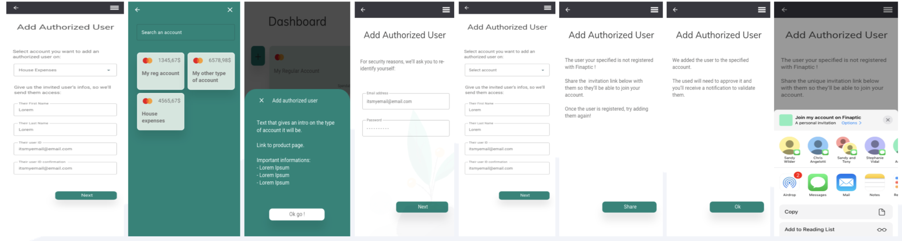
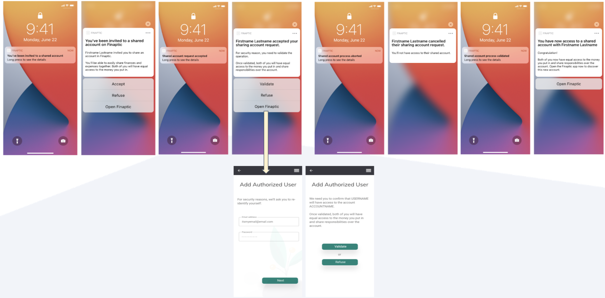

# Authorized User Overview

Welcome to Finaptic's Authorized User Service. We make it simple to share your account and finances with family members, loved ones and employees; and all done digitally. This documentation includes comprehensive information to arm you with an understanding of Finaptic's Authorized User offering.

#### **Guide Purpose**

**This guide will**

1. Educate you on Finaptic's Authorized User Service
2. Guide you on Experience

----

#### What is an Authorized User?

An Authorized User is a person allowed to manage your account.
For Deposit accounts, Authorized Users are usually family members, such as a child or a spouse and they do not have account decision making permissions.
They can use another person's account but aren’t legally responsible for paying bills associated with the account.
Authorized Users **are not** Primary Account Holders and their Account level privileges differ.

#### Onboarding of an Authorized User

KYC/AML regulations guide the onboarding of an Authorized User with 2 variables that influence the Onboarding Experience of an Authorized User:

1. Product-type they are being added to as an Authorized User

2. Their age at time of being added as an Authorized User

##### Onboarding an Authorized User by Product-type

| Product Type                           | ID Verify an Authorized User |
|:-------------------------------------- |:----------------------------:|
| **Deposit** *Non-Interest Earning* | Yes                          |
| **Deposit** *Interest Earning*     | Yes                          |
| **Credit Card**                        | No                           |

##### Onboarding an Authorized User by Age

| **Age Brackets**         | **FINTRAC Requirement**            | **Finaptic Technology Policy**                                                                                                                                                                                                               |
| ------------------------ | ---------------------------------- | -------------------------------------------------------------------------------------------------------------------------------------------------------------------------------------------------------------------------------------------- |
| **0 - 11 years of age**  | ID Verification is <u>Optional</u> | Don't ID Verify Child  Must ID Verify Parent/Guardian  <u>Details below</u>: Parent/Guardian ID must be verified *(ID does not be re-verified if on file but parent/guardian should be authenticated or provide acknowledgment)* |
| **12 - 15 years of age** | ID Verification is <u>Optional</u> | Same as above; *0-11 years of age*                                                                                                                                                                                                           |
| **16+ years of age**     | ID Verification is <u>Required</u> | Must ID Verify like an Adult                                                                                                                                                                                                                 |

##### List of fields to collect when Onboarding an Authorized User

| CATEGORIES            | RATIONALE                                                                  | FIELDS                                                                                                                                                                                                                                                                              | APPLIES TO                           |
| --------------------- | -------------------------------------------------------------------------- | ----------------------------------------------------------------------------------------------------------------------------------------------------------------------------------------------------------------------------------------------------------------------------------- | ------------------------------------ |
| **PERSONAL**          | Collect basic applicant information for communication & vetting purposes   | - Full Legal Name - Middle Name *(optional)* - Alias1 *(optional)* - Residential Address  - Date of Birth - Phone Number - Phone Number Type2 (Mobile or Landline)  - Email Address - Language Preferences2        | All Product-types All Age groups |
| **TAX** **RESIDENCY** | Identifying tax residency during account opening to comply with regulation | - Canadian Tax Residency Status - US Citizen - Another Country Tax Residency Status *If the applicant is a tax resident of Another Country (including the US), or a US Citizen, then the tax identification number for that country and Canadian SIN must be collected* | Deposit Products only                |
| **EMPLOYMENT**        | Support with Anti-Money Laundering filtering                               | - Employment Status - Employment Occupation - Industry - Employer Name - Business Address - Employer Phone Number - Employed Since Date *(optional)*                                                                                                        | Deposit Products only                |
| **ACCOUNT PURPOSE**   | Support with Anti-Money Laundering filtering                               | - Account Purpose - Account Source of Funds                                                                                                                                                                                               | Deposit Products only                |

1 "Alias" as a field will be released in December 2021

2 "Phone Number Type" and "Language Preferences" as fields will be released in November 2021

#### What to expect in our Releases?

|                                    | PRIVILEGES                                            | PRIMARY ACCOUNT HOLDER | AUTHORIZED USER *`(September 2021 Release)`* | AUTHORIZED USER  *`(December 2021 Release)`* |
|:---------------------------------- | ----------------------------------------------------- |:----------------------:|:------------------------------------------------:|:------------------------------------------------:|
| **As per regulatory requirements** | **Add/Remove an Authorized User**                     | **YES**                | **YES**                                          | **NO**                                           |
|                                    | **Close the Account**                                 | **YES**                | **YES**                                          | **NO**                                           |
| **Configurable**                   | **Move Money (Interac)**                              | **YES**                | **YES**                                          | **NO**                                           |
|                                    | **Move Money (Between Accounts they have access to)** | **YES**                | **YES**                                          | **YES**                                          |
|                                    | **View Primary Account Holder Txns**                  | **YES**                | **YES**                                          | **NO**                                           |
|                                    | **Notifications, Alerts & Statements**                | **YES**                | **YES**                                          | **LIMITED TO THEIR CARD**                        |

----

#### Visualizing the Authorized User Architecture

#### Visualizing the Experience of Inviting, Adding & Onboarding an Authorized User

**Note: Push Invitation is a future state experience**

____

#### API Overview

There are over 50 Onboarding API types which are discoverable on the [Onboarding API Specification](/../../API-Specifications/onboarding/) section. 
