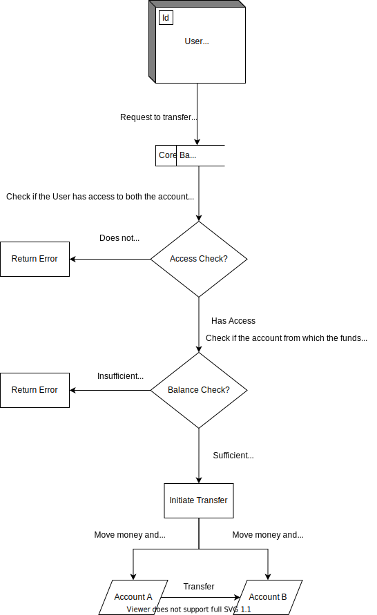
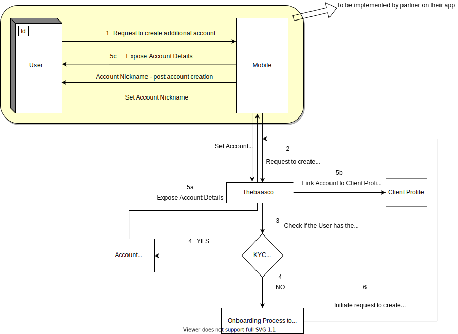

# Deposits Account Overview

Welcome to Finaptic’s Core Banking Product that offers flexible solutions for everyday transactions. This documentation includes comprehensive information for delivering compliant Core Banking products and integrating with Finaptic’s Core Banking Product Service.

## Guide Purpose

**This guide will**

- Educate you on Finaptic’s Core Banking Service
- Arm you with an API specifications for effective integration

---

## About the Product

#### What is a Deposit Account?

A bank account with a financial institution to let you deposit, transfer and withdraw money, subject to terms that are defined in the account agreement.

#### Benefits of a Deposit Account

Deposit Accounts offer high liquidity. Your money is always available offering the convenience to pay bills, deposit paychecks and transfer money between deposit accounts; and there are no penalties for early withdrawal to worry about.

#### How safe is your money?

Deposits made are eligible for Canada Deposit Insurance Corporation (CDIC) protection upto $100,000 per insured category per depositor. 

The Canada Deposit Insurance Corporation is a Canadian federal Crown Corporation created by Parliament in 1967 to provide deposit insurance to depositors in Canadian commercial banks and savings institutions. CDIC insures Canadians' deposits held at Canadian banks up to C$100,000 in case of a bank failure.

---

#### Finaptic delivers a customizable deposit account offering

#### What to expect in our Initial Release?

In the Initial Release, a Deposit Account will enjoy the below benefits

| Feature Category    | Feature Set                              | Inital Release | Future Release   |
| ------------------- | ---------------------------------------- |:--------------:|:----------------:|
| **Deposit Account** | **Depost Account**                       | **Yes**        | ***NA***         |
|                     | **Pre-Paid MasterCard**                  | **Yes**        | -                |
|                     | **Earn Interest**                        | -              | **Yes**          |
|                     | **Foreign Currency Account**             | **-**          | **Yes**          |
|                     | **Set Transaction Limits**               | -              | **Yes**          |
|                     | **Set Minimum Balance**                  | -              | **Yes**          |
|                     | **Set Account Level Fees**               | -              | **Yes**          |
|                     |                                          |                |                  |
| **Relationship**    | **Authorized User**                      | **Yes**        | -                |
|                     |                                          |                |                  |
| **Money Movement**  | **Internal Transfers**                   | -              | **Yes**          |
|                     | **Email Money Transfer**                 | **Yes**        | -                |
|                     | **Interac Receive**                      | **Yes**        | -                |
|                     | **Interac Send**                         | **Yes**        | -                |
|                     | **International Money Transfer**         | -              | **Yes**          |
|                     | **Mobile Remote Cheque Deposit Capture** | -              | **Yes**          |
|                     | **ATM Withdrawals**                      | -              | **Yes**          |
|                     | **ATM Cheque Deposits**                  | -              | **Yes**          |
|                     |                                          |                |                  |
| **Notifications**   | **Transaction Notifications**            | -              | **Yes**          |
|                     | **Transaction History**                  | **Yes**        | **Enhancements** |
|                     | **Transaction Filtering**                | **Yes**        | **Enhancements** |
|                     | **Statements**                           | -              | **Yes**          |

---

#### API Overview

There are 8 foundational API Calls to drive the creation & management of a Deposit Account. Link to the complete API specifications can be found - [**<u>Core Banking API Specification</u>**](/../../API-Specifications/corebanking/).

[**<u>CreateAccountRequest</u>**](/../../API-Specifications/corebanking/#createaccountrequest)

Used to perform the asynchronous operation of creating a new Account. Performing this operation will generate an asynchronous response of type CreateAccountResponse, on the response topic.

This API call will trigger the type of account to open between product catalog and requester domain including the paramaters of an account as defined in the banking layer smart contract.

[**<u>AccountCreatedEvent</u>**](/../../API-Specifications/corebanking/#accountcreatedevent)

An event that is raised when a Core-Banking Account is successfully created, following a CreateAccountRequest.

With this API call one will identify account details; such as  primary account holder name, authorized user name, account number and whether it is an interest earning account or not.

[**AccountDetails**](/../../API-Specifications/corebanking/#accountdetails)

Represents the details of a Core-Banking Account

This API will enable identication of account status, list of primary & authorized users including accrued interest to date. 

[**<u>GetAccountDetailsRequest</u>**](/../../API-Specifications/corebanking/#getaccountdetailsrequest)

A parameter to the GetAccountDetails operation, in order to determine which Account to retrieve the details from

This API call is used to determine that the requesting customer has appropriate access to retrieve account details.

[**<u>AccountStatusChangedEvent</u>**](/../../API-Specifications/corebanking/#accountstatuschangedevent)

An event raised when an Account changes status; and this API will track the updated status on an account including addition/removal of authorized users.

[**<u>AccountStatus</u>**](/../../API-Specifications/corebanking/#accountstatus)

An enumeration indicating the status of an Account. All accounts are created in the ACCOUNT_STATUS_INACTIVE state by default. 

There are 3 Account Statuses - Active, Inactive and Unspecified; and each representing a different account state. 

[**<u>ChangeAccountStatusRequest</u>**](/../../API-Specifications/corebanking/#changeaccountstatusrequest)

This API call is used to perform the asynchronous operation of changing an Account's status. Performing this operation will generate an asynchronous response of type ChangeAccountStatusResponse, on the response topic. 

[**<u>Accounts</u>**](/../../API-Specifications/corebanking/#accounts)

Exposes specific operations related to deposit accounts to retrieve general information about an Account, such as such as balance, status, primary account holder name, authorized user name, account number and whether it is an interest earning account or not.

____

#### Visualizing Critical Experiences

##### Internal Transfers

Defined as the ability to move money between owned deposit accounts. Below is a visualization of **Internal Transfers Money Movement**.

#### 

##### Additional Account Creation

Additional Account Creation is the creation of deposit accounts <u>post</u> the creation of a client profile. Outlined below is the flow of events to ensure a seamless and compliant creation of additional accounts in under 5 steps.

---
