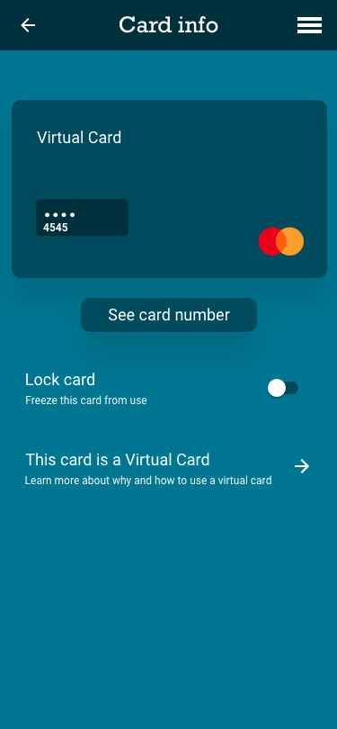
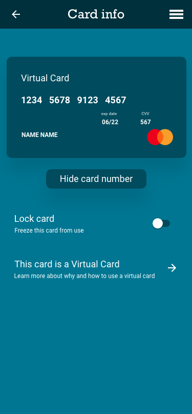

# Cards Overview

## Introduction

Finaptic offers its customers access to create Cards that link to other products, and serve as an access vehicle via the Mastercard Network. End users are able to use the card to access funds in the funding account associated with the card. The Core Card API enables customers to build various experiences that provide their customers with virtual and physical cards.

## Guide Purpose

This guide will:

- Provide an overview on Card services available to Finaptic customers.

- Provide an API overview for effective integration

---

## About the Product

#### What are cards?

Finaptic enables its customers to issue a Mastercard branded product to users. These cards must be linked to a deposit account through the [Customer Onboarding](/../../Implementation-Guide/Onboarding/OnboardingDocumentation/) process. Once cards are created through this process, a number of functionalities are available to support the operation, management, and account functions of the card.

Cards service exposes operations related to listing and retrieving details for Cards issued.

It is a real gRPC service accessible in a synchronous manner.

##### Virtual Cards

Finaptic takes data security seriously, and as such, does not expose through data the card number, CVV, or expiry date. As such, providing the end-user with these values requires the generation of a token, which is then used to reveal card details to the end-user in a graphical format. An example of this can be seen in the [Virtual Card Display](#virtual-card-display) section below.

##### Physical Cards

Finaptic does not offer physical cards at this time. This planned functionality will be defined in a future release.

### API Overview

#### Cards

##### GetCard

> **rpc** GetCard([GetCardRequest]/../../API-Specifications/corecard/(#thebaasco.tenant.corecard.v1.GetCardRequest))
    [Card](/../../API-Specifications/corecard/#thebaasco.tenant.corecard.v1.Card)

GetCard retrieves generic details about a single Card. The card data returned does not contain any sensitive information such as card number or expiration date. 
Only users associated with the Card will be able to invoke this endpoint and retrieve details for a given Card.

##### ListCards

> **rpc** ListCards([ListCardsRequest](/../../API-Specifications/corecard/#thebaasco.tenant.corecard.v1.ListCardsRequest))
    [ListCardsResponse](/../../API-Specifications/corecard/#thebaasco.tenant.corecard.v1.ListCardsResponse)

ListCards lists all Cards associated to the current user. The information returned does not contain any sensitive information such as card number or expiration date.
This endpoint uses pagination to allow listing the Cards in smaller, easy to manage, chunks.

##### CreateCardSDKSignOnToken

> **rpc** CreateCardSDKSignOnToken([CreateCardSDKSignOnTokenRequest](/../../API-Specifications/corecard/#thebaasco.tenant.corecard.v1.CreateCardSDKSignOnTokenRequest))
    [CreateCardSDKSignOnTokenResponse](/../../API-Specifications/corecard/#thebaasco.tenant.corecard.v1.CreateCardSDKSignOnTokenResponse)

CreateCardSDKSignOnToken generates a single-use, limited duration token, which is used by the Front End SDK to retrieve sensitive information about Cards.
The SDK is necessary when performing sensitive operations like retrieving the Card's number (PAN), expiration date, CVV, or resetting the Card's PIN.

#### CardsCommands
CardsCommandsService is a key component of Core Card API thar exposes asynchronous operations that alter the state of a Card.

It is not directly accessible by consumers as a gRPC service, it instead uses Google PubSub as delivery mechanism for requests and responses.

We include it in the documentation as a reference for a better understanding of the responsibilities and API surface of this domain

##### CreateCard

> **rpc** CreateCard([CreateCardRequest](/../../API-Specifications/corecard/#thebaasco.tenant.corecard.v1.CreateCardRequest))
    [Card](/../../API-Specifications/corecard/#thebaasco.tenant.corecard.v1.Card)

CreateCard is an asynchronous operation used to create a new Card. 
Performing this operation will generate an asynchronous response of type Card on the response topic.
When creating the card, the information contained in the Client-Profile domain for current user will be used to
populate Card information such as name on card, and billing address.
As result of a successful card creation, a business event of type CardCreatedEvent will be issued

##### UpdateCard

> **rpc** UpdateCard([UpdateCardRequest](/../../API-Specifications/corecard/#thebaasco.tenant.corecard.v1.UpdateCardRequest))
    [Card](/../../API-Specifications/corecard/#thebaasco.tenant.corecard.v1.Card)

UpdateCard is an asynchronous operation used to update details of a Card. 
Performing this operation will generate an asynchronous response of type Card on the response topic.
As result of a successful card update, a business event of type CardUpdatedEvent will be issued

#### Errors

No error information is available at this time

---

#### Visualizing Critical Experiences

Finaptic has provided the screen elements below for reference purposes. This process outlines a possible user flow representation of what your customer experience could resemble. Certain elements of the experience, such as card display, must be presented as prescribed, while others may be fully built into your user experience.

##### Virtual Card Display

It is recommended that the card be presented to the user as a graphical representation matching the card art that you have submitted to Finaptic during your distribution partner onboarding process.

An option to reveal card number can be presented to the user.

Finaptic recommends an additional layer of security here, such as re-validation of password, or an on-device validation function.

The image of the card art, containing the card number, CVV value, and expiry is then revealed to the user. These value do not pass through the system, but are displayed in an image format.

---