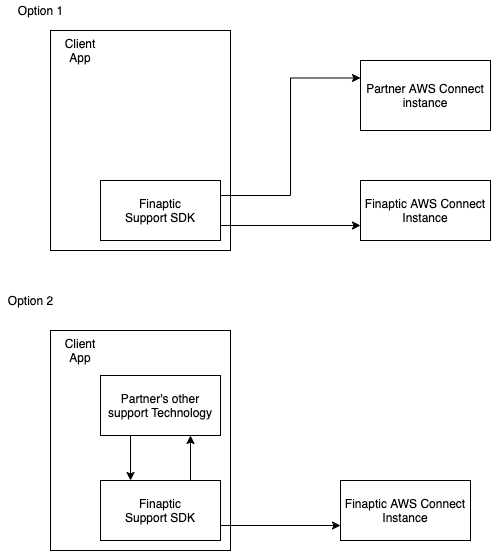
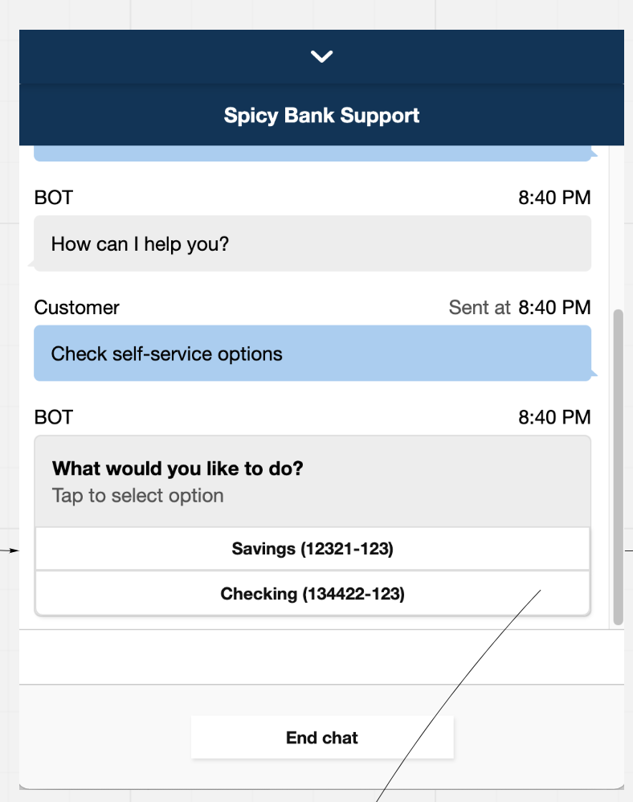
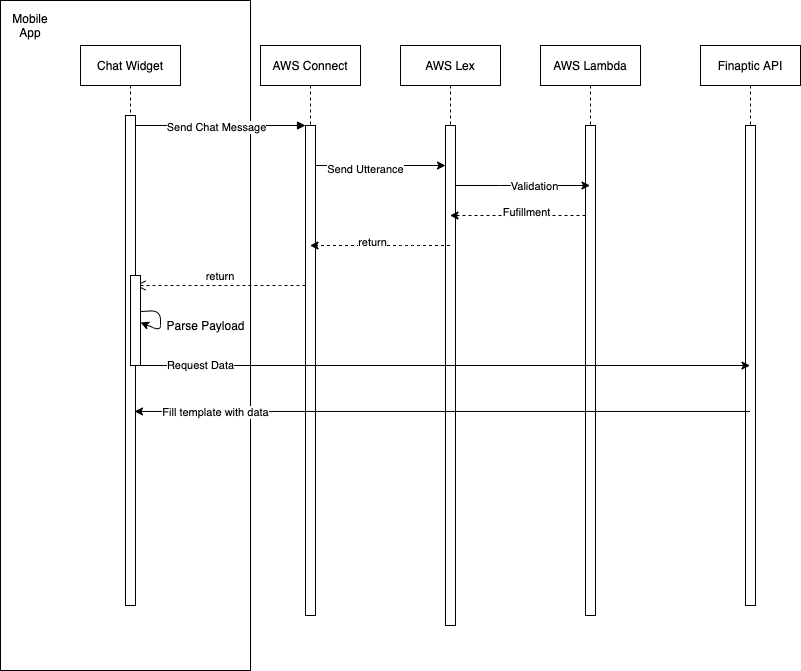

# Customer Support Overview

As a Banking as a Service platform we want to provide customer support to our tenant’s customers. Our goal is to provide this service as cost effectively as possible and reduce human-to-human touch points as much as possible. End users should feel they are interacting with the partners directly and do not need to be aware of Finaptic. Finally, customer data is critical, and employee fraud is a trust buster for both our relationship with partners and their relationship with their customers. 

Finaptic provides escalation customer support when it comes to banking-related issues. We do not provide first-line support for any partner-specific application questions or issues. Finaptic provides, as part of our SDK and services, customer support channels, technology, and escalation paths. 

## Platform for support contacts: Amazon Connect

Amazon Connect is an Amazon Web Services (AWS) public cloud customer contact center service. Amazon Connect enables customer service representatives to respond to phone calls or chat inquiries from end customers just as if the contact center infrastructure was set up and managed on premises.

### L2+ Customer Support Agents (Finaptic Employees)

Amazon Connect supports identity federation by configuring SAML2.0 with AWS IAM to enable web-based SSO to the Amazon Connect instance. This allows users to sign in to a portal in our organization hosted by a SAML 2.0 compatible identity provider, Google Workplace in our case, and log in to an Amazon Connect instance with SSO. 

Customer service agents - Agents use the Amazon Connect Contact Control Panel (CCP) to interact with customer contacts. It's how they receive calls, chat with contacts, transfer them to other agents, put them on hold, and perform other key tasks.

Customer service admin - can add users to Amazon Connect, give them their credentials, and assign the appropriate permissions so they can access the features needed to do their job through the instance configuration panel.

The URL to launch the CCP is similar to: https://partner-name-instance.aws/ccp-v2/

## Partner customer support integration

Partners are responsible for the first level of support as well developing their own documentation and FAQs. Finaptic provided customer support is an escalation path for banking related issues.

Our chat / chatbot solution is included as part of the Finaptic SDK for easy integration with your application if you choose to use it.

If you already have a chatbot or support chat interface we can work with you to integrate with our customer support chat APIs hosted in AWS Connect to allow for seamless handoff to our agents when level-2 escalation is necessary.

 

### Option 1: Use Amazon Connect Instances and SDK for everything

We will deploy an Amazon Connect instances for the customer. Their customer service agents will login in to their own CCP, for example https://tenant-a-prod.aws/ccp-v2/. We provide a "model home" setup with existing support flows, chat, and a basic pre-trained chatbot that includes basic banking support functionality (e.g. What's my balance?, how do I open an account?) - See below under "Chat bot" on how we can implement this in a partner agnostic way. They can then provide customized questions and response which we deploy to their chatbot instances running in AWS Lex.

Within the Amazon Connect flow there are built in escalation paths to hand-off customer contacts to Finaptic employees. Our Support SDK provides seamless hand-off by initiaing a new L2 Chat connection using the [AWS Connect Start Chat API](https://docs.aws.amazon.com/connect/latest/APIReference/API_StartChatContact.html) to Finaptic Customer Service Instance. 

### Option 2: Partner's use their own customer service technology

Similar to option, the Finaptic Support SDK can be use to programatically start an L2 chat session using the provide APIs. The API surface mirrors the one provided by Amazon Connect. This way partner's can develop their own user experience or use other out of the box support platforms. They will be responsible for using our SDK to initiate chats, open the necessary connection, and handle sending/receveing chat messages through the API when an L2 escalation is needed. 

In this case partner's would not be using the Finaptic provided Chat bots for L1 customer questions. 

## High level implemntation

Review the [Miro board for high level design](https://miro.com/app/board/o9J_lEALEvg=/) first.


### Amazon Connect flow

Amazon connect has a contact flow builder (API) and UI for creating re-usable contact flows components and entire flows. 

### Chat bot

We have developed our chat bot using AWS Lex backed by AWS Lambdas for validation and response fufillment. The chat widget is a customized version of the default widget and is extensible using the Amazon Connect chat APIs.

To  prevent data security concerns we developed the chat system to never need access to Finaptic APIs, such that no customer data will go through or be requested in AWS. The chat bot itself is only used to parse the intents and return templated responses to the client application. The client chat widget will parse the templates and fill in customer data using the client side API. The chatbot will return a customer payload response such as:

```json
{
  "templateType": "ListAccounts",
  "version": "1.0",
  "data": {
    "content": {
      "title": "Which account would you like to see the balance on?",
      "subtitle": "Tap to select option",
      "elements": "$API:GetAccountList"      
    }
  }
}
```
Template would be rendered as such:



The client widget will know how to render this and request the data using the client side SDK. This means all authentication and authorization goes through the exists mechanisms. 



### Data security

Since no customer banking data will be stored or access from AWS this reduces the surface area for data security requirements. There is still the possability of customers submitted PII or sensitive information in the chat box that is parsed on the AWS side. We  integrate [Amazon Comprehend](https://docs.aws.amazon.com/comprehend/latest/dg/how-pii.html) to automatically detech and redact PII information before it gets to the bot intent parser or human contact.

> Amazon Comprehend uses natural language processing (NLP) to extract insights about the content of documents. Amazon Comprehend processes any text file in UTF-8 format. It develops insights by recognizing the entities, key phrases, language, sentiments, and other common elements in a document. You can use Amazon Comprehend to detect entities in your text that contain personally identifiable information (PII), or PII entities. A PII entity is a textual reference to personal data that could be used to identify an individual, such as an address, bank account number, or phone number.

