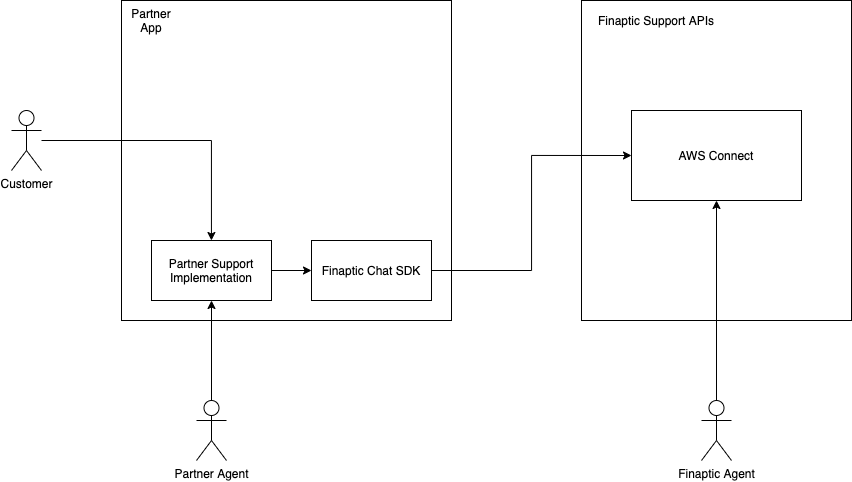
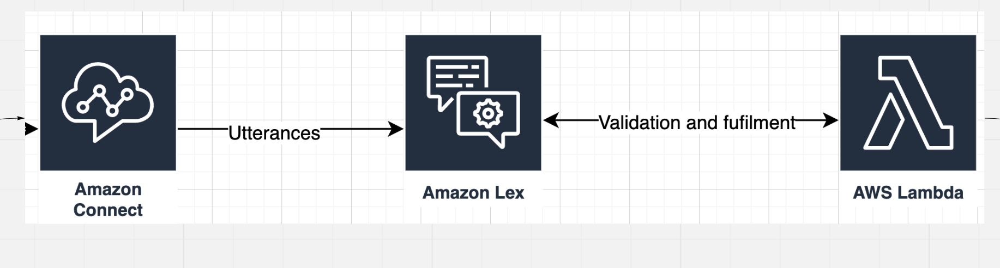
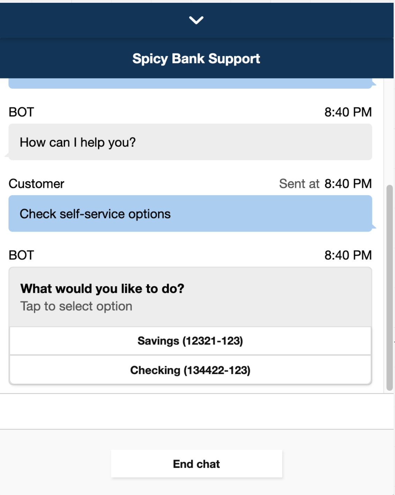

# Customer Support Overview

As a Banking as a Service platform, we want to provide customer support to our tenant’s customers. Our goal is to provide this service as cost-effectively as possible and reduce human-to-human touchpoints as much as possible. End users should feel they are interacting with the partners directly and do not need to be aware of Finaptic. Finally, customer data is critical, and employee fraud is a trustbuster for both our relationship with partners and their relationship with their customers. 

Finaptic provides escalation customer support when it comes to contacts that can not be resolved by the partner, such as technical issues with the Finpatic APIs.  We do not provide first-line support for any partner-specific application questions or issues. Finaptic provides, as part of our SDK and services, customer support channels, technology, and escalation paths. 

## Platform for support contacts: Amazon Connect

Amazon Connect is an Amazon Web Services (AWS) public cloud customer contact center service. Amazon Connect enables customer service representatives to respond to phone calls or chat inquiries from end customers just as if the contact center infrastructure was set up and managed on premises.

### L2+ Customer Support Agents (Finaptic Employees)

Amazon Connect supports identity federation by configuring SAML2.0 with AWS IAM to enable web-based SSO to the Amazon Connect instance. This allows users to sign in to a portal in our organization hosted by a SAML 2.0 compatible identity provider, Google Workplace in our case, and log in to an Amazon Connect instance with SSO. 

Customer service agents - Agents use the Amazon Connect Contact Control Panel (CCP) to interact with customer contacts. It's how they receive calls, chat with contacts, transfer them to other agents, put them on hold, and perform other key tasks.

Customer service admin - can add users to Amazon Connect, give them their credentials, and assign the appropriate permissions so they can access the features needed to do their job through the instance configuration panel.

## Partner customer support

Partners are responsible for the first level of support for their customers as well support related to their application and business. Partner responsibilities include: 

* Develop your own help documentation and FAQs.
* Provide staffing and support channels for customer contacts. Including staff that can answer questions about the product, how to perform actions in your application, and technical issues that are not related to Finaptic APIs.
* Implement an in-app chat that can be used for L1 customer support that enables hand-off to Finaptic for L2 support.

Our chat solution is included as part of the Finaptic SDK for easy integration with your application and existing in-application chat support. If you already have a chatbot or support chat interface we can work with you to integrate with our customer support chat APIs hosted in AWS Connect to allow for seamless handoff to our agents when level-2 escalation is necessary.

Finaptic is responsible for assisting if level 1 support is unable to provide resolution when it is related to banking-specific issues. Escalation will be initiated by the level 1 customer support agent through the in-app secure chat API. The hand-off to a Finaptic agent can be seamless and transparent to the customer.



Example steps in a customer interaction:

1. The customer opens the support widget in the partner's application and requests to speak to an agent.
2. The partner's support agent responds to the customer support request to assist with the question or issue. It is determined that the partner's agent cannot answer the inquiry. The agent triggers an escalation to L2 support from their support tools. This tells the application to call the Finaptic support API to start a chat session with a Finaptic agent.
3. The chat is initiated with the Finaptic support agent who can see the chat history and resolve the issue for the customer.

The hand-off can be made transparent to the customer and reuse the same chat window.

### Partners use their customer service technology

The Finaptic Support SDK can be used to programmatically start an L2 chat session using the provided APIs. This way partners can develop their own user experience or use other out-of-the-box support platforms. They will be responsible for using our SDK to initiate chats, open the necessary connection, and handle sending/receiving chat messages through the API when an L2 escalation is needed. 

In this option, Finaptic provides a simple API service to begin a chat session, and send messages between the customer and the Finaptic support agent. Finaptic does not provide a user interface for connecting to our agents through chat. Distribution partners can customize the chat window with their brand. Finaptic provides the APIs in the SDK to start a chat session and send messages between our agent and another entity. The Distribution Partner is responsible for the on-screen presentation and integration with their own L1 support system.


### (Future) Partners use an Amazon Connect Instance managed by Finaptic

We will deploy an Amazon Connect instance for the customer. Their customer service agents will login in to their own CCP, for example https://tenant-a-prod.aws/ccp-v2/. We provide a "model home" setup with existing support flows, chat, and a basic pre-trained chatbot that includes basic banking support functionality (e.g. What's my balance?, How do I open an account?) - See below under "Chat bot" on how we can implement this in a partner agnostic way. They can then provide customized questions and responses which we deploy to their chatbot instances running in AWS Lex.

Within the Amazon Connect flow there are built in escalation paths to hand-off customer contacts to Finaptic employees. Our Support SDK provides seamless hand-off by initiaing a new L2 Chat connection using the [AWS Connect Start Chat API](https://docs.aws.amazon.com/connect/latest/APIReference/API_StartChatContact.html) to Finaptic Customer Service Instance. 

## (Future) High level implementation for chat bot

Review the [Miro board for high level design](https://miro.com/app/board/o9J_lEALEvg=/) first.



### Amazon Connect flow

Amazon Connect has a contact flow builder (API) and UI for creating re-usable contact flows components and entire flows. 

### Chat bot (Future)

We have developed our chatbot using AWS Lex backed by AWS Lambdas for validation and response fulfillment. The chat widget is a customized version of the default widget and is extensible using the Amazon Connect chat APIs.

To prevent data security concerns we developed the chat system to never need access to Finaptic APIs, such that no customer data will go through or be requested in AWS. Thechatbott itself is only used to parse the intents and return templated responses to the client application. The client chat widget will parse the templates and fill in customer data using the client-side API. The chatbot will return a customer payload response such as:


```json
{
  "templateType": "ListAccounts",
  "version": "1.0",
  "data": {
    "content": {
      "title": "Which account would you like to see the balance on?",
      "subtitle": "Tap to select option",
      "elements": "$API:GetAccountList"      
    }
  }
}
```
Template would be rendered as such:



The client widget will know how to render this and request the data using the client side SDK. This means all authentication and authorization goes through the exists mechanisms. 


### Data security

Since no customer banking data will be stored or accessed from AWS this reduces the surface area for data security requirements. There is still the possibility of customer-submitted PII or sensitive information in the chat box that is parsed on the AWS side. We  integrate [Amazon Comprehend](https://docs.aws.amazon.com/comprehend/latest/dg/how-pii.html) to automatically detect and redact PII before it gets to the bot intent parser or human contact.

> Amazon Comprehend uses natural language processing (NLP) to extract insights about the content of documents. Amazon Comprehend processes any text file in UTF-8 format. It develops insights by recognizing the entities, key phrases, language, sentiments, and other common elements in a document. You can use Amazon Comprehend to detect entities in your text that contain personally identifiable information (PII), or PII entities. A PII entity is a textual reference to personal data that could be used to identify an individual, such as an address, bank account number, or phone number.

