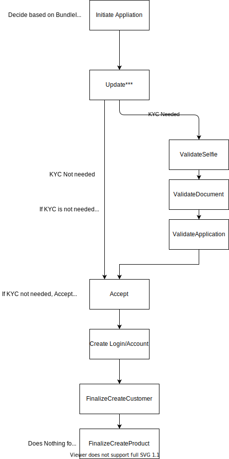

# Productless Onboarding

## Guide Purpose

**This guide will**

1. Educate you on how an Authorized User is Onboarded

**Links to related Onboarding topics**

1. [Onboarding Overview](/../../Implementation-Guide/Onboarding/OnboardingDocumentation/)
2. [Onboarding Sequence Diagram](/../../Implementation-Guide/Onboarding/OnboardingSequenceDoc/)
3. [Finaptic's Authorized User Policies](/../../Implementation-Guide/Banking/Authorized-User/AuthorizedUserDocumentation/)
4. [Test profiles](/../../Implementation-Guide/Onboarding/OnboardingTestProfiles/) to test your onboarding flow

---

#### What is a Productless Onboarding?

Productless  Onboarding is the foundation on which an Authorized User is Onboarded to the platform without the actual creation of a product post the successful completion of onboarding.

Productless Onboarding will apply to applicants who may or may not require AML & KYC identity validation. 

---

#### The Productless Onboarding Architecture

An Authorized User is onboarded to the platform via the Productless Onboarding Flow; `representing a minimum 5 steps to be onboarded`.

1. Make a valid request to the `InitiateApplicationRequest` with BundleID `productlessV1` 
2. Make a valid request to `UpdatePersonalDetailsRequest`  
3. Make a valid request to `UpdateContactDetailsRequest`  
4. Make a valid request to `AcceptApplicationRequest`  
5. Make a valid request to `FinalizeApplicationCreateCustomerRequest`, this is the end of the flow.  

Note that application status status is now **`Application Processed`**

-  

---
