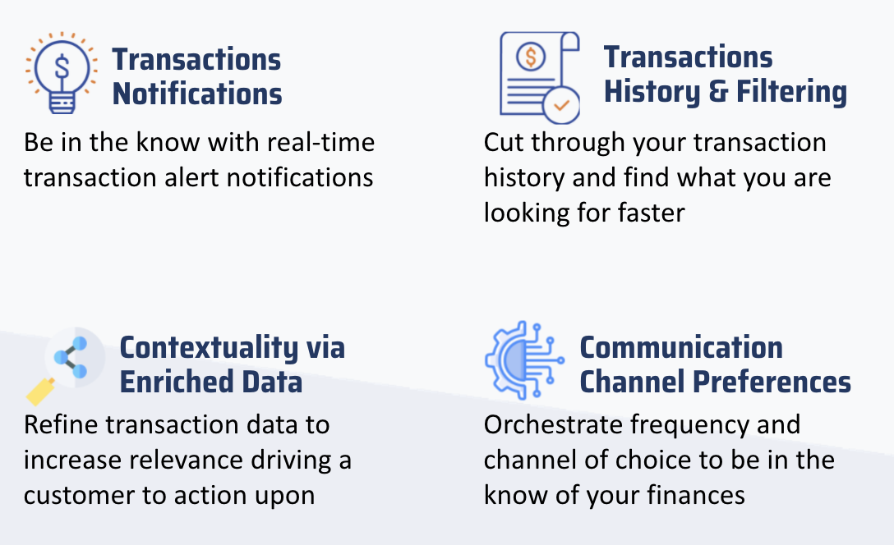

# PFM Overview

Welcome to Finaptic’s Personal Financial Management (PFM) Service that will help you deliver timely, relevant, contextialized and actionable digital-first communications. 

## Guide Purpose

**This guide will**

- Educate you on Finaptic’s Personal Financial Management Service
- Highlight our Release Plan
- Bridge to our API specifications

---

#### What is Personal Financial Management or PFM?

PFM is the concept of enhancing account level monitoring and enabling better control of your everyday banking. This service is developed to help customers gain insights and better manage both money-in & money-out transactions. A customer will be able to track finances in real time, giving them a view of their past transactions while protecting them under layers of security and keeping your personal information secure. 

#### Finaptic delivers a customizable offering

We believe that Personal Financial Management should ***inform***, ***guide*** and ***empower*** customers to stay on top of their finances.

#### Three underlying guiding principles to our approach

- **Delivery of real-time notifications**
  Given criticality of staying informed, alerts and communications should be near real-time.​

- **Contextuality drives value**
  Finances are personal and so should the insights & communications generated.​

- **Orchestration to personalize**
  Ability to set controls to avoid burdening the customers with messaging.

---

#### What to expect in our Initial Release?

| Category          | Feature                       | Initial Release | Future Release |
| ----------------- | ----------------------------- |:---------------:|:--------------:|
| **Transactions**  | **Notifications1** | -               | **Yes**        |
|                   | **History2**       | **Yes**         | **Enhanced**   |
|                   | **Filtering3**     | **Yes**         | **Enhanced**   |
|                   | **Geo-locate Transactions**   | -               | **Yes**        |
|                   | **Daily Spend Alerts**        | -               | **Yes**        |
|                   |                               |                 |                |
| **Orchestration** | **Push Notifications**        | -               | **Yes**        |
|                   | **SMS Notifications**         | -               | **Yes**        |
|                   | **Email Notifications**       | -               | **Yes**        |
|                   | **Notifications Off**         | -               | **Yes**        |
|                   | **In-App Event**              | **Yes**         | -              |

*1Transaction Notifications: Allows the customer to receive a push notification every time a transaction affects the balance of their account. For the initial release the customers will only be notified for the following transaction types: Credits, Debits, and Refunds.*

*2Transaction History: Viewing a list of all the transactions occurred on their accounts. For the initial release, customers will only be able to view the following types of transactions: Credits, Debits, and Refunds.*

*3Transaction Filtering: Filter transactions by User, Account, Account type, Time Period, User Device & Transaction Type.*

---

#### API Overview

There are 4 foundational Transactions related API Calls

[**<u>GetTransactionsRequest</u>**](/../../API-Specifications/corebanking/#gettransactionsrequest) 

This API call represents a message being passed as a parameter to the GetTransactions operation. 

This API is the initiator that will make the request to extract transactions for a specific account including setting the maximum count of transactions to view and the order in which to filter.

[**<u>GetTransactionsResponse</u>**](/../../API-Specifications/corebanking/#gettransactionsresponse)

This API call represents the response of a successful GetTransactions request. 

Here the API call will generate a response to list transactions including the order in which they should be sorted.

[**<u>Transaction</u>**](/../../API-Specifications/corebanking/#transaction)

This API call represents the details about the transaction and information regarding the account the transaction has occurred on. 

A customer will received enriched information about their transaction; the transaction state, amount, time & date of transaction, updated balance and merchant. 

[**<u>TransactionCreatedEvent</u>**](/../../API-Specifications/corebanking/#transactioncreatedevent)

TransactionCreatedEvent event is raised when a Transaction occurs.

This API call represents the creation of a transaction by time & date, who initiated the transaction and reflecting with both primary & authorized users.

Complete details of the PFM API specifications can be found [here]([Sign in to GitHub · GitHub](/../../API-Specifications/persfinmngt/)).

____

#### Glossary | Common Transaction "States"

- **Posted** 
  The transaction that has completed its life cycle and the settlement process is completed

- **Pending** 
  The transaction that is still to go through its lifecycle and pending settlement

- **Authorized** 
  An approval from a card issuer, usually through a card processor, that the customer has sufficient funds to cover the cost of the transaction.

- **Debit** 
  A charge to a customer’s bank card account. Cards tied to a checqing or savings account are often called debit cards.

- **Refund** 
  The creation of a credit to a cardholder account, usually as a result of a product or service return.

- **Declined** 
  A card will be Declined if the the Card is not in good standing condition, insufficient funds in the account and a varied number of business reasons implemented by the issuing institution.

- **Chargeback** 
  Occurs when a charge is reversed, returning credit to a card customer from a merchant.

- **Credit** A transfer of money to a customer’s bank account via the card.

- **E-transfer States:**
  
  **Deposited:** 
  The e-transfer service is successfully deposited into the customer account.
  
  **Rejected:** 
  The e-transfer service is rejected due to a varied no of reasons: The reason of rejection must be presented.

---
