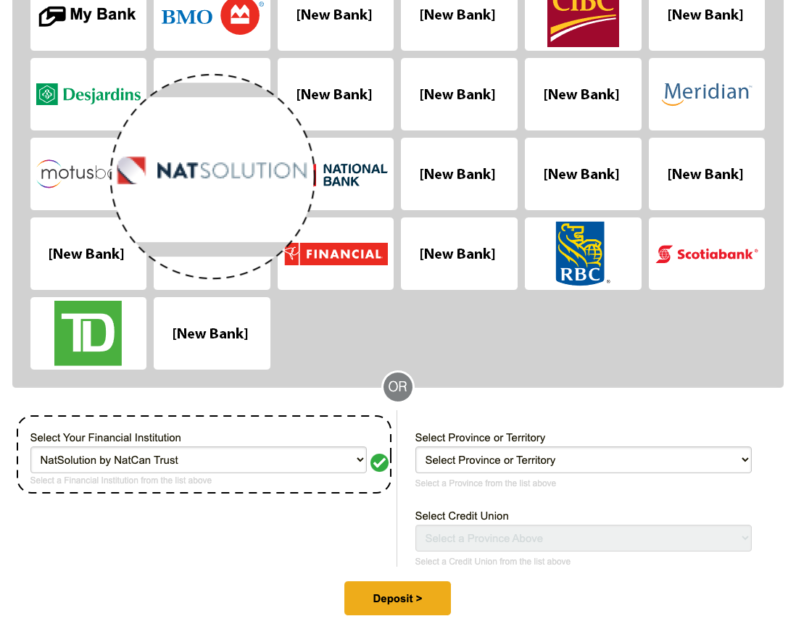
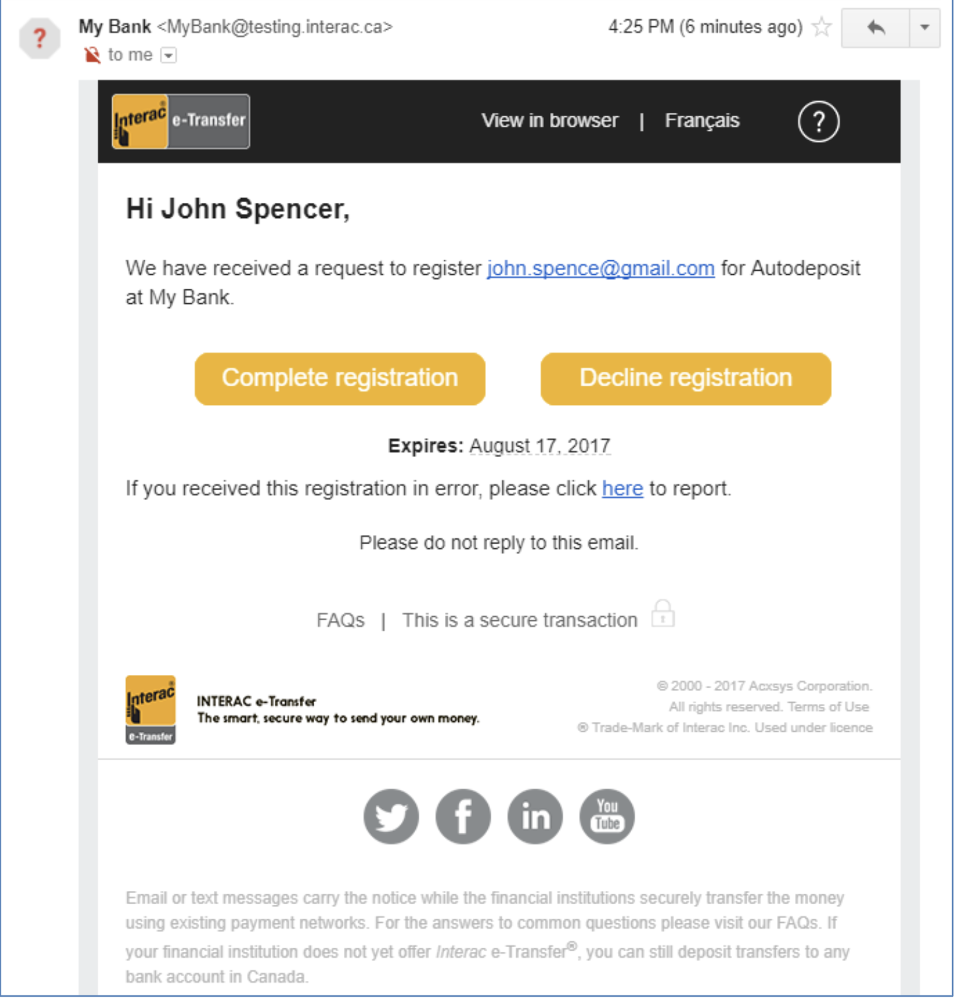
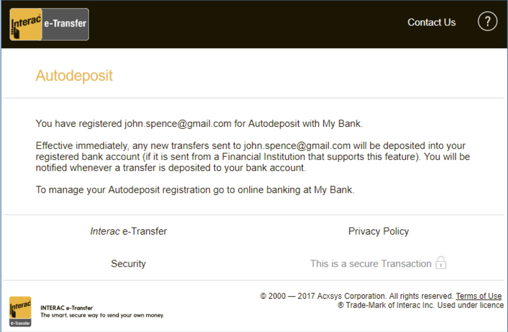

# Auto-Deposit Overview

## Introduction

Finaptic offers its customers access to the Interac payments network. Multiple products are available for Interac, and are accessible via the [Core Transfers](/../../API-Specifications/coretransfer/) endpoint. This endpopint gives Finaptic customers the ability to initiate Interac payment processes. 

## Guide Purpose

This guide will:

- Provide an overview on Interac services available to Finaptic customers

- Provide an API overview for effective integration

---

## About the Product

#### What is Interac?

[Interac](https://www.interac.ca) is a Canadian payment network that provides interbank payment capabilities via a number of products; with the predominant funds transfer network via its e-Transfer service. 

#### Common Terminology

*e-Transfer or simply transfer* – means an INTERAC e-Transfer, the transaction by which money is transferred using the INTERAC e-Transfer service

*Sender* – a customer who sends money to another customer using INTERAC e-Transfer

*Recipient* – a customer who receives an INTERAC e-Transfer

*ANR or Account Number Routing* – a customer can fund their account

#### 

#### What is Interac e-Transfer?

*Interac* e-Transfer is a secure, fast, and convenient way to send, request, and receive money from a person or a business with an email address or a valid Canadian mobile number, and an eligible bank account with a [participating Canadian financial institution](https://www.interac.ca/en/interac-e-transfer-consumer.html). Most transfers complete within one minute but some may take up to 30 minutes.

To send money using the *Interac* e-Transfer service, the account number of the recipient does not need to be known – only their email address or mobile number is required.

#### Which Interac features does Finaptic offer?

There are 5 core Interac features that support *money movement*.

| Feature                              | Description                                                                                                                                                                                                                  | How                   | Partner Availability |
| ------------------------------------ | ---------------------------------------------------------------------------------------------------------------------------------------------------------------------------------------------------------------------------- |:---------------------:|:--------------------:|
| **Interac Receive Email, SMS & ANR** | Ability to <u>receive</u> money into your account via Email or SMS or ANR                                                                                                                                                    | Email SMS ANR | Yes                  |
| **Interac Autodeposit**              | A convenient feature that saves you time; the money you <u>receive</u> using *Interac* e-Transfer can automatically be deposited into your account without requiring you to sign-in                                          | Email                 | Yes                  |
| **Interac Q&A**                      | If you are sent money to your email or mobile number using Interac e-Transfer and are not registered for Autodeposit, you will first need to answer a security question provided by the sender in order to deposit the funds | Email SMS         | Planned for 2022     |
| **Interac Send**                     | Ability to <u>send</u> money via Email or SMS                                                                                                                                                                                | Email SMS         | Planned for 2022     |
| **Interac Request**                  | Ability to <u>request</u> money via Email or SMS                                                                                                                                                                             | Email SMS         | Planned for 2022     |

#### 

#### What is Finaptic referred to as when selecting a Financial Institution to e-Transfer money to?

Within Interac, Finaptic Technologies is referred to as **`NatSolutions`**; example visual below.

----

#### Interac Auto-Deposit

Auto-deposit is a convenient feature that saves you time; the money you receive using *Interac* e-Transfer can automatically be deposited into your account without requiring you to sign-in to your account. Additionally, there is no need to go through the security Q&A process.

#### Autodeposit API Overview

###### One-Time Registration

You just need to choose one or more email addresses to receive notifications and a dedicated account where the funds can be deposited. Any e-Transfers sent to the registered email address will automatically be deposited to the designated account.

The registration request for Interac services is generated through the Interac API function.

This request is generated via the [CreateRegistrationRequest](/../../API-Specifications/coretransfer/#createregistrationrequest) call.

4 data elements are required via the API call in order to generate this request:

- [account_id](/../../API-Specifications/coretransfer/#listautodepositregistrationsrequest) - Provided for the account that the customer wishes auto-deposit transactions to be routed to
- [account_alias](/../../API-Specifications/coretransfer/#registration) - This is typically the user's email address, which can be used for both the account_alias field and the alias_email field
- [alias_email](/../../API-Specifications/coretransfer/#registration)
- [alias_phone_number](/../../API-Specifications/coretransfer/#registration)

All other details from the customer file that are required for registration will be retrieved by Finaptic during the registration process.

In the event that a user wants to change their registration to a different account, a new call with the new account ID must be made, at which point, the same process is to be followed.

###### Registration Errors

A number of errors could occur in the registration process. These errors will be communicated either via our asynchronous API surface, or via the synchronous SDK capabilities which can be found in our [SDK Guide](/../../SDK-Guide/).

Error possibilities at time of registration are as follows:

| Code | Description                                                              |
| ---- | ------------------------------------------------------------------------ |
| 301  | Customer does not exist                                                  |
| 379  | Invalid mobile phone area code                                           |
| 380  | Invalid mobile phone number                                              |
| 400  | Mutually exclusive options are specified in the request                  |
| 410  | Customer is disabled                                                     |
| 422  | Retail name missing                                                      |
| 451  | Customer not registered for transfer product, currency code combination  |
| 540  | Invalid bank account                                                     |
| 543  | Account-alias handle is already defined in e-Transfer system             |
| 545  | Duplicated participant account-alias reference number                    |
| 546  | Invalid account-alias registration notification preference               |
| 547  | Maximum number of account-alias registrations threshold exceeded         |
| 567  | Invalid UUID format                                                      |
| 591  | Sender Account Identifier and Service Type combination is not supported. |

###### Managing Registrations

A customer can set up multiple Autodeposit registrations, subject to a global limit (currently 5 for retail customers, 100 for small business customers, and 500 for corporate customers). 

Each email address or phone number can only be registered once across the entire e-Transfer network; however multiple email addresses and phone numbers can be registered to the same account. 

In online banking, the Recipient must be able to see a list of their Autodeposit registrations, showing the email address or phone number, the bank account associated with each, and the status of the registration (pending or active). 

For each Autodeposit registration, online banking gives the customer the option of cancelling a registration, or modifying it. Allowed modifications are changing the account details or notification preferences. The customer cannot change the email address or phone number associated with a registration – each new email address or phone number requires the creation of a new registration. 

A customer can initiate a new Autodeposit registration for an email address or mobile phone number that is already registered for Autodeposit. In this case, the verification notification explicitly asks the customer if they want to replace the old registration with the new one. The old registration remains active until such time as the new registration goes active (i.e. the customer has responded to the verification notification to confirm that they want to transfer the registration to the new account, and the new registration has been reviewed and allowed from the fraud perspective). Once the new registration goes active, the previous registration is automatically made inactive.

###### Fraud Check of Autodeposit Registrations

The biggest concern with Autodeposit registrations is the potential for a criminal to register someone else’s email address or phone number to an account that the criminal has access to. Therefore, the registration process must be monitored.

When the customer clicks the validation link from the notification to activate a new Autodeposit registration, the registration is scored by the fraud detection system. If nothing is suspicious, the registration becomes active immediately and the customer is informed of that. Registrations that appear suspicious are blocked until an Interac fraud analyst has had a chance to review the registration. In those cases the customer is told that the registration is being processed. If the registration seems legitimate, the fraud analyst unblocks it at which point it becomes active (and a confirmation notification is sent to the customer).

As long as a registration is not active (e.g. is blocked), the associated email address or phone number is not used for Autodeposit. Anyone sending an transfer to that email address or phone number has to send a normal INTERAC e-Transfer (i.e. with security question and answer).

Even after a registration has been activated, an Interac fraud analyst can block the registration if it becomes clear that the registration is not legitimate. This action will be used very sparingly, since there is significant impact on both senders and the recipient.

###### Expiration of Registrations

If an Autodeposit Registration remains unused for a long period of time, it will be removed from the system. For email addresses the period is *12 months*; for phone numbers it is *3 months*. 

Whenever the registration is used for receiving an INTERAC e-Transfer, the timer is reset so the registration will not expire for another 3 or 12 months. A week before the registration is due to expire, the INTERAC e-Transfer system sends a notification to the email address or phone number associated with the registration, that allows the Recipient to renew the registration for another period by simply clicking on a confirmation button. 

There is an option to cancel or report the registration on the same notification as well. In case the recipient does not take any action on the sent expiry reminder notification, the Autodeposit registration is expired by the system and a de-registration notification is sent to the recipient.

###### Deposits

When a deposit is sent to a customer who has registered for the Interac Autodeposit service, transactions will be routed to the account specified by the user during the registration call.

The process is automated, and the customer will be notified via an email or text message generated by Interac.

Interac Autodeposit transactions can be retrieved from the [Core Transfers](/../../API-Specifications/coretransfer/) domain and from the [Personal Financial Management](/../Implementation-Guide/Personal-Financial-Management/) domain. The PFM domain contains basic summary information regarding the transaction, while the Transfers domain contains a complete data set which may or may not be required for the end user to identify the transaction.

When funds have been receieved by the user, the deposit can exist in 3 states: 

1. Begin

2. Commited

3. Reversed

All deposit states will appear in the transaction history. 

###### Account Closures and Deposit Failures

A successful Autodeposit transfer depends on the success of the deposit action. If the deposit does not succeed at first, different things may happen: 

- If the financial institution (FI) indicates a soft error (e.g. systems unavailable) then Interac retries the deposit a few times until failing the transfer. Failing the transfer means that the Sender will need to reclaim the funds (or, if Auto Reclaim is active, the funds will be pushed back to the Sender automatically). 

- If the FI indicates a hard error (e.g. account is closed) then Interac not only fails the transfer, but deletes the Autodeposit registration.

---

#### Visualizing the Autodeposit Experience

###### Autodeposit Registration

Finaptic has provided the screen elements below for reference purposes. This process outlines a possible user flow representation of what your customer experience could resemble.

###### Registration Confirmation

Once a registration request is submitted, Interac and Finaptic take care of the rest of the process. 

Users will receive an email at the email address that they provided from Interac, which will ask them to verify that they have selected `NatSolutions` as their auto-deposit provider.

Once this verification step is complete, the registration process is also complete, which will result in a confirmation email being generated from Interac.

---