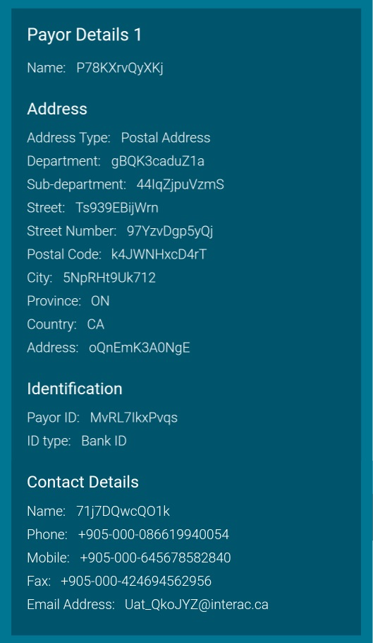
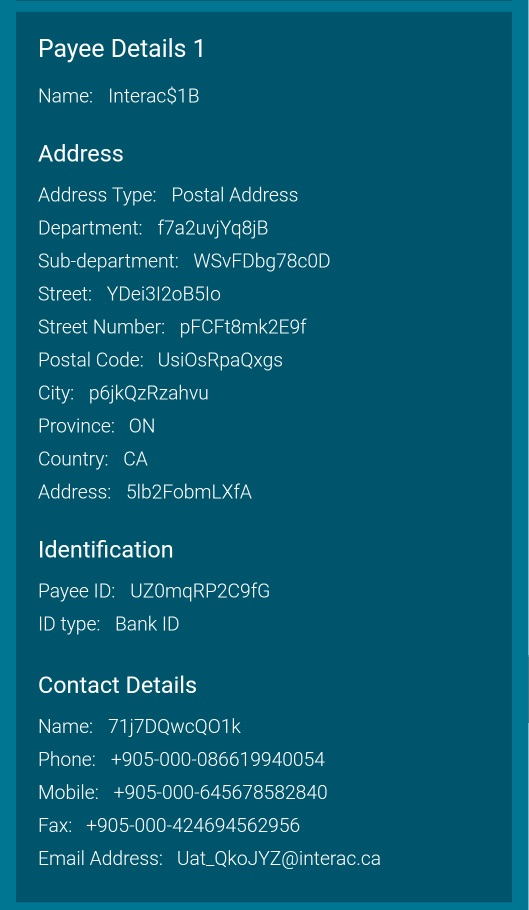
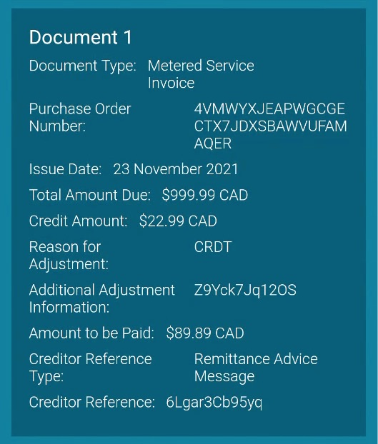

# Finaptic Android SDK

The Finaptic Android SDK provides a way to consume Finaptic APIs from your Android application. It is written in Kotlin.
 
Note that the Finaptic APIs are strictly accessed through the SDK because it hides the underlying implementation that could change in the future.

Android API version 27 or newer is required.

## Sample application

A sample application demonstrates what is explained in the document. Make sure you can run it using your own SDK key.
 
Here are the steps to run the sample app:
 
1. Open the file MainActivity.kt and replace the SDK key with the one provided to you. The key is configured in the FinapticSDK.init(...) call.
2. Run the sample app on a device or simulator.
3. Press the button at the bottom of the first screen to execute the onboarding flow.
4. Check the logs in Logcat (filter with "Finaptic"). You will see the sample app logs as well as the SDK logs.
5. Let the whole flow execute. It can take more than one minute. In a sandbox environment, you may experience delays when using a client for the first time or after a small inactivity period. It is due to the backend services cold start.
6. If an error arises, a dialog will be presented with the error. The flow couldn't complete properly and the full exception stack will be logged in Logcat. In this case, make sure the SDK key is the right one and retry.
7. If the flow completes without error (no more requests are executing), you are good to integrate the SDK in your own app.
 
##### ID and face capture with Acuant
Please take a look at AcuantSample on how to use Acuant for document and face capture.
You can read their official documentation [here](https://github.com/Acuant/AndroidSDKV11).
 
## Installation
 
1. Copy Finaptic SDK **contract** and **implementation** aar files to `app/libs`.
   
2. Require the following permissions in your `AndroidManifest.xml` file.

        <manifest xmlns:android="http://schemas.android.com/apk/res/android"
        xmlns:tools="http://schemas.android.com/tools">

        <uses-permission android:name="android.permission.INTERNET" />
        <uses-permission android:name="android.permission.ACCESS_NETWORK_STATE" />

        <!-- Acuant -->
        <uses-permission android:name="android.permission.CAMERA" />
        <uses-permission android:name="android.permission.WRITE_EXTERNAL_STORAGE"/>
        <uses-feature android:name="android.hardware.camera" />
        <uses-feature android:name="android.hardware.camera.autofocus" />
        <meta-data
            android:name="com.google.android.gms.vision.DEPENDENCIES"
            android:value="barcode,face"
            tools:replace="android:value"/>

        </manifest>

 
3. Make sure you have these flags in your `gradle.properties`.
   
        android.enableJetifier=true
        android.useAndroidX=true

 
4. Add the Finaptic SDK repositories in `build.gradle`.
   
        allprojects {
            repositories {
                google()
                mavenCentral()
                jcenter()

                // SDK libs path
                flatDir {
                    dirs 'libs'
                }
                maven { url 'https://jitpack.io' }

                // Acuant
                maven { url 'https://raw.githubusercontent.com/Acuant/AndroidSdkMaven/main/maven/' }
                maven { url 'https://raw.githubusercontent.com/iProov/android/master/maven/' }
            }
        }

 
5. Update `app/build.gradle` and sync.
      - Add the Manifest Placeholders for the Auth0 Domain and the Auth0 Scheme properties.
        
               android {
                   defaultConfig {
                       // Auth0 domain and scheme provided by Finaptic
                       manifestPlaceholders = [auth0Domain: "", auth0Scheme: "demo"]
                   }
               }

 
      - Target Java 8 byte code for Android and Kotlin plugins respectively.

               android {
                   compileOptions {
                       sourceCompatibility JavaVersion.VERSION_1_8
                       targetCompatibility JavaVersion.VERSION_1_8
                   }
                   kotlinOptions {
                       jvmTarget = '1.8'
                   }
               }

 
      - Add the Finaptic SDK dependencies.
          Because the SDK is provided as aar files instead of maven-like dependencies, you must also add the direct SDK dependencies.

               dependencies {
                   // Finaptic SDK in libs directory
                   implementation(name:'finaptic-sdk-contract', ext:'aar')
                   implementation(name:'finaptic-sdk-implementation', ext:'aar')

                   // Finaptic SDK dependencies
                   implementation 'io.grpc:grpc-okhttp:1.37.0'
                   implementation 'io.grpc:grpc-stub:1.37.0'
                   implementation("io.grpc:grpc-kotlin-stub-lite:1.0.0")
                   implementation platform('com.google.firebase:firebase-bom:27.0.0')
                   implementation 'com.google.firebase:firebase-analytics-ktx'
                   implementation 'com.google.firebase:firebase-auth-ktx'
                   implementation('com.google.firebase:firebase-firestore-ktx')
                   implementation 'org.jetbrains.kotlinx:kotlinx-coroutines-play-services:1.4.1'
                   implementation 'com.auth0.android:auth0:2.2.0'
                   implementation("org.jetbrains.kotlinx:kotlinx-serialization-json:1.3.1")

                   implementation 'com.amazonaws:aws-android-sdk-core:2.40.0'
                   implementation 'com.amazonaws:aws-android-sdk-connect:2.40.0'
                   implementation 'com.amazonaws:aws-android-sdk-connectparticipant:2.40.0'
                   implementation 'com.amazonaws:aws-android-sdk-mobile-client:2.40.0'
                   implementation "com.squareup.okhttp3:okhttp:4.9.0"
                   implementation 'com.github.babbel:okhttp-aws-signer:1.0.1'

                   // Acuant dependencies
                   implementation 'com.acuant:acuantcommon:11.4.12'
                   implementation 'com.acuant:acuantcamera:11.4.12'
                   implementation 'com.acuant:acuantimagepreparation:11.4.12'
                   implementation 'com.acuant:acuantdocumentprocessing:11.4.12'
                   implementation 'com.acuant:acuantfacematch:11.4.12'
                   implementation 'com.acuant:acuantfacecapture:11.4.12'
                   implementation 'com.acuant:acuantpassiveliveness:11.4.12'
               }

 
## Initialization
 
The SDK must be initialized before you can make any call. The FinapticSDK.init function must be invoked as a coroutine. The first parameter is a Context (ex: Activity, ApplicationContext).
 
```
GlobalScope.launch {
   // Initialize the SDK with the key provided by Finaptic
   sdk = FinapticSDK.init(this@MainActivity, "ewogICJzeW5jT25ib2...")
}
```
The init function can be called multiple times, but a single instance will be returned (the first one created). This means you can't change the context or SDK key to get another instance. The context is used for initialization only and won't be retained by the SDK. It is recommended to initialize the SDK once and store the returned instance in your own variable or container.
 
You can now start to use the SDK through multiple clients.
 
## OnboardingClient

Onboarding flow consist of initiate, get, update, validate and finalize calls.
 
1. Initiate application
      - [initiateApplication](#initiateapplication)
2. Get information
      - [getConsentElectronicCommunication](#getconsentelectroniccommunication)
      - [getConsentPrivacyPolicy](#getconsentprivacypolicy)
      - [getConsentTermsOfUse](#getconsenttermsofuse)
      - [getConsentProductAgreement](#getconsentproductagreement)
3. Update information
      - [updatePersonalDetails](#updatepersonaldetails)
      - [updateContactDetails](#updatecontactdetails)
      - [updateAccountDetails](#updateaccountdetails)
      - [updateAddresses](#updateaddresses)
      - [updateConsents](#updateconsents)
      - [updateCustomerResidency](#updatecustomerresidency)
      - [updateDisclosures](#updatedisclosures)
      - [updateEmployment](#updateemployment)
      - [updateCommunicationPreferences](#updatecommunicationpreferences)
4. Validate application
      - [validateDocuments](#validatedocuments)
      - [validateSelfie](#validateselfie)
      - [validateApplication](#validateapplication)
      - [acceptApplication](#acceptapplication)
5. Finalize application
      - [finalizeApplicationCreateCustomer](#finalizeapplicationcreatecustomer)
      - [finalizeApplicationCreateProduct](#finalizeapplicationcreateproduct)

#### OnboardingOperationResponseDetails

OnboardingOperationResponseDetails are the common response fields for an onboarding application create or update message.

- ***applicationId***: The UUID of the application the response is for.
- ***onboardingApplicationStatus***: The updated application status. The value here is one of the following:
    - **"UNDEFINED"** is reserved for error detection purposes. It should not be used directly.
    - **"New Application"** describes an Application that has just been created.
    - **"Data Collection** describes an Application that has successfully performed an Update call or failed a ValidateSelfieRequest or a ValidateDocumentsRequest.
    - **"KYC In Progress"** describes an Application that has successfully performed a ValidateSelfieRequest or ValidateDocumentsRequest.
    - **"KYC Success"** describes an Application that has successfully performed KYC checks as a result of a ValidateApplicationRequest.
    - **"KYC Failed"** describes an Application that has failed KYC as a result of a ValidateApplicationRequest.
    - **"KYC Rejected"** describes an Application that has no remaining KYC attempts.
    - **"Application Accepted"** describes an application that has successfully completed an AcceptApplicationRequest.
    - **"Application Processed"** describes an application that has been successfully completed.
    - **"Application Cancelled"** describes an application that has been cancelled by the customer.
    - **"Application Rejected"** describes an application that has been rejected and cannot be continued. This is used  when a more descriptive rejection status is not available.
- ***requestStatus***: The success status of the request.
- ***requestStatusReason***: The detailed reason for the request status. *Deprecated*: Use ***requestReasonCodes*** instead.
- ***remainingAllowedRetries***: The remaining KYC retries allowed.
- ***failureStatusCodes***: The list of codes explaining the reason of the request outcome. This list will only be populated when request status is **"KYC Failed"**, **"KYC Rejected"**, or **"Application Rejected"**. The list will otherwise be empty. The value stored here is one of the code values retrieved from the [ReferenceDataClient](#referencedataclient) with ***dataType*** set to ***ReferenceDataTypes.FAILURE_CODE***.
- ***verificationNeeded***: The list of verifications that will be needed be performed in order to complete the application. See [OnboardingVerification](#onboardingverification).
- ***consents***: The list of Consents required as part of this onboarding application. See [TermsAndConditions](#termsandconditions).
- ***disclosures***: The list of Consents required as part of this onboarding application. See [TermsAndConditions](#termsandconditions).

#### OnboardingVerification

Verification needed for an onboarding application

- ***name***: The name of the OnboardingVerification.
    - **"KYC"** means this application will perform KYC validation during the validate phase (ValidateDocumentsRequest, ValidateSelfieRequest and ValidateApplicationRequest) before being able to complete onboarding application.
    - **"ProfileCreation"** means that this application requires input of basic customer information, without doing full KYC, before being able to complete onboarding application.
    - **"AccountUsage"** means that this application needs to collect Account Usage information using UpdateAccountDetailsRequest before being able to complete onboarding application.
- ***requiredUpdates***: The list of all Update request that are required as part of this verification (eg : [UpdateAccountDetailsRequest, UpdateConsentsRequest]).

#### TermsAndConditions

TermsAndConditions is either a consent or a disclosure.

- ***documentType***: The type of the terms and conditions. The value stored here is one of the code values retrieved from the [ReferenceDataClient](#referencedataclient) with ***dataType*** set to **ReferenceDataTypes.CONSENT_TYPE** or **ReferenceDataTypes.DISCLOSURE_TYPE**.
- ***documentNameAndVersion***: The URL of the versioned terms and conditions document the customer needs to review and accept.
- ***neededBeforeValidation***: Whether or not the terms and conditions need to be accepted before calling any of the validate requests.

### initiateApplication
 
This is the only call that must be executed prior any other one when processing an onboarding application.
 
```
val response = sdk.onboardingClient.initiateApplication(
   InitiateApplicationRequest(
       productId = "prepaidV1"
   )
)

if (response.basicDetails.requestStatus != "OK") {
    // Could not process the request properly. You can retry the request.
}
val applicationId = response.basicDetails.applicationId

Log.d(TAG, "Verification needed for an onboarding application:")
initiateApplicationResponse.basicDetails.verificationNeeded.forEach {
    Log.d(TAG, it.toString())
}
```

#### InitiateApplicationRequest
- ***bundleId***: The unique identifier of the bundle being applied for.
    - **"despositV1"**: Deposit account without card.
    - **"prepaidV1"**: Account and prepaid-card.
    - **"creditcardV1"**: Account with credit card.
    - **"productlessV1"**: Onboard a customer and **do not** validate his identity.
    - **"kycV1"**: Onboard a customer, but **do validate** his identity.

#### InitiateApplicationResponse
- ***basicDetails***: The basic details of the onboarding application response. See [OnboardingOperationResponseDetails](#onboardingoperationresponsedetails).


 The returned application CONSENT TYPE and DOCUMENT NAME AND VERSION are required in consent update request.
### getConsentElectronicCommunication

```
    val response = sdk.onboardingClient.getConsentElectronicCommunication()
```
### getConsentTermsOfUse

```
    val response = sdk.onboardingClient.getConsentTermsOfUse()
```
### getConsentProductAgreement

```
    val response = sdk.onboardingClient.getConsentProductAgreement()
```
### getConsentPrivacyPolicy

```
    val response = sdk.onboardingClient.getConsentPrivacyPolicy()
```

The returned application ID is required in every other request.
### updatePersonalDetails

```
val response = sdk.onboardingClient.updatePersonalDetails(
   UpdatePersonalDetailsRequest(
       onboardingApplicationId = applicationId,
       customerPersonalDetails = PersonalDetails(
           firstName = "John",
           middleName = null,
           lastName = "Miller",
           dateOfBirth = LocalDate.of(1941, 5, 24),
           alias = null
       )
   )
)

if (response.basicDetails.requestStatus != "OK") {
    // Could not process the request properly. You can retry the request.
}
```
 
#### UpdatePersonalDetailsRequest

Used to update the customer personal details in the onboarding application.

 - ***onboardingApplicationId***: The UUID of the onboarding application to update.
 - ***customerPersonalDetails***: See [personal details](#personaldetails).

#### UpdatePersonalDetailsResponse
- ***basicDetails***: The basic details of the onboarding application response. See [OnboardingOperationResponseDetails](#onboardingoperationresponsedetails).

#### PersonalDetails
- ***firstName***: The customer first name. This value is required and has a maximum of 50 characters. Accepted characters: -, ', French accents, 0-9.
- ***middleName***: The customer middle name. This value is optional and has a maximum of 50 characters. Accepted characters: -, ', French accents, 0-9.
- ***lastName***: The customer last name. This value is required and has a maximum of 50 characters. Accepted characters: -, ', French accents, 0-9.
- ***dateOfBirth***: The customer's date of birth.
- ***alias***: The customer alias. This value is optional and has a maximum of 20 characters. Accepts alphanumeric input without special characters.

### updateContactDetails
 
```
val contactPhoneNumber = PhoneNumber(smsCompatible = true, number = "+15141234567")
val response = sdk.onboardingClient.updateContactDetails(
   UpdateContactDetailsRequest(
       onboardingApplicationId = applicationId,
       customerContactDetails = ContactDetails(
           customerEmail = "john.miller@mail.com",
           contactPhoneNumber = contactPhoneNumber
       )
   )
)

if (response.basicDetails.requestStatus != "OK") {
    // Could not process the request properly. You can retry the request.
}
```
 
#### UpdateContactDetailsRequest

Used to update the customer contact details in the onboarding application.

- ***onboardingApplicationId***: The UUID of the onboarding application to update.
- ***customerContactDetails***: See [contact details](#contactdetails).

#### UpdateContactDetailsResponse
- ***basicDetails***: The basic details of the onboarding application response. See [OnboardingOperationResponseDetails](#onboardingoperationresponsedetails).

#### ContactDetails
- ***contactPhoneNumber***: The contact phone number. This value is optional and must be in a valid phone number format.
- ***customerEmail***: The contact email address. This value is required and must be in a valid email address format.

### updateAccountDetails

Fetch account purpose and source of funds values from [reference data client](#referencedataclient).

- `dataType = ReferenceDataTypes.ACCOUNT_PURPOSE`
- `dataType = ReferenceDataTypes.SOURCE_OF_FUNDS`
 
```
val response = sdk.onboardingClient.updateAccountDetails(
   UpdateAccountDetailsRequest(
       onboardingApplicationId = applicationId,
       accountDetails = AccountUsageDetails(
           accountPurpose = accountPurposeCode,
           primarySourceOfFunds = listOf(sourceOfFundsCode),
           authorizedThirdPartyUsage = authorizedThirdPartyUsage
       )
   )
)

if (response.basicDetails.requestStatus != "OK") {
    // Could not process the request properly. You can retry the request.
}
```

#### UpdateAccountDetailsRequest

Used to update the customer account details in the onboarding application.

- ***onboardingApplicationId***: The UUID of the onboarding application to update.
- ***accountDetails***: See [account usage details](#accountusagedetails).

#### UpdateAccountDetailsResponse
- ***basicDetails***: The basic details of the onboarding application response. See [OnboardingOperationResponseDetails](#onboardingoperationresponsedetails).

#### AccountUsageDetails

Providing the source of funds and purpose for applying for an Account.

- ***accountPurpose***: The intended purpose of the Account. This value is required. The value stored here is one of the code values retrieved from the [ReferenceDataClient](#referencedataclient) with ***dataType*** set to ***ReferenceDataTypes.ACCOUNT_PURPOSE***.
- ***primarySourceOfFunds***: The values stored here are a collection of the code values retrieved from the [ReferenceDataClient](#referencedataclient) with ***dataType*** set to ***ReferenceDataTypes.SOURCE_OF_FUNDS***.
- ***authorizedThirdPartyUsage***: Indicates wether or not the account will be used on behalf of third parties not otherwise identified as owners or authorized users. **True** means that account will be used on behalf of third parties while **false** means that account will not be used on behalf of third parties.

 
### updateAddresses
You need to use [AddressClient](#addressclient) to get the user's address.
 
```
val response = sdk.onboardingClient.updateAddresses(
   UpdateAddressesRequest(
       onboardingApplicationId = applicationId,
       addresses = listOf(address)
   )
)

if (response.basicDetails.requestStatus != "OK") {
    // Could not process the request properly. You can retry the request.
}
```

#### UpdateAddressesRequest

Used to update the addresses occupied by the customer in the onboarding application.

- ***onboardingApplicationId***: The UUID of the onboarding application to update.
- ***addresses***: Collection of addresses occupied by the customer. See [Address](#address).

#### UpdateAddressesResponse
- ***basicDetails***: The basic details of the onboarding application response. See [OnboardingOperationResponseDetails](#onboardingoperationresponsedetails).

#### Address
- ***type***: The type of Address being represented. Must be either **"HOME"** or **"WORK"** (required).
- ***organization***: The first line of the Address. This value is required and has a maximum of 300 characters.
- ***line1***: The first line of the Address. This value is required and has a maximum of 300 characters.
- ***line2***: The second line of the Address. This value is optional, and has a maximum of 300 characters.
- ***line3***: The third line of the Address. This value is optional, and has a maximum of 300 characters.
- ***line4***: The fourth line of the Address. This value is optional, and has a maximum of 300 characters.
- ***line5***: The fifth line of the Address. This value is optional, and has a maximum of 300 characters.
- ***line6***: The sixth line of the Address. This value is optional, and has a maximum of 300 characters.
- ***line7***: The seventh line of the Address. This value is optional, and has a maximum of 300 characters.
- ***line8***: The eighth line of the Address. This value is optional, and has a maximum of 300 characters.
- ***locality***: The local sub administrative area such as the municipality or community name. In Canadian and US addresses, this corresponds to the city or town name. This value is optional and has a maximum of 150 characters. e.g. Toronto, Orlando.
- ***dependentLocality***: The municipality or community name of the major postal region address. For Canadian and US addresses, this can remain empty. This value is optional and has a maximum of 150 characters. 
- ***doubleDependentLocality***: The municipality or community name of the local postal region address. For Canadian and US addresses, this can remain empty. This value is optional and has a maximum of 150 characters.
- ***administrativeArea***: The name of the first level administrative area. This value is optional and has a maximum of 150 characters. e.g. For US this would be 'State' and Canada this would be 'Province'
- ***subAdministrativeArea***: The name of the second level administrative area. This value is optional and has a maximum of 150 characters. e.g. For a city use 'City', county use 'County', etc.
- ***area***: The name of country first level administrative subdivision area in the address. For Canada, this is name of the province and for the US this is the name of the State. This field is required and has
- ***postalCode***: The local postal code for routing mail to the address and should contain the ZIP code for US addresses. This field is required and has a maximum of 150 characters.
- ***country***: The name of the country for the Address. This value is required and has a maximum of 50 characters.

### updateConsents
Fetch consent values from [reference data client](#referencedataclient) with `dataType = ReferenceDataTypes.CONSENT_TYPE`.
 
```
val response = sdk.onboardingClient.updateConsents(
   UpdateConsentsRequest(
       onboardingApplicationId = applicationId,
       consents = listOf(
           Consent(
               consentType = consentType.code,
               documentNameAndVersion = "https://must-be-a-well-formed-url.com/document/1.0",
               consentTimestamp = Instant.now(),
               viewTimestamp = Instant.now()
           )
       )
   )
)

if (response.basicDetails.requestStatus != "OK") {
    // Could not process the request properly. You can retry the request.
}
```
 
#### UpdateConsentsRequest

Used to update the consents received from the customer for the onboarding application.

- ***onboardingApplicationId***: The UUID of the onboarding application to update.
- ***consents***: Collection of consents. See [Consent](#consent).

#### UpdateConsentsResponse
- ***basicDetails***: The basic details of the onboarding application response. See [OnboardingOperationResponseDetails](#onboardingoperationresponsedetails).

#### Consent

Consent is indicating the receipt of a requested customer Consent.

- ***consentType***: The type of Consent received from the customer. This value is required. The value stored here is one of the code values retrieved from the [ReferenceDataClient](#referencedataclient) with ***dataType*** set to **ReferenceDataTypes.CONSENT_TYPE**.
- ***documentNameAndVersion***: The name and version of the document in URL format that the customer consented to.
- ***viewTimestamp***: The UTC timestamp when the customer viewed the document.

### updateCustomerResidency
 
```
val response = sdk.onboardingClient.updateCustomerResidency(
   UpdateCustomerResidencyRequest(
       onboardingApplicationId = applicationId,
       residency = CustomerResidency(
           isCanadianTaxResident = true,
           citizenship = "CA"
       )
   )
)

if (response.basicDetails.requestStatus != "OK") {
    // Could not process the request properly. You can retry the request.
}
```

#### UpdateCustomerResidencyRequest

Uused to update the customer residency status in the onboarding application.

- ***onboardingApplicationId***: The UUID of the onboarding application to update.
- ***residency***: The customer residency status. See [CustomerResidency](#customerresidency).

#### UpdateCustomerResidencyResponse
- ***basicDetails***: The basic details of the onboarding application response. See [OnboardingOperationResponseDetails](#onboardingoperationresponsedetails).

#### CustomerResidency

Contains the residency status details of the customer.

- ***isCanadianTaxResident***: The Canadian residency status. This is true if the customer is a Canadian resident, false otherwise.
- ***otherResidences***: A collection of other countries where the customer has residence. At least one is required if not a Canadian resident. See [OtherResidence](#otherResidence).
- ***sinToken***: A tokenized UUID representation of the customer SIN number.
- ***citizenship***: The primary or current citizenship of the customer. The format is an ISO 3166 Country alpha-2 code (e.g. US, CA, FR).

#### OtherResidence

Alternate countries and places of residence.

- ***otherResidenceCountry***: The name of the other country of residence.
- ***tinToken***: A tokenized UUID representation of the unique TIN for the country of residence. Optional.
- ***citizenship***: The citizenship status in the country of residence. Required if residence country is US or Canada.

### updateDisclosures
Fetch disclosure type values from [reference data client](#referencedataclient) with `dataType = ReferenceDataTypes.DISCLOSURE_TYPE`.
 
```
val response = sdk.onboardingClient.updateDisclosures(
   UpdateDisclosuresRequest(
       onboardingApplicationId = applicationId,
       disclosures = listOf(
           Disclosure(
               disclosureType = disclosureType.code,
               documentNameAndVersion = "https://must-be-a-well-formed-url.com/document/1.0",
               timestamp = Instant.now()
           )
       )
   )
)

if (response.basicDetails.requestStatus != "OK") {
    // Could not process the request properly. You can retry the request.
}
```

#### UpdateDisclosuresRequest

Used to update the disclosures received by the customer in the onboarding application

- ***onboardingApplicationId***: The UUID of the onboarding application to update.
- ***disclosures***: Collection of disclosures. See [Disclosure](#disclosure).

#### UpdateDisclosuresResponse
- ***basicDetails***: The basic details of the onboarding application response. See [OnboardingOperationResponseDetails](#onboardingoperationresponsedetails).

#### Disclosure

Customer receipt of a documented Disclosure.

- ***disclosureType***: The type of Disclosure sent to the customer. This value is required. The value stored here is one of the code values retrieved from the [ReferenceDataClient](#referencedataclient) with ***dataType*** set to **ReferenceDataTypes.DISCLOSURE_TYPE**.
- ***timestamp***: The UTC timestamp when the customer viewed the document.
- ***documentNameAndVersion***: Name and version of the disclosure document in URL format that the customer viewed.

### updateEmployment

Fetch employment status from [reference data client](#referencedataclient).

- `dataType = ReferenceDataTypes.OCCUPATION`
- `dataType = ReferenceDataTypes.INDUSTRY`
- `dataType = ReferenceDataTypes.EMPLOYMENT_STATUS`
 
```
val phoneNumber =  PhoneNumber(smsCompatible = true,number = "+14507654321")
val response = sdk.onboardingClient.updateEmployment(
   UpdateEmploymentRequest(
       onboardingApplicationId = applicationId,
       employmentInfo = Employment(
           employmentStatus = employmentStatus.code,
           employerName = "Finaptic",
           occupation = occupation.code,
           industry = industry.code,
           workAddress = address,
           phoneNumber = phoneNumber,
           startDate = LocalDate.of(2019, 1, 1),
           endDate = LocalDate.of(2020, 12, 31)
       )
   )
)

if (response.basicDetails.requestStatus != "OK") {
    // Could not process the request properly. You can retry the request.
}
```
#### UpdateEmploymentRequest

Used to update the customer employment information in the onboarding application.

- ***onboardingApplicationId***: The UUID of the onboarding application to update.
- ***employmentInfo***: Employment information. See [Employment](#employment).

#### UpdateEmploymentResponse
- ***basicDetails***: The basic details of the onboarding application response. See [OnboardingOperationResponseDetails](#onboardingoperationresponsedetails).

#### Employment

Employment defines the details of Employment for the customer being onboarded.

- ***employmentStatus***: The status of Employment. The value is retrieved from the [ReferenceDataClient](#referencedataclient) with ***dataType*** set to **ReferenceDataTypes.EMPLOYMENT_STATUS**.
- ***employerName***: The full employer name. The value is required and has a maximum of 50 characters.
- ***industry***: The industry code the Employment is in. This value is required and has a maximum of 50 characters. The value is retrieved from the /[ReferenceDataClient](#referencedataclient) with ***dataType*** set to **ReferenceDataTypes.INDUSTRY**.
- ***occupation***: The roles and duties the customer performs for the employer. This value is optional and has a maximum of 50 characters. The value is retrieved from the [ReferenceDataClient](#referencedataclient) with ***dataType*** set to **ReferenceDataTypes.OCCUPATION**. If the employment status is 'EMPLOYMENT_STATUS_UNEMPLOYED', 'EMPLOYMENT_STATUS_RETIRED', 'EMPLOYMENT_STATUS_STUDENT_UNEMPLOYED', or 'EMPLOYMENT_STATUS_HOMEMAKER' then the Occupation field must be left empty.
- ***startDate***: The month and year the customer started this position.
- ***endDate***: The month and year the customer no longer held this position.
- ***workAddress***: The 'type' field must be set to 'WORK'. Required. See [Address](#address).
- ***phoneNumber***: The phone number of the employer. Required.

### updateCommunicationPreferences
Fetch communication preferences from [reference data client](#referencedataclient) with `dataType = ReferenceDataTypes.COMMUNICATION_PREFERENCE`.
```
val response = sdk.onboardingClient.updateCommunicationPreferences(
   UpdateCommunicationPreferencesRequest(
       onboardingApplicationId = applicationId,
       customerCommunicationPref = communicationPreferences.code
   )
)

if (response.basicDetails.requestStatus != "OK") {
    // Could not process the request properly. You can retry the request.
}
```

#### UpdateCommunicationPreferencesRequest

Used to update the communication preferences of the customer in the onboarding application.

- ***onboardingApplicationId***: The UUID of the onboarding application to update.
- ***customerCommunicationPref***: The customer communication preference. The value is retrieved from the [ReferenceDataClient](#referencedataclient) with ***dataType*** set to **ReferenceDataTypes.COMMUNICATION_PREFERENCE**.
- ***customerCommunicationLanguage***: The customer communication language. The value is retrieved from the [ReferenceDataClient](#referencedataclient) with ***dataType*** set to **ReferenceDataTypes.LANGUAGE**.

#### UpdateCommunicationPreferencesResponse
- ***basicDetails***: The basic details of the onboarding application response. See [OnboardingOperationResponseDetails](#onboardingoperationresponsedetails).

### createFileUploadURL
Create upload url for document front, back and selfie.

```
val fileUploadURL = sdk.onboardingClient.createFileUploadURL(
    CreateFileUploadUrlRequest(
        onboardingApplicationId = applicationId
    )
)
```

#### CreateFileUploadUrlRequest
- ***onboardingApplicationId***: The UUID representing the onboarding application that requested a file upload URL.

#### CreateFileUploadUrlResponse
- ***filename***: The generated name for the file to upload. This value must be used for [ValidateDocumentsRequest](#validatedocumentsrequest) or [ValidateSelfieRequest](#validateselfierequest).
- ***uploadUrl***: The URL to use to upload the file.

### validateDocuments
Fetch document types from [reference data client](#referencedataclient) with `dataType = ReferenceDataTypes.DOCUMENT_TYPE`.
 
```
val response = sdk.onboardingClient.validateDocuments(
   ValidateDocumentsRequest(
       onboardingApplicationId = applicationId,
       documentDetails = listOf(
           DocumentInfo(
               documentType = documentType.code,
               documentCountry = "CA",
               frontImageFileName = idFrontFileUpload.filename,
               backImageFileName = idBackFileUpload.filename,

               // The state issuing the document used to identify the applicant.
               // documentState must be set when document type is driver license.
               // The value stored here is one of the code values retrieved from the
               // ReferenceDataClient with dataType set to ReferenceDataTypes.STATE concatenate with country code retrieved from dataType set to ReferenceDataTypes.COUNTRY.
               // e.g. 'STATE_CA' will retrieve all states from Canada ('BC', 'AB', 'QC'...)
               documentState = documentStateType.code
           )
       )
   )
)

if (response.basicDetails.requestStatus != "OK") {
    // Could not process the request properly. You can retry the request.
}

// The following check is only for validateSelfie, validateDocuments and validateApplication
if (response.basicDetails.onboardingApplicationStatus == ApplicationStatus.dataCollection ||
    response.basicDetails.onboardingApplicationStatus == ApplicationStatus.kycFailed ||
    response.basicDetails.onboardingApplicationStatus == ApplicationStatus.kycRejected ) {
        
    // The user was not approved during validation. 
    // You may ask the user to check his info, retake the images and update/validate again.

    val failureStatusCodes = response.basicDetails.failureStatusCodes
    if (failureStatusCodes.isNotEmpty()) {
        // The list of codes explaining the reason of the request outcome.
        // This list will only be populated when request status is "KYC Failed", "KYC Rejected", or "Application Rejected".
        // The list will otherwise be empty. The value stored here is one of the code values retrieved from the
        // ReferenceDataClient with dataType set to ReferenceDataClient.FAILURE_CODE.

        // You can't retry after getting one of the following error codes:
        // FAILURE_CODE_DEFAULT
        // FAILURE_CODE_AGE_OF_MAJORITY

        Log.d(TAG, "failureStatusCodes: $failureStatusCodes")
    }
}
```

#### ValidateDocumentsRequest

Used to perform operation of validating the identification documents received from the customer in the onboarding application.

- ***onboardingApplicationId***: The UUID of the onboarding application to validate.
- ***documentDetails***: Collection of documents to validate. See [DocumentInfo](#documentinfo).

#### ValidateDocumentsResponse
- ***basicDetails***: The basic details of the onboarding application response. See [OnboardingOperationResponseDetails](#onboardingoperationresponsedetails).

For error handling, you need to check ***failureStatusCodes*** if the ***requestStatus*** is **"KYC Failed"**, **"KYC Rejected"**, or **"Application Rejected"**. The values stored here is one of the code values retrieved from the [ReferenceDataClient](#referencedataclient) with ***dataType*** set to ***ReferenceDataTypes.FAILURE_CODE***.

You can't retry after getting one of the following error codes:

- **"FAILURE_CODE_DEFAULT"**
- **"FAILURE_CODE_AGE_OF_MAJORITY"**

#### DocumentInfo

Details of an onboarding document collected from the customer to prove identity.

- ***documentType***: The type of document used for identification. The value here is one of the code values retrieved from the [ReferenceDataClient](#referencedataclient) with ***dataType*** set to ***ReferenceDataTypes.DOCUMENT_TYPE***. e.g. **"DOCUMENT_TYPE_CANADIAN_DRIVERS_LICENSE"** or **"DOCUMENT_TYPE_CANADIAN_PASSPORT"**.
- ***documentCountry***: The country the document was issued for.
- ***frontImageFileName***: The file name of the uploaded image of the front of the document. (required, file size <4MB)
- ***backImageFileName***: The file name of the uploaded image of the back of the document. (required, file size <4MB)
- ***documentState***: The state issuing the document used to identify the applicant. The value here is one of the code values retrieved from the [ReferenceDataClient](#referencedataclient) with ***dataType*** set to **"STATE_"** concatenate with country code retrieved from ***dataType*** set to ***ReferenceDataTypes.COUNTRY***. e.g. 'STATE_CA' will retrieve all states from Canada ('BC', 'AB', 'QC'...)

### validateSelfie
```
val response = sdk.onboardingClient.validateSelfie(
   ValidateSelfieRequest(
       onboardingApplicationId = applicationId,
       fileName = fileUpload.filename
   )
)

if (response.basicDetails.requestStatus != "OK") {
    // Could not process the request properly. You can retry the request.
}

// The following check is only for validateSelfie, validateDocuments and validateApplication
if (response.basicDetails.onboardingApplicationStatus == ApplicationStatus.dataCollection ||
    response.basicDetails.onboardingApplicationStatus == ApplicationStatus.kycFailed ||
    response.basicDetails.onboardingApplicationStatus == ApplicationStatus.kycRejected ) {

    // The user was not approved during validation. 
    // You may ask the user to check his info, retake the images and update/validate again.

    val failureStatusCodes = response.basicDetails.failureStatusCodes
    if (failureStatusCodes.isNotEmpty()) {
        // The list of codes explaining the reason of the request outcome.
        // This list will only be populated when request status is "KYC Failed", "KYC Rejected", or "Application Rejected".
        // The list will otherwise be empty. The value stored here is one of the code values retrieved from the
        // ReferenceDataClient with dataType set to ReferenceDataClient.FAILURE_CODE.

        // You can't retry after getting one of the following error codes:
        // FAILURE_CODE_DEFAULT
        // FAILURE_CODE_AGE_OF_MAJORITY

        Log.d(TAG, "failureStatusCodes: $failureStatusCodes")
    }
}
```

#### ValidateSelfieRequest

Used to perform operation of validating the selfie pictures received from the customer in the onboarding application.

- ***onboardingApplicationId***: The UUID of the onboarding application to validate.
- ***fileName***: The name of the selfie file to validate. (required, file size <4MB)

#### ValidateSelfieResponse
- ***basicDetails***: The basic details of the onboarding application response. See [OnboardingOperationResponseDetails](#onboardingoperationresponsedetails).

For error handling, you need to check ***failureStatusCodes*** if the ***requestStatus*** is **"KYC Failed"**, **"KYC Rejected"**, or **"Application Rejected"**. The values stored here is one of the code values retrieved from the [ReferenceDataClient](#referencedataclient) with ***dataType*** set to ***ReferenceDataTypes.FAILURE_CODE***.

You can't retry after getting one of the following error codes:

- **"FAILURE_CODE_DEFAULT"**
- **"FAILURE_CODE_AGE_OF_MAJORITY"**

### validateApplication
 
```
val response = sdk.onboardingClient.validateApplication(
   ValidateApplicationRequest(
       onboardingApplicationId = applicationId
   )
)

if (response.basicDetails.requestStatus != "OK") {
    // Could not process the request properly. You can retry the request.
}

// The following check is only for validateSelfie, validateDocuments and validateApplication
if (response.basicDetails.onboardingApplicationStatus == ApplicationStatus.dataCollection ||
    response.basicDetails.onboardingApplicationStatus == ApplicationStatus.kycFailed ||
    response.basicDetails.onboardingApplicationStatus == ApplicationStatus.kycRejected ) {
        
    // The user was not approved during validation. 
    // You may ask the user to check his info, retake the images and update/validate again.

    val failureStatusCodes = response.basicDetails.failureStatusCodes
    if (failureStatusCodes.isNotEmpty()) {
        // The list of codes explaining the reason of the request outcome.
        // This list will only be populated when request status is "KYC Failed", "KYC Rejected", or "Application Rejected".
        // The list will otherwise be empty. The value stored here is one of the code values retrieved from the
        // ReferenceDataClient with dataType set to ReferenceDataClient.FAILURE_CODE.

        // You can't retry after getting one of the following error codes:
        // FAILURE_CODE_DEFAULT
        // FAILURE_CODE_AGE_OF_MAJORITY

        Log.d(TAG, "failureStatusCodes: $failureStatusCodes")
    }
}
```

#### ValidateApplicationRequest

Used to perform operation of validating the entire onboarding application and all documents received from the customer.

- ***onboardingApplicationId***: The UUID of the onboarding application to validate.

#### ValidateApplicationResponse
- ***basicDetails***: The basic details of the onboarding application response. See [OnboardingOperationResponseDetails](#onboardingoperationresponsedetails).

For error handling, you need to check ***failureStatusCodes*** if the ***requestStatus*** is **"KYC Failed"**, **"KYC Rejected"**, or **"Application Rejected"**. The values stored here is one of the code values retrieved from the [ReferenceDataClient](#referencedataclient) with ***dataType*** set to ***ReferenceDataTypes.FAILURE_CODE***.

You can't retry after getting one of the following error codes:

- **"FAILURE_CODE_DEFAULT"**
- **"FAILURE_CODE_AGE_OF_MAJORITY"**

### acceptApplication
 
```
val response = sdk.onboardingClient.acceptApplication(
   AcceptApplicationRequest(
       onboardingApplicationId = applicationId
   )
)

if (response.basicDetails.requestStatus != "OK") {
    // Could not process the request properly. You can retry the request.
}
```

#### AcceptApplicationRequest

Used to perform operation of accepting the onboarding application received from the customer.

- ***onboardingApplicationId***: The UUID of the onboarding application to accept.

#### AcceptApplicationResponse
- ***basicDetails***: The basic details of the onboarding application response. See [OnboardingOperationResponseDetails](#onboardingoperationresponsedetails).

### finalizeApplicationCreateCustomer
The user needs to be [authenticated](#authenticationclient) before you create a customer.
 
```
val response = sdk.onboardingClient.finalizeApplicationCreateCustomer(
   FinalizeApplicationCreateCustomerRequest(
       onboardingApplicationId = applicationId
   )
)

if (response.basicDetails.requestStatus != "OK") {
    // Could not process the request properly. You can retry the request.
}
```

#### FinalizeApplicationCreateCustomerRequest

Used to perform operation of creating the customer for the onboarding application.

- ***onboardingApplicationId***: The UUID of the onboarding application to create a customer for.

#### FinalizeApplicationCreateCustomerResponse
- ***basicDetails***: The basic details of the onboarding application response. See [OnboardingOperationResponseDetails](#onboardingoperationresponsedetails).
- ***customerId***: The UUID representing the newly created customer.
### finalizeApplicationCreateProduct
 
```
val response = sdk.onboardingClient.finalizeApplicationCreateProduct(
   FinalizeApplicationCreateProductRequest(
       onboardingApplicationId = applicationId
   )
)

if (response.basicDetails.requestStatus != "OK") {
    // Could not process the request properly. You can retry the request.
}
```

#### FinalizeApplicationCreateProductRequest

Used to perform operation of creating the product for the onboarding application.

- ***onboardingApplicationId***: The UUID of the onboarding application to create the product for.

#### FinalizeApplicationCreateProductResponse
- ***basicDetails***: The basic details of the onboarding application response. See [OnboardingOperationResponseDetails](#onboardingoperationresponsedetails).
- ***products***: Collection of products created. See [OnboardedProduct](#onboardedproduct).

### cancelApplication

Canceling the onboarding application.

```
val request = CancelApplicationRequest(onboardingApplicationId = applicationId)
val response = sdk.onboardingClient.cancelApplication(request)

if (response.basicDetails.requestStatus != "OK") {
    // Could not process the request properly. You can retry the request.
}
```

#### CancelApplicationRequest
- ***onboardingApplicationId***: The UUID of the onboarding application to cancel.

#### CancelApplicationResponse
- ***basicDetails***: The basic details of the onboarding application response. See [OnboardingOperationResponseDetails](#onboardingoperationresponsedetails).


#### OnboardedProduct
- ***productId***: The UUID of the onboarded product.
- ***sourceDomain***: The source domain of the onboarded product.

## Authorized Users 

### InviteAuthorizedUser
```
try {
    val request = InviteAuthorizedUserRequest(
        invitedCustomerIdentifier = "test@finaptic.com",
        accountId = account.id)
    val response = sdk.onboardingClient.inviteAuthorizedUser(request)
    Log.d(TAG, "Invite authorized user success with id ${response.invitation.invitationId}")
} catch (e: FinapticException) {
    Log.e(TAG, "Invite authorized user error", e)
}
```

#### InviteAuthorizedUserRequest

Used to perform operation of inviting a user to join an account as an authorized user.

- ***invitedCustomerIdentifier***: The identifier to be used to lookup for the invited customer. This can either the username, or the email address of the customer to invite. If the identifier does not map to any known user, the operation will succeed, if this occurs the invitation will expire automatically after a period of time, without having been accepted or declined.
- ***accountId***: The ID of the account on which an authorized user is to be added. The customer issuing the request must be an Owner for the account. 
- ***invitationMetadata***: Optional. Additional metadata to attach to the invitation, to be consumed by the invited user before accepting the invitation.

#### InviteAuthorizedUserResponse
- ***invitation***: The resulting invitation created by the InviteAuthorizedUserRequest. See [AuthorizedUserInvitation](#authorizeduserinvitation) for details.

Errors:

- If the customer mapping to this identifier is already an Owner or an Authorized User for the account, then the operation will fail with a **FinapticExceptionCode.ALREADY_EXISTS** code,  and provide a message indicating the reason for the conflict. 
- If there is already an invitation that was issued for this account, for the invited user, the operation will fail with an **FinapticExceptionCode.ALREADY_EXISTS** code, and provide a message indicating the reason for the conflict.
- If the customer issuing the request isn't an Owner, then the operation will fail with a **FinapticExceptionCode.PERMISSION_DENIED** code, and provide a message indicating the reason. 
- If there is already an invitation that was issued for this account, for the invited customer, the operation will fail with a **FinapticExceptionCode.ALREADY_EXISTS** code, and provide a message indicating the reason for the conflict.

#### AuthorizedUserInvitation
- ***invitationId***: The unique identifier of the invitation. This value is required to Accept, Decline, or Confirm invitations.
- ***issuerCustomerId***: The customer ID of the person that issued the invitation.
- ***invitedCustomerId***: The customer ID of the person that was invited to join the account as an authorized user.
- ***accountId***: The account ID for which an invitation was sent.
- ***status***: The current status of the invitation. Refer to [AuthorizedUserInvitationStatus](#authorizeduserinvitationstatus-enum) enumeration for details on statuses and meaning.
- ***creationTime***: The time at which the invitation was issued.
- ***expirationTime***: Time at which it will no longer be possible for the invited customer to Accept the invitation.
- ***invitationMetadata***: Additional metadata that has been attached to the invitation. This will contain the metadata specified by the last operation on the invitation.

#### AuthorizedUserInvitationStatus enum
- ***pending***: Represents an invitation that is waiting for an accept or decline response from the invited user.
- ***accepted***: Represents an invitation that was accepted by the invited user, and pending completion by the issuer of the invitation.
- ***declined***: Represents an invitation that was declined by the invited user. A declined invitation cannot be completed.
- ***completed***: Represents an invitation that was successfully completed by the issuer of the invitation. In this status, the invited customer has successfully joined the account as an Authorized User.
- ***expired***: Represents an invitation that wasn't accepted or declined within the allotted time. An expired invitation cannot be accepted or declined.

### AcceptAuthorizedUserInvitation
```
try {
    val request = AcceptAuthorizedUserInvitationRequest(invitationId = invitation.invitationId)
    sdk.onboardingClient.acceptAuthorizedUserInvitation(request)
    Log.d(TAG, "Accepted authorized user invitation")
} catch (e: FinapticException) {
    Log.e(TAG, "Accept authorized user invitation error:", e)
}
```

#### AcceptAuthorizedUserInvitationRequest

Used to perform operation of accepting an invitation issued to the user to join an account as an authorized user. 

- ***invitationId***: The ID of the invitation to accept. This must represent a valid invitation that was issued to the current user.
- ***invitationMetadata***: Optional. Additional metadata to attach to the response to the invitation, for the consumption by inviter before confirming the invitation.

#### AcceptAuthorizedUserInvitationResponse
*Response intentionally left without fields.*

Errors:

- If the current user is not the user the invitation was issued to, then the operation will fail with a **FinapticExceptionCode.PERMISSION_DENIED** code, and provide a message indicating the reason for the conflict.
- If the invitation is not in the Pending status, the operation will fail with a **FinapticExceptionCode.FAILED_PRECONDITION** code, and provide a message indicating that status was invalid. 
- If the invitation has expired, the operation will also fail with a **FinapticExceptionCode.FAILED_PRECONDITION** code, and provide a message indicating that invitation has expired.

### DeclineAuthorizedUserInvitation
```
try {
    val request = DeclineAuthorizedUserInvitationRequest(invitationId = invitation.invitationId)
    sdk.onboardingClient.declineAuthorizedUserInvitation(request)
    Log.d(TAG, "Declined authorized user invitation")
} catch (e: FinapticException) {
    Log.e(TAG, "Decline authorized user invitation error", e)
}
```

#### DeclineAuthorizedUserInvitationRequest
- ***invitationId***: The ID of the invitation to decline. This must represent a valid invitation that was issued to the current user.
- ***invitationMetadata***: Optional. Additional metadata to attach to the response to the invitation, for the consumption by inviter when reviewing invitation status.

#### DeclineAuthorizedUserInvitationResponse
*Response intentionally left without fields.*

Errors:

- If the current user is not the user the invitation was issued to, then the operation will fail with a **FinapticExceptionCode.PERMISSION_DENIED** code, and provide a message indicating the reason for the conflict.
- If the invitation is not in the Pending status, the operation will fail with a **FinapticExceptionCode.FAILED_PRECONDITION** code, and provide a message indicating that status was invalid.
- If the invitation has expired, the operation will also fail with a **FinapticExceptionCode.FAILED_PRECONDITION** code, and provide a message indicating that invitation has expired.

### ConfirmAuthorizedUserInvitation
```
try {
    val request = ConfirmAuthorizedUserInvitationRequest(invitationId = invitation.invitationId)
    sdk.onboardingClient.confirmAuthorizedUserInvitation(request)
    Log.d(TAG, "Confirmed authorized user invitation")
} catch (e: FinapticException) {
    Log.e(TAG, "Confirm authorized user invitation error:", e)
}
```

#### ConfirmAuthorizedUserInvitationRequest

Used to perform operation of confirming an invitation that was accepted by the invited customer. 

- ***invitationId***: The ID of the invitation to confirm.

#### ConfirmAuthorizedUserInvitationResponse
*Response intentionally left without fields.*

Errors:

- If the current user is not the issuer of the invitation, then the operation will fail with a **FinapticExceptionCode.PERMISSION_DENIED**  code, and provide a message indicating the reason for the conflict.
- If the invitation is not in the Accepted status, the operation will fail with a **FinapticExceptionCode.FAILED_PRECONDITION**  code, and provide a message indicating that status was invalid.

### RemoveAuthorizedUser
```
try {
    val request = RemoveAuthorizedUserRequest(
                accountId = invitation.accountId,
                authorizedUser = invitation.invitedCustomerId)
    sdk.onboardingClient.removeAuthorizedUser(request)
    Log.d(TAG, "Removed authorized user")
} catch (e: FinapticException) {
    Log.e(TAG, "Remove authorized user error:", e)
}
```

A user can remove an authorized user only if they have completed the step up authentication with a scope set to **"remove:authorized_user"**.
```
try {
    val request = SignInRequest(credential = credential, scope = "remove:authorized_user")
    sdk.authenticationClient.signIn(request)
} catch(e: FinapticException) {
    Log.e(TAG, "Sign in error:", e)
}
```

#### RemoveAuthorizedUserRequest

Used to remove an authorized user from the provided Account.

- ***accountId***: The ID of the Account where the authorized is removed from. 
- ***authorizedUser***:  The ID of the authorized user to add to the Account.

#### RemoveAuthorizedUserResponse
- ***authorizedUsers***: The resulting list of authorized users of the Account.

### GetInvitations

Returns the list of invitations for the current user. This will include invitations issued by the current user, as well as invitations where the current user is the invited customer. This operation always return all invitations, including invitations that are pending, expired, have been accepted, declined, require confirmation or that have already been completed.
    
```
try {
    val response = sdk.onboardingClient.getInvitations(request = GetAuthorizedUserInvitationsRequest())
    response.invitations.forEach { Log.d(TAG, "Invitation with ${it.status} status and id ${it.invitationId} ") }
} catch (e: FinapticException) {
    Log.e(TAG, "Get invitations error:", e)
}
```

#### GetAuthorizedUserInvitationsRequest
*At this moment, there are no configurable options for this request.*

#### GetAuthorizedUserInvitationsResponse
- ***invitations***: The list of invitations for the current user. See [AuthorizedUserInvitation](#authorizeduserinvitation)

## ReferenceDataClient

ReferenceDataTypes:

- ADDRESS_TYPE
- CONSENT_TYPE
- DISCLOSURE_TYPE
- DOCUMENT_TYPE
- COMMUNICATION_PREFERENCE
- ACCOUNT_PURPOSE
- SOURCE_OF_FUNDS
- EMPLOYMENT_STATUS
- ONBOARDING_STATUS
- COUNTRY
- STATE
- OCCUPATION
- INDUSTRY
- LANGUAGE
- FAILURE_CODE
 
```
val accountPurposes = sdk.referenceDataClient
   .getReferenceDataByType(
       GetReferenceDataByTypeRequest(
           dataType = ReferenceDataTypes.ACCOUNT_PURPOSE,
           locale = "EN_CA"
       )
   ).data
```
 
## AddressClient

Address client provides a list of suggested addresses. Make sure to use debouncing or throttling when calling this function on user input.
 
```
val suggestionsResponse = sdk.addressClient.getSuggestions(
   AddressSuggestionsRequest(
       onboardingApplicationId = applicationId,
       pattern = "123",
       addressType = AddressClient.HOME_ADDRESS_TYPE
   )
)
```
## AuthenticationClient
### signUp
```
val credential = Credential(
               email = "sample@finaptic.com",
               password = "Password1234!@#$",
               username =  "Username"
       )
try {
    sdk.authenticationClient.signUp(SignUpRequest(credential))
    Log.d(TAG, "Sign up success. Proceed to sign in.")
} catch (e: FinapticException) {
    Log.e(TAG, "Sign up error", e)
}
```

Possible error codes:

- ***FinapticExceptionCode.SIGNUP_CREDENTIAL_ERROR***
      - If the password used doesn't comply with the password policy for the connection.
      - The user your are attempting to sign up is invalid.
      - The chosen password is too weak
- ***FinapticExceptionCode.SIGNUP_ERROR***: 
      - The chosen password is based on user information. eg. password contains email, username contains emails etc.
      - The user you are attempting to sign up has already signed up.
      - The username you are attempting to sign up with is already in use.

The ***message*** property of **FinapticException** will give more information about the error.

#### Credential
- ***email***: Used to signUp or signIn the user. (requred for signUp)
- ***username***: Username can be up to 15 characters, contain alphanumeric characters and the following characters: '_', '+', '-', '.', '!', '#', '$', ''', '^', '`', '~' and '@'.maxLength Can be used to sign up and sign in the user. It might be optional.
- ***password***: Password must have at least 12 characters, 1 lowercase, 1 uppercase, 1 number and should not contain common words or email parts.

### signIn
```
try {
    val signInResult = sdk.authenticationClient.signIn(SignInRequest(credential))
} catch (e: FinapticException) {
    Log.e(TAG, "Sign in error", e)
}
```
 
Possible error codes:

- ***FinapticExceptionCode.SIGNIN_ERROR***
      - The password provided for sign up/update has already been used (reported when password history feature is enabled).
      - The account is blocked due to too many attempts to sign in.
      - If the password has been leaked and a different one needs to be used.
- ***FinapticExceptionCode.SIGNIN_INVALID_PASSWORD*** 
      - The username and/or password used for authentication are invalid.
      - The password provided does not match the connection's strength requirements.
- ***FinapticExceptionCode.MFA_ERROR***: 
      - The multi-factor authentication (MFA) code provided by the user is invalid/expired.
      - The administrator has required multi-factor authentication, but the user has not enrolled.
      - The user must provide the multi-factor authentication code to authenticate.
- ***FinapticExceptionCode.SIGNIN_USER_BLOCKED***: 
      - The account is blocked. You can ask the user to contact support.

The ***message*** property of **FinapticException** will give more information about the error.

### currentAuthState
If the accessToken has expired, the client automatically uses the refreshToken and renews the credentials for you. Returns null if the user is unauthenticated.
```
val currentState = sdk.authenticationClient.currentAuthState()
```
 
### refreshAuthState
Returns null if the user is unauthenticated.
```
val currentState = sdk.authenticationClient.refreshAuthState()
```
 
### signOut
```
sdk.authenticationClient.signOut()
```

### resetPassword

If the call is successful and the email is registered, the user receives a password reset email.

```
try {
    val email = "sample@finaptic.com"
    sdk.authenticationClient.resetPassword(request = ResetRequest(email = email))
} catch (e: FinapticException) {
    Log.d(TAG, "Reset Password error", e)
}
```
 
 
## CoreBankingClient

### getAccountDetails
```
val request = GetAccountDetailsRequest(accountId)
val response = sdk.coreBankingClient.getAccountDetails(request)

val status = response.status
val accruedInterest = response.accruedInterest
```

#### AuthState
- **accessToken**: Current access token.
- **refreshToken**: Current refresh token.


## CoreCardClient
 
### getCard

Retrieves generic details about a single [Card](#card). 


```
try {
    val request = GetCardRequest(cardId = cardId)
    val card = sdk.coreCardClient.getCard(request)
     Log.d(TAG, "Get card success with id ${response.id}")
} catch (e: FinapticException) {
    Log.d(TAG, "Get card error", e)
}
```

#### GetCardRequest
- ***cardId***: The ID of the Card to retrieve.
  
### listCards

Lists all [Cards](#card) associated to the current user.

```
try {
    val request = ListCardsRequest(
           pageSize = 10,
           pageToken = null)
    val response = sdk.coreCardClient.listCards(request)
    Log.d(TAG, "List card success")
} catch (e: FinapticException) {
    Log.d(TAG, "List card error", e)
}
```

#### ListCardsRequest
- ***pageSize***: The maximum number of Cards to retrieve as part of this request. This value needs to be superior, or equal to 1.
- ***pageToken***: When retrieving page other than the initial page, the value for the ***pageToken*** must be specified, and taken from the previous page's ***nextPageToken*** value (see [ListCardsResponse](#listcardsresponse)). When no value is specified, then the initial page will be returned.

#### ListCardsResponse
- ***cards***: The list of Cards requested.
- ***nextPageToken***: The token to be used to retrieve the next page of data. Must be passed in the ***pageToken*** field of the next request (see [ListCardsRequest](#listcardsrequest)). When no value is returned in this field, then no further data exists to be listed.

### revealCardInfo

Reveals [card](#card) information to the user.

```
try {
    sdk.coreCardClient.revealCardInfo(cardId)
    Log.d(TAG, "Reveal card info success")
} catch (e: FinapticException) {
    Log.d(TAG, "Reveal card info error", e)
}
```

A user can reveal card info only if they have completed the step up authentication with a scope set to **"view:card_number"**.
```
try {
    val request = SignInRequest(credential = credential, scope = "view:card_number")
    sdk.authenticationClient.signIn(request)
    Log.d(TAG, "You may call revealCardInfo")
} catch (e: FinapticException) {
    Log.d(TAG, "Sign in error", e)
}
```

### createAuthorizedUserCard

```
try {
    val card = AuthorizedUserCard(
        cardType = CardType.CARD_TYPE_PREPAID,
        accountId = accountId
    )
    val request = CreateAuthorizedUserCardRequest(
        card = card,
        authorizedUserId = authorizedUserId
    )
    val response = sdk.coreCardClient.createAuthorizedUserCard(request)
    Log.d(TAG, "Create authorized user card success: ${response.card}")
} catch (e: FinapticException) {
    Log.d(TAG, "Create authorized user card error", e)
}
```

#### CreateAuthorizedUserCardRequest
- ***card***: Refer to [AuthorizedUserCard](#authorizedusercard) for details.
- ***authorizedUserId***: The ID of the authorized user who will be the owner of the newly created card

#### CreateAuthorizedUserCardResponse
- ***card***: Refer to [Card](#card) for details.

Possible error codes:

- ***FinapticExceptionCode.CARDS_INVALID_ACCOUNT***: If the account passed as argument does not exist or is not owned by the current user.
- ***FinapticExceptionCode.CARDS_INVALID_AUTH_USER***: If the user ID passed as argument does not exist or is not an authorized user of the account.

#### AuthorizedUserCard
- ***cardType***: The type of the Card. See [CardType](#cardtype-enum).
- ***accountId***: The ID of the Account that will be linked to this Card.
- ***description***: Optional description for this Card.


### lockCard

This feature allows customers to prevent transactions from getting authorized while they confirm if a card is effectively lost. After finding the card if it is the case, they can re-enable the card by using the unlock function, see [unlockCard](#unlockcard).

```
try {
    val request = LockCardRequest(cardId = cardId)
    sdk.coreCardClient.lockCard(request)
    Log.d(TAG, "Lock card success")
} catch (e: FinapticException) {
    Log.d(TAG, "Lock card error", e)
}
```

#### LockCardRequest
- ***cardId***: The ID of the card to be locked.

#### LockCardResponse
- ***card***: The card in its current status as result of the operation. See [Card](#card).

Errors

- ***FinapticExceptionCode.CARDS_INVALID_CARD_ID***: If the card ID passed as argument does not resolve to a valid card or the card is not owned by the current user or the underlying account is not owned by the current user.

### unlockCard

This feature allows customers to re-enable transactions on the card if they find it after suspecting it lost.

```
try {
    val request = UnlockCardRequest(cardId = cardId)
    sdk.coreCardClient.unlockCard(request)
    Log.d(TAG, "Unlock card success")
} catch (e: FinapticException) {
    Log.d(TAG, "Unlock card error", e)
}
```

#### UnlockCardRequest
- ***cardId***: The ID of the locked card to be unlocked.

#### UnlockCardResponse
- ***card***: The card in its current status as result of the operation. See [Card](#card).

Errors

- ***FinapticExceptionCode.CARDS_INVALID_CARD_ID***: If the card ID passed as argument does not resolve to a valid card or the card is not owned by the current user or the underlying account is not owned by the current user.

#### Card
- ***id***: The ID of this Card.
- ***cardType***: The type of the Card. See [CardType](#cardtype-enum).
- ***accountId***: The ID of the Account linked to this Card.
- ***description***: The description for this Card.
- ***state***: Describes the current state of the card. See [CardState](#cardstate-enum).
- ***ownerId***: The user ID of the card owner.

#### CardType enum
- ***CARD_TYPE_UNSPECIFIED***: Should never be used directly. It is returned when a value has not been specified, and is present by convention, for error-detection purposes. 
- ***CARD_TYPE_PREPAID***: Represents a Prepaid Card.

#### CardState enum
- ***CARD_STATE_UNSPECIFIED***: Should never be used directly. It is returned when a value has not been specified, and is present by convention, for error-detection purposes.
- ***CARD_STATE_ACTIVE***: Indicates that the card is ready to be used.
- ***CARD_STATE_LOCKED***: Indicates that the card is temporarily blocked for usage.

## HelpCenter

The help center adds the ability to connect a Finaptic Customer Service agent for L2+ escalations. We provide APIs to integrate existing customer service chat / threaded conversations into your client application. The expectation is that a new chat should be triggered by an L1 customer support agent, while customers should be able to resume existing threads to provide additional information or view responses from Finaptic.

- Start customer support chat
- List chat threads
- Get a chat thread's history

### startChat

Create ***StartChatRequest***.

- ***displayName*** can be username. You can get it from AuthenticationClient's [getUserInfo](#getuserinfo).
- ***subject*** provided by the customer when starting a new chat or from [ChatThread](#chatthread).
- ***contactCaseId*** is used to resume a thread. Use ***null*** to start a new one.

```
val request = StartChatRequest(displayName = displayName,
                                subject = subject,
                                contactCaseId = nil)
```

Calling **startChat** will try to connect and return [ChatClient](#chatclient).
```
try {
    val chatClient = sdk.helpCenter.startChat(startChatRequest)
} catch(e: FinapticException) {
    Log.e(TAG, "Start chat error:", e)
}
```

### listChatThreads

**Note:** This method can be called after [Customer is created](#finalizeapplicationcreatecustomer).


Create ***ListChatThreadsRequest***.

- ***nextToken*** is provided by [ListChatThreadsResponse](#listchatthreadsresponse) and can be used to get next page. 

```
val request = ListChatThreadsRequest(nextToken = null)
```

On success, **listChatThreads** will return [ListChatThreadsResponse](#listchatthreadsresponse).
```
try {
    val response = sdk.helpCenter.listChatThreads(request)
    Log.d(TAG, "List chat threads success. Threads: ${response.items.count()}") 
} catch(e: FinapticException) {
    Log.e(TAG, "List chat threads error:", e)
}
```

#### ListChatThreadsResponse

- ***nextToken*** can be used to fetch next page.
- ***items*** is an array of [ChatThread](#chatthread)

#### ChatThread

- ***id***
- ***lastUpdated***
- ***status*** is [ChatThreadStatus](#chatthreadstatus-enum).
- ***subject*** provided by the customer when starting a new chat.
- ***createdAt***
- ***customerId***

#### ChatThreadStatus enum

- **WAITING_FOR_AGENT**
- **WAITING_FOR_CUSTOMER** when an agent has responded and needs more information from the customer. Waiting for customer should indicate there is an unread message.
- **RESOLVED**
  
### listChatHistory

**Note:** This method can be called after [Customer is created](#finalizeapplicationcreatecustomer).


Create ***ListChatHistoryRequest***.

- ***contactId*** is the **id** of [ChatThread](#chatthread).
- ***nextToken*** is provided by [ListChatHistoryResponse](#listchathistoryresponse) and can be used to get next page. 


```
val request = ListChatHistoryRequest(contactId = contactId, nextToken = nil)
```


On success, **listChatHistory** will return [ListChatHistoryResponse](#listchathistoryresponse).
```
try {
    val response = sdk.helpCenter.listChatHistory(request)
    Log.d(TAG, "List chat history success. Messages: ${response.items.count()}")
} catch(e: FinapticException) {
    Log.e(TAG, "List chat history error:", e)
}
```

#### ListChatHistoryResponse

- ***nextToken*** used to fetch next page.
- ***items*** is an array of [ChatMessage](#chatmessage)

## ChatClient

### sendMessage
```
val request = SendMessageRequest(messageContent = "Text message")
try {
    chatClient.sendMessage(sendMessageRequest)
    Log.d(TAG, "Chat message sent.")
} catch(e: FinapticException) {
    Log.e(TAG, "Send message error:", e)
}
```

### messages

Message history in **descending** order. It's a list of [ChatMessage](#chatmessage).

### receiveMessage

Deliver sequence of [ChatMessage](#chatmessage) over time.

```
GlobalScope.launch(Dispatchers.IO) {
    chatClient.receiveMessage().collect {
        Log.d(TAG, "Chat message: $it")
    }
}
```

### receiveEvent

Deliver sequence of [ChatEvent](#chatevent) over time.

```
GlobalScope.launch(Dispatchers.IO) {
    chatClient.receiveEvent().collect {
        Log.d(TAG, "Chat events: $it")
    }
}
```

### connectionStatus

Subscribing to **connectionStatus** publisher will deliver sequence of [ChatConnectionStatus](#chatconnectionstatus-enum) over time.

```
GlobalScope.launch(Dispatchers.IO) {
    chatClient.connectionStatus().collect {
        Log.d(TAG, "Chat client connection status: $it")
    }
}
```

You can get the current status at any time by calling connectionStatus().**value**.
```
val connectionStatus = chatClient.connectionStatus().value
```

### stopContact

Stops the chat, but threads are not deleted. They will show up in the help center listChatHistory API call after ~3 minutes.

```
try {
    chatClient.stopContact()
    Log.d(TAG, "Stop contract success.")
} catch(e: FinapticException) {
    Log.e(TAG, "Stop contact error:", e)
}
```

#### ChatConnectionStatus enum

- ***CONNECTING*** when ChatClient is connecting or reconnecing after connection loss.
- ***CONNECTED***
- ***ENDED*** when [stopContact](#stopcontact) is called or agent closes the case.

#### ChatMessage

- ***id***
- ***participantRole*** is [ParticipantRole](#participantrole-enum) enum.
- ***displayName***
- ***content*** is the text message.
- ***timestamp***
  
#### ParticipantRole enum

- ***CUSTOMER***
- ***SYSTEM_MESSAGE***
- ***AGENT***
  
#### ChatEvent

- ***id***
- **type** is [ChatEventType](#chateventtype-enum) enum.
- **timestamp**
- **displayName**

#### ChatEventType enum

- ***JOINED*** when agent joined the chat.
- ***TYPING*** when agent is typing.


## DistributionClient

Distribution client exposes operations for push notification.

### registerChannel

Registers a push notification channel for the specified device.

```
try {
    val request = RegisterPushNotificationChannelRequest(deviceId, registrationId)
    sdk.distributionClient.registerChannel(request)
    Log.d(TAG, "Register channel success")
} catch (e: FinapticException) {
    Log.d(TAG, "Register channel error", e)
}
```

#### RegisterPushNotificationChannelRequest

- ***deviceId*** for which to register the push notification channel. This can be a unique ID provided by the device vendor or an anonymous sandboxed ID that uniquely represents the device.
- ***registrationId*** for the respective device. This is the registration token generated by Firebase Messaging. See [Firebase documentation for more information](https://firebase.google.com/docs/cloud-messaging/android/client#retrieve-the-current-registration-token).

#### TransactionCreatedEvent

For each Transaction, a push notification will be sent with the following data. You can call [getTransaction](#gettransaction) to get more details.


```
{
    "eventType": "TransactionCreatedEvent",
    "transactionId": "00c660a0-c03d-401d-bf77-99df3e6a157f"
    "amount": "12.30",
    "availableBalance": "120.00",
    "actualBalance": "100.00",
    "transactionTime": "2021-12-17 12:34:56.793213 +0000 UTC",
}
```

## InteracClient

InteracClient exposes methods used to register and list/retrieve Auto Deposit Registrations.

### createRegistration

Once a registration request is submitted, users will receive an email at the email address that they provided from Interac, which will ask them to confirm their auto-deposit registration.

```
try {
    val registration = Registration(
        accountId = account.id,
        aliasEmail = "test@finaptic.com"
    )
    val request = CreateRegistrationRequest(registration)
    val response = sdk.interacClient.createRegistration(request)
    Log.d(TAG, "Create autodeposit registration success with email ${response.registration.aliasEmail}")
} catch (e: FinapticException) {
    when(e.code) {
        FinapticExceptionCode.UNAVAILABLE ->
            Log.e(TAG, "Check your internet connection and try again", e)
        FinapticExceptionCode.DEADLINE_EXCEEDED ->
            Log.e(TAG, "Operation couldn't complete in the default timeout. Try again.", e)

        FinapticExceptionCode.TRANS_INTERAC_INVALID_ACCOUNT ->
            Log.e(TAG, "Invalid account", e)
        FinapticExceptionCode.TRANS_INTERAC_ALIAS_IN_USE ->
            Log.e(TAG, "Autodeposit alias in use", e)
        FinapticExceptionCode.TRANS_INTERAC_REG_COUNT_EXCEEDED ->
            Log.e(TAG, "Maximum number of account-alias registrations threshold exceeded", e)
        FinapticExceptionCode.TRANS_INTERAC_INV_MOB_NUMBER ->
            Log.e(TAG, "Invalid mobile phone number", e)
        FinapticExceptionCode.TRANS_INTERAC_INV_MOB_AREACODE ->
            Log.e(TAG, "Invalid mobile phone area code", e)

        else -> 
            Log.e(TAG, "Create autodeposit registration error", e)
    }
}
```

Possible error codes:

- ***FinapticExceptionCode.TRANS_INTERAC_INVALID_ACCOUNT***: Invalid account.
- ***FinapticExceptionCode.TRANS_INTERAC_ALIAS_IN_USE***: Autodeposit alias in use.
- ***FinapticExceptionCode.TRANS_INTERAC_REG_COUNT_EXCEEDED***: Maximum number of account-alias registrations threshold exceeded.
- ***FinapticExceptionCode.TRANS_INTERAC_INV_MOB_NUMBER***: Invalid mobile phone number.
- ***FinapticExceptionCode.TRANS_INTERAC_INV_MOB_AREACODE***: Invalid mobile phone area code.

#### CreateRegistrationRequest
- ***registration***: See [Registration](#registration).

#### CreateRegistrationResponse
- ***registration***: See [Registration](#registration).

#### Registration
- ***registrationId***: Output only.
- ***expiryDate***: Output only.
- ***accountId***: Provided for the account that the customer wishes auto-deposit transactions to be routed to.
- ***aliasEmail***: Email for autodeposit registation.
- ***aliasPhoneNumber***: Optional. See [PhoneNumber](#phonenumber).

#### PhoneNumber
- ***phoneNumber***: Valid phone number.

### ListAutodepositRegistrations

```
try {
    val request = ListAutodepositRegistrationsRequest(accountId = account.id)
    val response = sdk.interacClient.listAutodepositRegistrations(request)
    response.registrations.forEach { Log.d(TAG, "Autodeposit registration for ${it.aliasEmail}") }
} catch (e: FinapticException) {
    Log.e(TAG, "List autodeposit registrations error", e)
}
```

#### ListAutodepositRegistrationsRequest
- ***accountId***: The Account ID for the Registrations that are to be listed.

#### ListAutodepositRegistrationsResponse
- ***registrations***: The requested list of [Registrations](#registration).

### updateRegistration

When updating the account alias registration, minimal changes are allowed, notably it is meant to change the target account linked to the alias. Notice that it is not possible to change the account alias handle itself (e.g. email/phone number). If more important changes are needed, the customer could always use the delete registration service and start a new account alias from scratch after that.

```
try {
    val request = UpdateRegistrationRequest(
        registrationId = registrationId,
        accountId = accountId)
    val response = sdk.interacClient.updateRegistration(request)
    Log.d(TAG, "Update registration success ${response.registration}")
} catch (e: FinapticException) {
    when (e.code) {
        FinapticExceptionCode.UNAVAILABLE ->
            Log.e(TAG, "Check your internet connection and try again", e)
        FinapticExceptionCode.DEADLINE_EXCEEDED ->
            Log.e(TAG, "Operation couldn't complete in the default timeout. Try again.", e)

        FinapticExceptionCode.TRANS_INTERAC_INVALID_ACCOUNT ->
            Log.e(TAG, "Invalid account.", e)
        FinapticExceptionCode.UNAUTHORIZED ->
            Log.e(TAG, "Registration ID passed as argument is not owned by the current user.", e)

        else ->
            Log.e(TAG, "Update autodeposit registration error", e)
    }
}
```

#### UpdateRegistrationRequest

Used to initiate the update of an existing Interac account alias registration.

- ***registrationId***: The ID of the Registration to update.
- ***accountId***: The ID of the Account.

#### UpdateRegistrationResponse
- ***registration***: See [Registration](#registration).

Errors:

- **FinapticExceptionCode.INVALID_ARGUMENT**: if the account ID passed as argument is not owned or authorized for the current user.
- **FinapticExceptionCode.UNAUTHORIZED**: if the registration ID passed as argument is not owned by the current user.
- **FinapticExceptionCode.INTERNAL**: if there is an unexpected error while processing the request.

### deleteRegistration

Deleting an account alias registration will invalidate/inactivate the link between an account alias handle (email/phone) and an account, so that the account will no longer receive deposits automatically when sent using the given alias. At that moment, the customer is free to use the same alias handle to create a new registration pointing to the same or a different account.

```
try {
    val request = DeleteRegistrationRequest (registrationId = registrationId)
    val response = sdk.interacClient.deleteRegistration(request)
    Log.d(TAG, "Delete autodeposit registration success ${response.registration}")
} catch (e: FinapticException) {
    when(e.code) {
        FinapticExceptionCode.UNAVAILABLE ->
            Log.e(TAG, "Check your internet connection and try again", e)
        FinapticExceptionCode.DEADLINE_EXCEEDED ->
            Log.e(TAG, "Operation couldn't complete in the default timeout. Try again.", e)
        
        FinapticExceptionCode.UNAUTHORIZED ->
            Log.e(TAG, "Registration ID passed as argument is not owned by the current user.", e)

        else ->
            Log.e(TAG, "Delete autodeposit registration error", e)
    }
}
```

#### DeleteRegistrationRequest

Used to initiate the deletion/deactivation of an existing Interac account alias registration.

- ***registrationId***: The ID of the Registration to delete.

#### UpdateRegistrationResponse
- ***registration***: See [Registration](#registration).

Errors:

- **FinapticExceptionCode.UNAUTHORIZED**: if the registration ID passed as argument is not owned by the current user.
- **FinapticExceptionCode.INTERNAL**: if there is an unexpected error while processing the request.

### authenticateIncomingTransfer

Used to authenticate an inbound Interac transfer. You can get the security question by calling [getIncomingTransferDetails](#getincomingtransferdetails). 

Different errors can arise when authenticating an incoming transfer. For details see [incoming transfer error codes](#incoming-transfer-error-codes).

```
try {
    val request = AuthenticateIncomingTransferRequest(
        interacPaymentNumber,
        securityAnswer = "string"
    )
    val response = sdk.interacClient.authenticateIncomingTransfer(request)
    Log.d(TAG, "Authenticate incoming transfer success: $response")
} catch (e: FinapticException) {
    Log.e(TAG, "Authenticate incoming transfer error", e)
}
```

#### AuthenticateIncomingTransferRequest
- ***interacPaymentNumber***: The payment number, as provided by Interac, which this request authenticates.
- ***securityAnswer***: The answer to the security question as provided by the customer.

#### AuthenticateIncomingTransferResponse
- ***interacPaymentNumber***: The payment number.
- ***success***: Indicates if the provided response was correct.
- ***retryAllowed***: In case of an incorrect response (success=false), indicates if the user can try again providing a new answer.


### completeIncomingTransfer

Used to complete the deposit of an inbound Interac transfer. Different errors can arise when completing an incoming transfer. For details see [incoming transfer error codes](#incoming-transfer-error-codes).

```
try {
    val request = CompleteIncomingTransferRequest(
        interacPaymentNumber,
        targetAccountId = targetAccountId,
        recipientMemo = "Optional memo"
    )
    val response = sdk.interacClient.completeIncomingTransfer(request)
    Log.d(TAG, "Complete incoming transfer success: $response")
} catch (e: FinapticException) {
    Log.e(TAG, "Complete incoming transfer error", e)
}
```

#### CompleteIncomingTransferRequest
- ***interacPaymentNumber***: The payment number, as provided by Interac, for which the deposit is being completed.
- ***targetAccountId***: Represents the target account ID. Current customer needs to be the owner or authorized user of the target account. Target account must be a deposit account.
- ***recipientMemo***: An optional memo provided by the recipient. This memo will be sent to the sender.

#### CompleteIncomingTransferResponse
- ***interacPaymentNumber***: The payment number.
- ***transactionId***: Represents this single financial transaction (operation).
- ***lifecycleTransactionId***: Represents the overarching transaction, across all phases of its lifecycle.

### declineIncomingTransfer

Used to complete the deposit of an inbound Interac transfer. Different errors can arise when declining an incoming transfer. For details see [incoming transfer error codes](#incoming-transfer-error-codes).

```
try {
    val request = DeclineIncomingTransferRequest(
        interacPaymentNumber,
        recipientMemo = "Optional memo"
    )
    val response = sdk.interacClient.declineIncomingTransfer(request)
    Log.d(TAG, "Decline incoming transfer success: $response")
} catch (e: FinapticException) {
    Log.e(TAG, "Decline incoming transfer error", e)
}
```

#### DeclineIncomingTransferRequest
- ***interacPaymentNumber***: The payment number, as provided by Interac, for which the transfer is being declined.
- ***recipientMemo***: An optional memo provided by the recipient. This memo will be sent to the sender.

#### DeclineIncomingTransferResponse
- ***interacPaymentNumber***: The payment number.

#### Incoming Transfer Error Codes
- ***FinapticExceptionCode.TRANS_INTERAC_INVALID_TRANSFER***: Transfer does not exist
- ***FinapticExceptionCode.TRANS_INTERAC_ALREADY_CANCELLED***: Returned when attempting to authenticate a transfer that has already been canceled.
- ***FinapticExceptionCode.TRANS_INTERAC_ALREADY_ACCEPTED***: Returned when attempting to authenticate a transfer that has already been accepted.
- ***FinapticExceptionCode.TRANS_INTERAC_PREVIOUS_TRANSFER_IN_PROGRESS***: Returned when there already exists a transfer between sender and recipient that has not been completed or canceled.
- ***FinapticExceptionCode.TRANS_INTERAC_INCONSISTENT_CUSTOMER***: Returned when performing any operation a transfer has been authenticated by different customer ID.
- ***FinapticExceptionCode.TRANS_INTERAC_TRANSFER_LIMITS_EXCEEDED***: Rolling or per-transaction limits exceeded . 
- ***FinapticExceptionCode.TRANS_INTERAC_AUTHENTICATION_REQUIRED***: Returned when attempting to complete an incoming Q&A transfer whose authentication step has not yet been completed successfully. E.g. the user has not provided the correct answer to the security question.


## CoreTransactionClient

### listAccounts

Lists all accounts on which the current user is the owner, or an authorized user. Uses pagination to allow listing accounts in smaller, easy to manage, chunks.

```
try {
    val request = ListAccountsRequest(pageSize = 10)
    val response = sdk.coreTransactionClient.listAccounts(request)
    Log.d(TAG, "List accounts success")
    response.accounts.forEach { Log.d(TAG, "Account with id ${it.id.toString()}") }
} catch (e: FinapticException) {
    Log.e(TAG, "List accounts error", e)
}
```

#### ListAccountsRequest
- ***pageSize***:  The maximum number of Accounts to retrieve as part of this request. This value needs to be superior, or equal to 1.
- ***pageToken***:  When retrieving a page other than the initial page, the value for the ***pageToken*** must be specified, and taken from the previous page's ***nextPageToken*** value (see [ListAccountsResponse](#listaccountsresponse)). When no value is specified, then the initial page will be returned.

#### ListAccountsResponse
- ***accounts***:  The requested list of Accounts.
- ***nextPageToken***:  The token to be used to retrieve the next page of data. Must be passed in the ***pageToken*** field of the next request (see [ListAccountsRequest](#listaccountsrequest)). When no value is returned in this field, then no further data exists to be listed.

### getAccount

```
try {
    val request = GetAccountRequest(accountId)
    val response = sdk.coreTransactionClient.getAccount(request)
    Log.d(TAG, "Get account success with id ${response.id.toString()}")
} catch (e: FinapticException) {
    Log.e(TAG, "Get account error", e)
}
```

#### GetAccountRequest
- ***accountId***: The ID of the Account to retrieve.

### listAuthorizedUsers

Lists all authorized users of an account.

```
try {
    val request = ListAuthorizedUsersRequest(accountId)
    val response = sdk.coreTransactionClient.listAuthorizedUsers(request)
    Log.d(TAG, "List authorized users success")
    response.authorizedUsers.forEach { Log.d(TAG, "Authorized user with id $it") }
} catch (e: FinapticException) {
    Log.e(TAG, "List authorized users error", e)
}

```

#### ListAuthorizedUsersRequest
- ***accountId***:  The ID of the Account for which the authorized users are to be listed.

#### ListAuthorizedUsersResponse
- ***authorizedUsers***: The requested list of authorized users ids.

### listOwners

Lists all owners of an account if the caller as the access rights.

```
try {
    val response = sdk.coreTransactionClient.listOwners(request)
    Log.d(TAG, "List owners success")
    response.owners.forEach { Log.d(TAG, "Owner with id $it") }
} catch (e: FinapticException) {
    Log.e(TAG, "List owners error", e)
}
```

### listTransactions

Lists Transactions associated to the Account specified using pagination. Transactions are sorted in descending order of Transaction time.

```
try {
    val request = ListTransactionsRequest(
        accountId = accountId,
        pageSize = 10)
    val response = sdk.coreTransactionClient.listTransactions(request)
    Log.d(TAG, "List transactions success")
    response.transactions.forEach { Log.d(TAG, "Transaction with id ${it.transactionId.toString()}") }
} catch (e: FinapticException) {
    Log.e(TAG, "List transactions error", e)
}
```

#### ListTransactionsRequest
- ***accountId***: The ID of the Account to list Transactions for.
- ***from***: The UTC timestamp from which to list Transactions.
- ***to***: The UTC timestamp until which to list Transactions.
- ***pageSize***: The maximum number of Transactions to retrieve as part of this request. This value needs to be superior, or equal to 1.
- ***pageToken***: When retrieving page other than the initial page, the value for the ***pageToken*** must be specified, and taken from the previous page's ***nextPageToken*** value (see [ListTransactionsResponse](#listtransactionsresponse)). When no value is specified, then the initial page will be returned.

##### ListTransactionsResponse
- ***transactions***: The requested list of Transactions.
- ***nextPageToken***: The token to be used to retrieve the next page of data. Must be passed in the ***pageToken*** field of the next request (see [ListTransactionsRequest](#listtransactionsrequest)). When no value is returned in this field, then no further data exists to be listed.
- 
## CoreTransferClient

Exposes endpoints related to the retrieval of transfers data.

### getTransferDetails

Returns the latest state of a transfer by a given transaction ID. See [TransferTransactionDetails](#transfertransactiondetails) for more details.

```
try {
    val request = GetTransferDetailsRequest(transactionId)
    val transferTransactionDetails = sdk.coreTransferClient.getTransferDetails(request)
} catch (e: Throwable) {
    Log.d(TAG, "Get transferTransactionDetails failed", e)
}
```

#### GetTransferDetailsRequest
- ***transactionId***: The ID of the transaction to get details for.

Errors
- ***FinapticExceptionCode.TRANS_INVALID_TRANSACTION***: If a transaction ID is provided that is not found or resolves to an unauthorized account
- ***FinapticExceptionCode.INTERNAL***: If an unexpected error occurs while processing the request. The error will include a RefNumber which Finaptic can use to investigate the cause.

### listTargetAccounts

Retrieves all accounts that can be used as recipient of funds for the intended type of transfer the current user wants to initiate/authorize. It is expected that after listing target accounts, one of the account IDs returned would be used by the customer for incoming transfer operations like creation of an Interac auto-deposit registration, depositing an incoming transfer or moving money between accounts.

```
try {
    val request = ListTargetAccountsRequest(
        transferType = TransferType.INTERNAL_ACCOUNT_TO_ACCOUNT,
        pageSize = 10)
    val response = sdk.coreTransferClient.listTargetAccounts(request)
    Log.d(TAG, "List Target Accounts success: $response")
} catch (e: Throwable) {
    Log.d(TAG, "List Target Accounts failed", e)
}
```

#### ListTargetAccountsRequest
- ***transferType***: The type of the transfer the customer wants to initiate/authorize. See [TransferType](#transfertype-enum).
- ***pageSize***: The maximum number of Accounts to retrieve as part of this request. This value needs to be superior, or equal to 1.
- ***pageToken***: When retrieving a page other than the initial page, the value for the ***pageToken*** must be specified, and taken from the previous page's ***nextPageToken*** value (see [ListTargetAccountsResponse](#listtargetaccountsresponse)). When no value is specified, then the initial page will be returned.

#### ListTargetAccountsResponse
- ***accounts***: The resulting list of Account identifiers for selection. See [AccountIdentification](#accountidentification).
- ***nextPageToken***: The token to be used to retrieve the next page of data. Must be passed in the page_token field of the next request (see [ListTargetAccountsRequest](#listtargetaccountsrequest)). When no value is returned in this field, then no further data exists to be listed.

#### AccountIdentification

Used to identify which accounts can be presented to the consumer for certain selections, e.g. for selection lists while trying to perform/authorize transfers.

- ***id***: The unique ID of the Account as created by its source domain.
- ***sourceDomain***: The source domain which created the Account (eg: core-banking).


### initiateTransfer

Create a transfer fund request between accounts owned by current customer.

```
try {
    val amount = Amount(amount = BigDecimal("0.01"), currency = "CAD")
    val request = InitiateTransferRequest(
        sourceAccountId = sourceAccountId,
        destinationAccountId = destinationAccountId,
        fundTransfer = amount
    )
    val response = sdk.coreTransferClient.initiateTransfer(request)

    if (response.reason.isNotEmpty()) {
        Log.d(TAG, "Initiate transfer failed with reason: ${response.reason}")
        return
    }

    val transfer = response.details
    Log.d(TAG, "Initiate transfer success: $transfer")

} catch (e: FinapticException) {
    Log.d(TAG, "Get Transaction Details error", e)
}
```

#### InitiateTransferRequest
- ***sourceAccountId***: Represents the source account ID. Current customer needs to be owner or authorized user of the source account. Source account needs to have sufficient available balance and actual balance to be able to initiate the transfer.
- ***destinationAccountId***: Represents the destination account ID. Current customer needs to be owner or authorized user of the destination account.
- ***fundTransfer***: The amount of the fund transfer. The amount should be always positive.

#### InitiateTransferResponse
- ***details***: Details of the transaction with its status (whether the transaction is [TransferStatus.completed](#transferstatus-enum) or [TransferStatus.declined](#transferstatus-enum)). See [TransferTransactionDetails](#transfertransactiondetails) for more details.
- ***reason***: Empty when status is [TransferStatus.completed](#transferstatus-enum). Reason why transfer is declined.

#### TransferTransactionDetails
- ***transactionId***: Represents this single financial transaction (operation).
- ***lifecycleTransactionId***: Represents the overarching transaction, across all phases of its lifecycle (e.g. authorization, settlement, reversal, ...).
- ***status***: Status of the transfer. See [TransferStatus](#transferstatus-enum) enumeration for details on possible statuses.
- ***customerRole***: The role played by our customer in this transaction. See [CustomerRole](#customerole-enum) for details on possible roles.
- ***transferType***: The type of transfer for this transaction. See [TransferType](#transfertype-enum) for details on possible types.
- ***counterparty***: When ***transferType* is **INTERAC_AUTODEPOSIT**, this will contain the details about the person/entity on the other side of this transfer. When ***transferType*** is **INTERNAL_ACCOUNT_TO_ACCOUNT**, this will contain the details of the owner of the destination account.
- ***clearingSystemRefNumber***: Unique identifier assigned to the transaction by the external payment/transfer clearing system.
- ***remittance***: Includes [remittance data](#structured-and-unstructured-remittance-data) from this transfer if it contains any.


#### TransferStatus enum
- ***TRANSFER_STATUS_UNSPECIFIED***: It is returned when a value has not been specified, and is present by convention, for error-detection purposes. 
- ***DECLINED***: Indicates that the transfer has been declined and rollback has been performed.
  When transferType is ***INTERNAL_ACCOUNT_TO_ACCOUNT***, this could be due to insufficient funds to initiate the transfer.
- ***COMPLETED***: Indicates that the transfer has been successfully completed.
- ***PENDING***: Indicates that the transfer is in an intermediate stage before completion.

#### CustomerRole enum
- ***CUSTOMER_ROLE_UNSPECIFIED***: It is returned when a value has not been specified, and is present by convention, for error-detection purposes.
- ***RECIPIENT***: Indicates that the customer is the recipient of the transfer operation.
- ***INITIATOR***: Indicates that the customer is the initiator of the transfer operation.

#### TransferType enum
- ***TRANSFER_STATUS_UNSPECIFIED***: It is returned when a value has not been specified, and is present by convention, for error-detection purposes. 
- ***INTERNAL_ACCOUNT_TO_ACCOUNT***: Indicates that the transfer was an Account to Account transfer that did not transit through external systems ( stayed within the institution ).
- ***INTERAC_AUTODEPOSIT***: Indicates that the transfer came through Interac systems, and used the Interac Autodeposit mechanism.
- ***INTERAC_REGULAR_PAYMENT***: Indicates that the transfer came through Interac systems, and used the Interac Q&A mechanism.
  

### Structured and Unstructured Remittance Data

***Remittance*** includes additional information provided by the sender giving context for a transfer for instance, a transfer may be sent to a business by one of its clients in order to pay for a bill, the remittance data will include a reference to that bill payment. Remittance data could be **unstructured** or **structured** or both.


#### Unstructured

The unstructured remittance data can be used for free-form text such as in a memo field.

User Interface and Data Mapping Example:

| Label | Data element |
|:----- |:------------:|
| Notes | data |


#### Structured

Structured remittance data can be sent in up to 5 blocks for each transaction, with each block representing a document, such as a purchase order.

The structured remittance data is organized into the following groupings of information:

- ***Referred Document Information***: Information about the 'invoice'. Not necessarily an invoice, but some document that outlines the context and reason for the payment.
- ***Referred Document Amount***: The amount being paid in the current transfer.
- ***Creditor Reference Information***: Additional reference info provided by the creditor.
- ***Invoicer***: Contains information about the payee, such as contact information.
- ***Invoicee***: Contains information about the payor, such as contact information.
- ***Additional remittance information***: A free form text field for additional remittance information.

#### User Interface and Data Mapping Examples:


##### Payor Details

***invoicee*** contains information about the payor.

| Label | Data element |
|:----- |:------------:|
| Name | invoicee.name |
| **Address** |  |
| Address Type | invoicee.postalAddress.addressType.[code](#addresstype2code-enum) |
| Department | invoicee.postalAddress.department |
| Sub-department | invoicee.postalAddress.subDepartment |
| Street | invoicee.postalAddress.streetName |
| Street Number | invoicee.postalAddress.buildingNumber |
| Postal Code | invoicee.postalAddress.postCode |
| City | invoicee.postalAddress.townName |
| Province | invoicee.postalAddress.countrySubDivision |
| Country | invoicee.postalAddress.country |
| Address | invoicee.postalAddress.addressLine |
| **Identification** | |
| Payor ID | invoicee.identification.organisationIdentification.other[n].identification |
| ID type | invoicee.identification.organisationIdentification.other[n].schemeName.[code](#externalorganisationidentification1code-enum) |
| **Contact Details** | |
| Name | invoicee.contactDetails. name |
| Phone | invoicee.contactDetails.phoneNumber |
| Mobile | invoicee.contactDetails.mobileNumber |
| Fax | invoicee.contactDetails.faxNumber |
| Email Address | invoicee.contactDetails.emailAddress |



##### Payee Details

***invoicer*** contains information about the payee.

| Label | Data element |
|:----- |:------------:|
| Name | invoicer.name |
| **Address** |  |
| Address Type | invoicer.postalAddress.addressType.[code](#addresstype2code-enum) |
| Department | invoicer.postalAddress.department |
| Sub-department | invoicer.postalAddress.subDepartment |
| Street | invoicer.postalAddress.streetName |
| Street Number | invoicer.postalAddress.buildingNumber |
| Postal Code | invoicer.postalAddress.postCode |
| City | invoicer.postalAddress.townName |
| Province | invoicer.postalAddress.countrySubDivision |
| Country | invoicer.postalAddress.country |
| Address | invoicer.postalAddress.addressLine |
| **Identification** | |
| Payee ID | invoicer.identification.organisationIdentification.other[n]. identification |
| ID type | invoicer.identification.organisationIdentification.other[n].schemeName.[code](#externalorganisationidentification1code-enum) |
| **Contact Details** | |
| Name | invoicer.contactDetails. name |
| Phone | invoicer.contactDetails. phoneNumber |
| Mobile | invoicer.contactDetails. mobileNumber |
| Fax | invoicer.contactDetails. faxNumber |
| Email Address | invoicer.contactDetails. emailAddress |



##### Document information

| Label | Data element |
|:----- |:------------:|
| Document Type | referredDocumentInformation[n].type.codeOrProprietary.[code](#documenttype6code-enum) |
| Purchase Order Number | referredDocumentInformation[n].number |
| Issue Date | referredDocumentInformation[n].relatedDate |
| Total Amount Due | referredDocumentAmount.duePayableAmount.amount<br/>referredDocumentAmount.duePayableAmount.currency |
| Discount Amount<br/>*(if creditDebitIndicator=DBIT)* | referredDocumentAmount.adjustmentAmountAndReason[n].amount.amount<br/>referredDocumentAmount.adjustmentAmountAndReason[n].amount.currency |
| Credit Amount<br/>*(if creditDebitIndicator=CRDT)* | referredDocumentAmount.adjustmentAmountAndReason[n].amount.amount<br/>referredDocumentAmount.adjustmentAmountAndReason[n].amount.currency |
| Reason for Adjustment | referredDocumentAmount.adjustmentAmountAndReason[n].reason |
| Additional Adjustment Information | referredDocumentAmount.adjustmentAmountAndReason[n].additionalInformation |
| Amount to be Paid | referredDocumentAmount.remittedAmount.amount<br/>referredDocumentAmount.remittedAmount.currency |
| Creditor Reference Type | creditorReferenceInformation.type.codeOrProprietary.[code](#documenttype3code-enum) |
| Creditor Reference | creditorReferenceInformation.reference |



##### Additional remittance information

| Label | Data element |
|:----- |:------------:|
| Additional Details | additionalRemittanceInformation[n] |


#### AddressType2Code enum
- ***ADDR***: Postal Address
- ***PBOX***: POBox Address
- ***HOME***: Residential Address
- ***BIZZ***: Busines s Address
- ***MLTO***: MailTo Address
- ***DLVY***: Delivery To Address

#### ExternalOrganisationIdentification1Code enum
- ***BANK***: Bank ID
- ***CBID***: Central Bank ID
- ***CHID***: Clearing House ID
- ***CINC***: Corporation
- ***COID***: Country Code
- ***CUST***: Customer ID
- ***DUNS***: DUNS Number
- ***EMPL***: Employer ID
- ***GS1G***: Global Location Number
- ***SREN***: SIREN code
- ***SRET***: SIRET code
- ***TXID***: Tax ID

#### DocumentType6Code enum
- ***MSIN***: Metered Service Invoice
- ***CNFA***: Credit Note Related To Financial Adjustment
- ***DNFA***: Debit Note Related To Financial Adjustment
- ***CINV***: Commercial Invoice
- ***CREN***: Credit Note
- ***DEBN***: Debit Note
- ***HIRI***: Hire Invoice
- ***SBIN***: Self Billed Invoice
- ***CMCN***: Commercial Contract
- ***SOAC***: Statement Of Account
- ***DISP***: Dispatch Advice
- ***BOLD***: Bill Of Lading
- ***VCHR***: Voucher
- ***AROI***: Account Receivable Open Item
- ***TSUT***: Trade Services Utility Trans action
- ***PUOR***: Purchase Order

#### DocumentType3Code enum
- ***RADM***: Remittance Advice Message
- ***RPIN***: Related Payment Instructions
- ***FXDR***: Foreign Exchange Deal Reference
- ***DISP***: Dispatch Advice
- ***PUOR***: Purchase Order
- ***SCOR***: Structured Communication Reference

### getIncomingTransferDetails

Retrieves the details and state of an incoming Interac Q&A transfer.

```
try {
    val request = GetIncomingTransferDetailsRequest(interacPaymentNumber)
    val response = sdk.coreTransferClient.getIncomingTransferDetails(request)
    Log.d(TAG, "Get incoming transfer details success: ${response.transferDetails}")
} catch (e: FinapticException) {
    Log.e(TAG, "Get incoming transfer details error", e)
}
```

#### GetIncomingTransferDetailsRequest
- ***interacPaymentNumber***: The payment id, as provided by custom url scheme. You need to register custom URL scheme that Finaptic will provide(e.g. finaptic://interac/deposit?lang=en&paymentid=000000000). You can find more information [here](https://developer.android.com/training/app-links/deep-linking).

#### GetIncomingTransferDetailsResponse
- ***transferDetails***: Contains details about a given inbound Interac transfer. See [IncomingTransferDetails](#incomingtransferdetails).

Errors:

- An error with error code **FinapticExceptionCode.TRANS_INTERAC_INVALID_TRANSFER** msg: "payment number is invalid" will be generated in the following scenarios:
     - calls made with a non-existent ***interacPaymentNumber***
  
- An error with error code **FinapticExceptionCode.TRANS_INTERAC_INCONSISTENT_CUSTOMER** msg: "Transfer was previously authenticated with a different customer ID" will be generated when:
     - calls made with a different customer than was previously authenticated

#### IncomingTransferDetails
- ***interacPaymentNumber***: The payment number, as provided by Interac, which the details of the transfer will be returned for.
- ***transferStatus***: The current status of the transfer. See [IncomingTransferStatus](#incomingtransferstatus-enum).
- ***transferAmount***: The amount of the transfer.
- ***expiryDate***: The timestamp when this transfer will expire.
- ***initiatorName***: The name of who initiated the transfer.
- ***authenticationRequired***: Indicates if this transfer requires that the recipient provide a security answer before depositing the transfer into the account.
- ***securityQuestion***: If ***authenticationRequired*** is true, the field contains the security question that the user must provide the answer to in order to deposit the transfer.
- ***senderMemo***: An optional memo provided by the sender.

#### IncomingTransferStatus enum
- ***UNSPECIFIED***: Reserved for error detection purposes. It should not be used directly.
- ***AVAILABLE***: Represents that a transfer has not been processed and is in a valid state to be authorized.
- ***AUTHORIZED***: Represents that a transfer has been authorized and is in a valid state to be accepted or declined.
- ***ACCEPTED***: Represents that a transfer has been accepted. The transfer is complete and deposited into the target account.
- ***CANCELED***: Represents that a transfer is complete and not deposited to an account. Ways to achieve this state are: if the transfer is canceled by the sender, if the receiver declines the transfer, the transfer has expired, the receiver is unable to authenticate the transfer within the allotted attempts.


## Personal Finance Management

### getTransactions

Lists transactions for a given Account with pagination.

```
try {
    val request = GetTransactionsRequest(
        accountId = accountId,
        pageSize = 10,
        sortOrder = TransactionOrder.DESCENDING)
    val response = sdk.personalFinanceManagementClient.getTransactions(request)
    Log.d(TAG, "Get transactions success")
    response.transactions.forEach { Log.d(TAG, "Transaction with id ${it.transactionId.toString()}") }
} catch (e: FinapticException) {
    Log.e(TAG, "Get transactions error", e)
}
```

#### GetTransactionsRequest
- ***accountId***:  The Account ID for which Transactions are returned.
- ***pageSize***: The maximum number of Transactions to return. This value must be greater or equal to one.
- ***pageToken***: When retrieving page other than the initial page, the value for the page_token must be specified, and taken from the previous page's ***nextPageToken*** value (see [GetTransactionsResponse](#gettransactionsresponse)). When no value is specified, then the initial page will be returned.
- ***sortOrder***: The order the returned Transactions are sorted in. Transactions are sorted by the Transaction's ***transactionTime*** field. See [TransactionOrder](#transactionorder-enum).

#### GetTransactionsResponse
- ***previousPageToken***: The token to be used to retrieve the previous page of data. Must be passed in the **pageToken** field of the next request (see [GetTransactionsRequest]($gettransactionsrequest)). When no value is returned in this field, then there is no previous data to be listed.
- ***transactions***:  The requested list of [Transactions](#transaction).
- ***nextPageToken***: The token to be used to retrieve the next page of data. Must be passed in the ***pageToken*** field of the next request (see [GetTransactionsRequest]($gettransactionsrequest)). When no value is returned in this field, then no further data exists to be listed.
- ***sortOrder***: The order the Transactions are listed in. See [TransactionOrder](#transactionorder-enum).

### getTransaction
```
try {
    val request = GetTransactionRequest(transactionId = transactionId)
    val response = sdk.personalFinanceManagementClient.getTransaction(request)
    Log.d(TAG, "Get transaction success with id: ${response.transaction.transactionId}")
} catch (e: FinapticException) {
    Log.e(TAG, "Get transaction error", e)
}
```

#### GetTransactionRequest
- ***transactionId***: Transaction id.

#### GetTransactionResponse
- ***transaction***: See [Transactions](#transaction).


#### TransactionOrder enum
- ***ORDER_UNSPECIFIED***: Should never be used directly. It is returned when a value has not been specified, and is present by convention, for error-detection purposes. Trying to make a request with this type will result in an error.
- ***DESCENDING***: Represents newest first.
- ***ASCENDING***: Represents oldest first.

#### Transaction
- ***transactionId***:  Unique identifier that represents this single financial transaction.
- ***lifecycleTransactionId***: Unique identifier that represents the overarching transaction, across all phases of its lifecycle.
- ***amount***: The Amount of the Transaction.
- ***transactorName***: The name and location of the vendor where the payment was processed.
- ***balance***: The resulting Balance of the Account after the Transaction has occurred.
- ***transactionState***: TransactionState enumeration represents the state of a Transaction. See [TransactionState](#transactionstate-enum).
- ***transactionType***: The TransactionType of the Transaction. See [TransactionType](#transactiontype-enum).
- ***accountId***: ID of the Account on which the Transaction was authorised. This can also be utilised to fetch the Account.
- ***category***: A localized descriptor of the transaction's category (i.e. Groceries, Transport, etc.).
- ***transactionTime***:  The UTC timestamp when the Transaction occurred.
- ***accountDomain***: The name of the domain that can be queried for additional details regarding the Account of this transaction.
- ***initiatingDomain***: The name of the domain that can be queried for additional details regarding this Transaction.

#### TransactionState enum
- ***TRANSACTION_STATE_UNSPECIFIED***: Reserved for error detection purposes. It should not be used directly.
- ***POSTED***: Represents a transaction that has been completed.
- ***PENDING***: Represents a transaction in an intermediate state, dependent on the transaction type.
- ***UNKNOWN***: Represents a transaction type where available information is insufficient to determine TransactionState.

#### TransactionType enum
- ***TRANSACTION_TYPE_UNSPECIFIED***: Reserved for error detection purposes. It should not be used directly.
- ***AUTHORIZED***: Represents a transaction type that is a purchase for which the merchant has received approval from the bank. An ***AUTHORIZED*** transaction will always have state ***PENDING***.
- ***DEBIT***: Represents a transaction type when there is an addition to the amount in the customer's account.
- ***REFUND***: Represents a transaction type when businesses and merchants issue a reversal of the transaction that had previously occurred (e.g. a previously credited transaction will be debited back into the customers account).
- ***CHARGEBACK***: Represents a transaction type that is returned to a payment card after a customer successfully disputes an item on their account statement or transactions report. A chargeback may occur on debit cards (and the underlying bank account) or on credit cards.
- ***CREDIT***: Represents a transaction type when there is a deduction to the amount in the customer's account.
- ***PRODUCT_NOT_DEFINED***: Represents a transaction state where available information is insufficient to determine TransactionType.

## Exceptions

Every callable method from the SDK potentially throws a FinapticException, which is a regular Java/Kotlin exception with an extra "code" attribute. 

This try-catch block can surround any SDK call.
```
try {
    val initiateApplicationResponse = sdk.onboardingClient.initiateApplication(
        InitiateApplicationRequest(
            productId = "prepaid_account"
        )
    )
    val applicationId = initiateApplicationResponse.basicDetails.applicationId
} catch (e: FinapticException) {
    when(e.code) {
        FinapticExceptionCode.UNAVAILABLE ->
            Log.e(TAG, "Check your internet connection and try again", e)
        FinapticExceptionCode.DEADLINE_EXCEEDED ->
            Log.e(TAG, "Operation couldn't complete in the default timeout. Try again.", e)
        else -> throw e
    }
}
```
