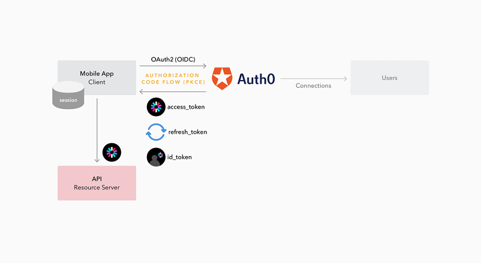
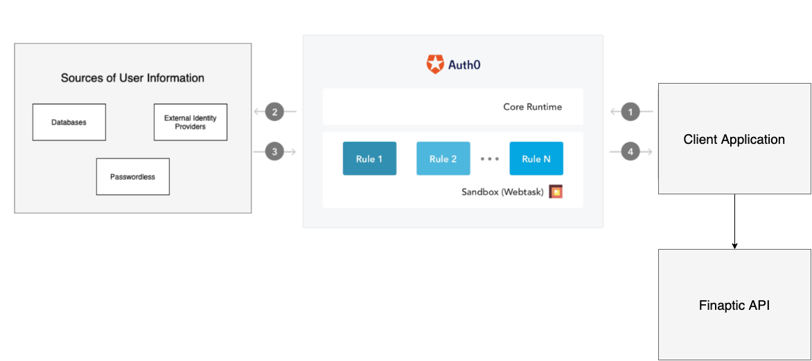
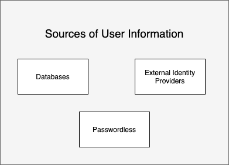
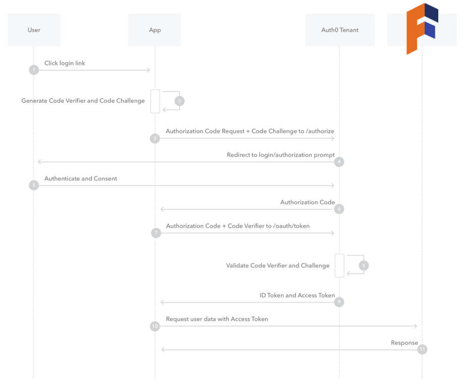
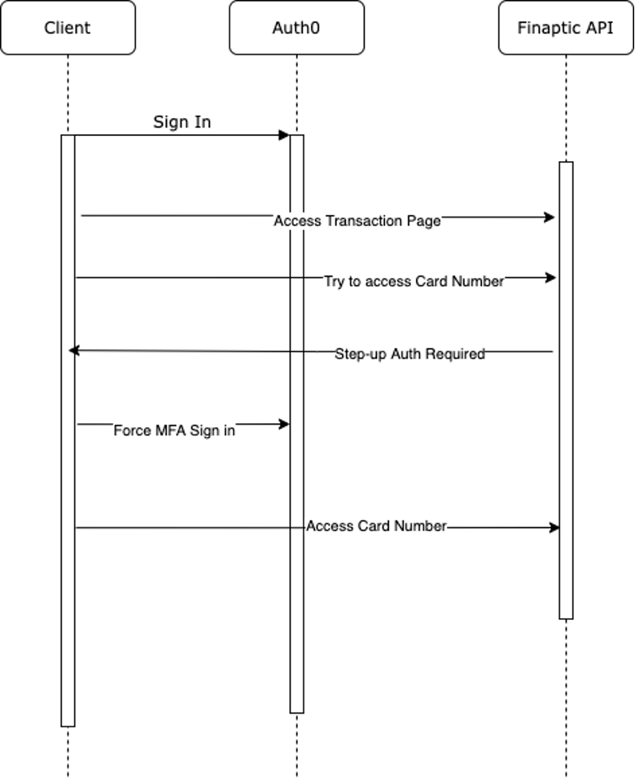

# Authentication Overview

Application Security is a top priority for Finaptic. To ensure we protect our clients, their brand, and most importantly their customer&#39;s data we use industry leading Enterprise Identity provider Auth0 for our Consumer Identity Access Management (CIAM).

## What is Auth0?

Auth0 is an easy to implement, flexible authentication and authorization platform which is SOC2, ISO 27001, ISO 27018, and PCI DSS compliant. It uses industry standards for authentication such as OIDC, OAuth 2.0, and SAML.

## The Basic Overview of Authentication Flow

1. The client app initiates an authentication request to Finaptic's partner specific Auth0 provider.
2. Auth0 uses its own user store to get the credentials or routes the request to an Identity Provider through a configured connection.
3. The user authenticates successfully.
4. A token is passed back to the client application. This token is then sent along with every request from the client application to the Finaptic APIs.

## User Informations

Sources of user information in this context are basically where the user identity information resides. This will depend on your existing user database or identity provider setup.

- External Identity Providers - Identity Providers are servers that can provide identity information to other servers. Many Identity Providers are supported using various protocols (like OpenID Connect (OIDC), SAML, WS-Federation, etc.)
- Auth0 Database - If you want to create your own user store, instead of using external identity providers like Google or Facebook, you can use a Database Connection. This way you can authenticate users with an email or username and a password. The credentials can be securely stored either in the Auth0 user store or in your own database.
- Passwordless (Future) - connections allow users to log in without the need to remember a password. Instead, users enter their mobile phone number or email address and receive a one-time code or link, which they can then use to log in.

### User Database
Typical database connection scenarios include:

1. [**Recommended**] Using Auth0 directly as your user store - Auth0 provides the database infrastructure to store your users by default. This scenario provides the best performance for the authentication process since all data is stored in Auth0. The Auth0-hosted database is highly secure. Passwords are never stored or logged in plain text but are hashed with bcrypt.
2. Using your own user store - We recommend migrating your user data to Auth0 in this scenario.

#### Migrating to Auth0 from a custom user store

Auth0 provides an automatic migration feature that adds your users to the Auth0 database one-at-a-time as each log in and avoids asking your users to reset their passwords all at the same time. A bulk import to Auth0 user store is also an option.

## Authorization Code Flow with Proof Key for Code Exchange (PKCE)
We use PKCE to mitigate security concerns posed by an authorization code Flow alone. Such as a native app cannot securely store a client secret which would be bound to the app and is the same for all users and devices. 

1. The user clicks Login within the application.

2. Finaptc&#39;s SDK, using Auth0&#39;s SDK creates a cryptographically-random code verifier and from this generates a code challenge.

3. The SDK redirects the user to the Auth0 Authorization Server along with the code challenge.

4. The authorization server redirects the user to the login and authorization prompt.

5. The user authenticates using one of the configured login options (Email/Password, Google, etc.).

6. The authorization server stores the code challenge and redirects the user back to the application with an authorization code.

7. The SDK sends this code and the code verifier (created in step 2) to the authorization server.

8. The authorization server verifies the code challenge and code verifier.

9. The authorization server responds with an ID Token and Access Token (and optionally, a Refresh Token).

10. The client application can use this access token to call the FInaptic API to access information.

11. The API responds with requested data.

## Multi-Factor Authentication

Multi-factor authentication (MFA) provides a method to verify a user&#39;s identity by requiring them to provide more than one piece of identifying information. This ensures that only valid users can access their accounts even if they use a username and password that may have been compromised from a different application.

**Support MFA channels include:**

- **In App push notifications** [**Recommended**] - Send users push notifications to their pre-registered devices, typically a mobile phone or tablet, from which a user can immediately allow or deny account access via the simple press of a button.
- **One-Time passwords** - One-time passwords allow you to use an authenticator application on the user&#39;s personal device, such as Google Authenticator, to generate a one-time password that changes over time, and which can be entered as the second factor to validate an account.
- **Email** - Enable users to perform MFA using one-time passwords delivered through email when they don&#39;t have other authentication factors available
- **SMS Notification** - Send users a one-time code over SMS which the user is then prompted to enter before they can finish authenticating.

### Step-up Multi-Factor Authentication

With step-up authentication, applications that allow access to different types of resources can require users to authenticate with a stronger authentication mechanism to access sensitive resources.

1. The client logins

2. They access a less sensitive part of the application

3. Next, they try to access more sensitive data, like their full card number.

4. The Finaptic API enforces that MFA is required for this use case.

5. The client application asks the users for their 2nd factor to &quot;Step up&quot; their authentication.

6. The Finaptic API accepts the new token and returns the sensitive data.

## Attack Protection Features

|   **Feature** | **Risk Signal** | **How it works** |
| --- | --- | --- |
| **Bot Detection** | IP reputation computed by analyzing the quality of traffic seen for each IP. | Triggers a CAPTCHA step when a login attempt comes from an IP suspected of use by a bot. |
| **Suspicious IP Throttling** | Velocity of login attempts from an IP for any number of accounts against a tenant. | Detects when a bot/script tries too many username/password combinations within a short period of time. |
| **Brute-force Protection** | Velocity of login attempts from an IP for a particular account. | Detects when a bad actor tries to login to an account too many times within a period of time. |
| **Breached Password Detection** | Use of a breached password that appears in lists of breached passwords on the dark web. | Stops users from using passwords that are known to be breached in some 3P sites. |

## Biometrics (WIP)

Keychain biometric protection: The long-term session credentials must be protected by biometric authentication. For iOS, this means ensuring [kSecAttrAccessibleWhenPasscodeSetThisDeviceOnly](https://developer.apple.com/documentation/security/ksecattraccessiblewhenpasscodesetthisdeviceonly) is configured (a device without a passcode can&#39;t have biometric), and this ensures this credential won&#39;t be usable through keychain syncing. [kSecAccessControlBiometryAny](https://developer.apple.com/documentation/security/secaccesscontrolcreateflags/ksecaccesscontrolbiometryany?language=objc) must also be configured for keychain stored credentials. Equivalent implementation on Android.

## Integrating with your Application

Integrating with Finaptic and Auth0 will depend heavily on your use case and application design.

As part of the Finaptic SDK we provide the necessary APIs and configurations to integrate with Auth0 and recommend you use our SDK. You can also use any of the Auth0 native SDKs that provide support for mobile (Android, iOS). Finally, it&#39;s also possible to use any Vendor agnostic OpenID Connect library in your implementation.

## Links and other references

[User sources connections](https://auth0.com/docs/connections)

[Step-up Authentication](https://auth0.com/docs/mfa/step-up-authentication)

[OpenID Connect](https://openid.net/connect/)

[RFC 7636: Proof Key for Code Exchange](https://oauth.net/2/pkce/)