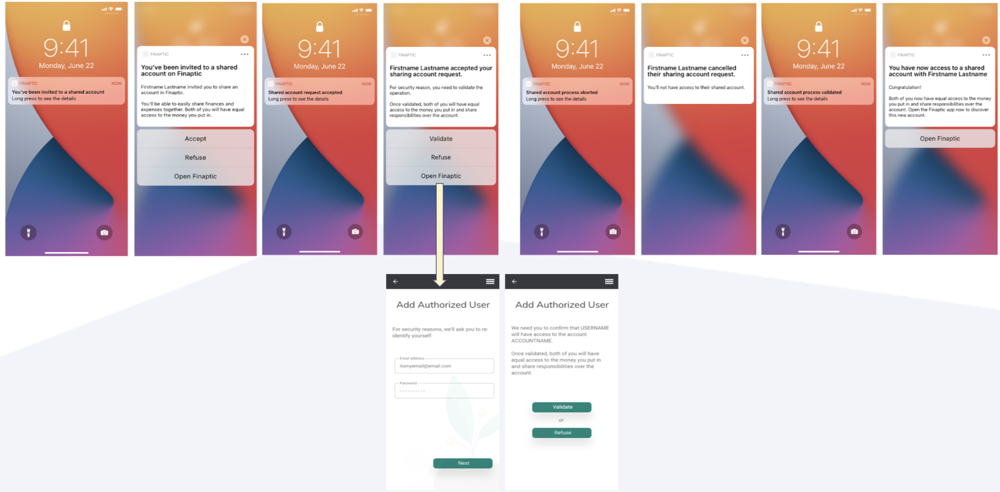

# Authorized User Overview

Welcome to Finaptic's Authorized User Service. We make it simple to share your account and finances with family members, loved ones and employees; and all done digitally. This documentation includes comprehensive information to arm you with an understanding of Finaptic's Authorized User offering.

#### **This guide will**

1. Educate you on Finaptic's Authorized User Service
2. Guide you on Experience

#### What is an Authorized User?

An Authorized User is a person allowed to manage your account.
For Deposit accounts, Authorized Users are usually family members, such as a child or a spouse and they do not have account decision making permissions.
They can use another person's account but aren’t legally responsible for paying bills associated with the account.
Authorized Users **<u>are not</u>** Primary Account Holders and their Account level privileges differ.

#### What to expect in our Initial Release?
In the <u>Initial release</u>, an Authorized User <u>will be</u> granted account privileges similar to a Primary Holder

|                                 **   | PRIVILEGES                                            | PRIMARY ACCOUNT HOLDER | AUTHORIZED USER **|
|:---------------------------------- | ----------------------------------------------------- |:----------------------:|:---------------:|
| **As per regulatory requirements** | **Add/Remove an Authorized User**                     | **YES**                | **YES**         |
|                                    | **Close the Account**                                 | **YES**                | **YES**         |
| **Configurable**                   | **Move Money (Interac)**                              | **YES**                | **YES**         |
|                                    | **Move Money (Between Accounts they have access to)** | **YES**                | **YES**         |
|                                    | **View Primary Account Holder Txns**                  | **YES**                | **YES**         |
|                                    | **Notifications, Alerts & Statements**                | **YES**                | **YES**         |

#### Visualizing the Authorized User Architecture

#### Visualizing the Experience of Inviting, Adding & Onboarding an Authorized User

**Note: Push Invitation is a future state experience**

## Link to API specifications
[Onboarding API Specification](../../api_specifications/onboarding/)
