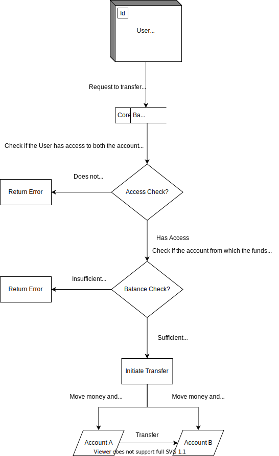
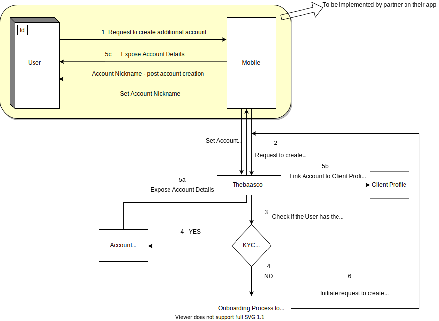

## Deposits Account Overview
Welcome to Finaptic’s Core Banking Product that offers flexible solutions for everyday transactions. This documentation includes comprehensive information for delivering compliant Core Banking products and integrating with Finaptic’s Core Banking Product Service.

## This guide will
- Educate you on Finaptic’s Core Banking Service
- Arm you with an API specifications for effective integration

---

## About the Product

#### What is a Deposit Account?
A bank account with a financial institution to let you deposit, transfer and withdraw money, subject to terms that are defined in the account agreement.

#### Benefits of a Deposit Account
Deposit Accounts offer high liquidity. Your money is always available offering the convenience to pay bills, deposit paychecks and transfer money between deposit accounts; and there are no penalties for early withdrawal to worry about.

#### How safe is your money?
Deposits made are eligible for Canada Deposit Insurance Corporation (CDIC) protection upto $100,000 per insured category per depositor. 

The Canada Deposit Insurance Corporation is a Canadian federal Crown Corporation created by Parliament in 1967 to provide deposit insurance to depositors in Canadian commercial banks and savings institutions. CDIC insures Canadians' deposits held at Canadian banks up to C$100,000 in case of a bank failure.

---

#### Finaptic delivers a wholesome & customizable deposit account offering

#### What to expect in our Initial Release?
In the <u>Initial Release</u>, a Deposit Account will enjoy the below benefits

| Feature Category    | Feature Set                              | Inital Release | Future Release   |
| ------------------- | ---------------------------------------- |:--------------:|:----------------:|
| **Deposit Account** | **Depost Account**                       | **Yes**        | ***NA***         |
|                     | **Pre-Paid MasterCard**                  | **Yes**        | -                |
|                     | **Earn Interest**                        | -              | **Yes**          |
|                     | **Foreign Currency Account**             | **-**          | **Yes**          |
|                     | **Set Transaction Limits**               | -              | **Yes**          |
|                     | **Set Minimum Balance**                  | -              | **Yes**          |
|                     | **Set Account Level Fees**               | -              | **Yes**          |
|                     |                                          |                |                  |
| **Relationship**    | **Authorized User**                      | **Yes**        | -                |
|                     |                                          |                |                  |
| **Money Movement**  | **Internal Transfers**                   | **Yes**        | -                |
|                     | **Email Money Transfer**                 | **Yes**        | -                |
|                     | **Interac Receive**                      | **Yes**        | -                |
|                     | **Interac Send**                         | **Yes**        | -                |
|                     | **International Money Transfer**         | -              | **Yes**          |
|                     | **Mobile Remote Cheque Deposit Capture** | -              | **Yes**          |
|                     | **ATM Withdrawals**                      | -              | **Yes**          |
|                     | **ATM Cheque Deposits**                  | -              | **Yes**          |
|                     |                                          |                |                  |
| **Notifications**   | **Transaction Notifications**            | **Yes**        | **Enhancements** |
|                     | **Transaction History**                  | **Yes**        | **Enhancements** |
|                     | **Transaction Filtering**                | **Yes**        | **Enhancements** |
|                     | **Statements**                           | -              | **Yes**          |

---

#### Visualizing Critical Experiences

##### Internal Transfers
Defined as the ability to move money between owned deposit accounts. Below is a visualization of **Internal Transfers Money Movement**.

#### 

##### Additiona Account Creation
Additional Account Creation is the creation of deposit accounts <u>post</u> the creation of a client profile. Outlined below is the flow of events to ensure a seamless and compliant creation of additional accounts in under 5 steps.

---

## Link to API specifications
[Core Banking API Specification](../../api_specifications/corebanking/)
