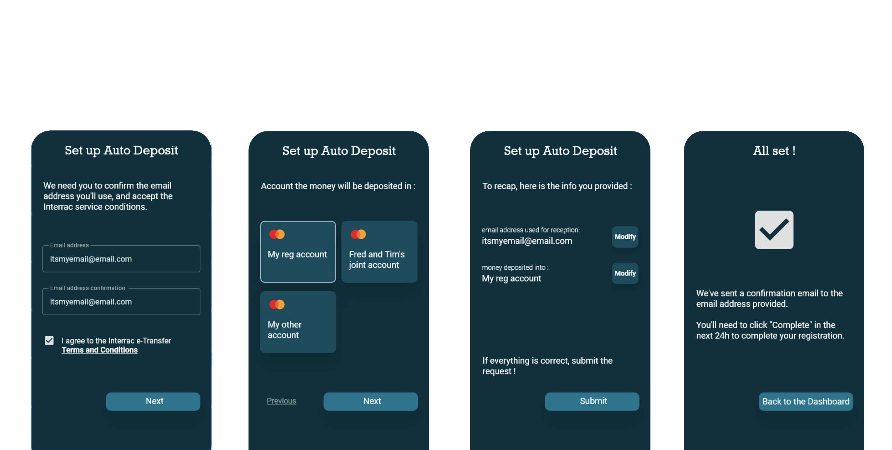

## INTRODUCTION

Finaptic offers its customers access to the Interac payments network. Multiple products are available for Interac, and are accessible via the [/interac](API_Specifications/Interac_API) endpoint. This endpopint gives Finaptic customers the ability to initiate Interac payment processes. 

## THIS GUIDE WILL

- Provide an overview on Interac services available to Finaptic customers.

- Provide an API overview for effective integration

---

## ABOUT THE PRODUCT

#### WHAT IS INTERAC?

[Interac](https://www.interac.ca) is a Canadian payment network that provides interbank payment capabilities via a number of products. Finaptic customers are able to access this functionality, enabling their users to receive funds from other financial institutions.

Users perform a customer registration, in which their email address or telephone number are linked to the Finaptic deposit account of their choice. Users are then able to receive funds to their Finaptic account.

When funds have been receieved by the user, the deposit can exist in 3 states: Begin, Commited, Reversed.

All deposit states will appear in the transaction history. Details of this transaction can be retrieved from Finaptic's [Core-Transaction](Core_Transaction/coretransaction.md) service to indicate what state the transaction is in.

### API OVERVIEW

#### REGISTRATION
The registration request for Interac services is generated through the Interac API function.

This request is generated via the [CreateRegistrationRequest](API_Specifications/) call.

4 data elements are required via the API call in order to generate this request:

* [account_id](API_Specifications/Interac_API/#registration) - Provided for the account that the customer wishes auto-deposit transactions to be routed to
* [account_alias](API_Specifications/Interac_API/#registration) - This is typically the user's email address, which can be used for both the account_alias field and the alias_email field
* [alias_email](API_Specifications/Interac_API/#registration)
* [alias_phone_number](API_Specifications/Interac_API/#registration)

All other details from the customer file that are required for registration will be retrieved by Finaptic during the registration process.

In the event that a user wants to change their registration to a different account, a new call with the new account ID must be made, at which point, the same process is to be followed.

#### REGISTRATION ERRORS

A number of errors could occur in the registration process. These errors will be communicated either via our asynchronous API surface, or via the synchronous SDK capabilities which can be found in [SDK_Overview](mobile/).

Error possibilities are as follows:

#### DEPOSITS

Interac Auto-Deposit transactions can be retrieved from the [Core_Transaction](Core_Transaction/coretransaction.md#interac) domain and from the [Personal_Financial_Management](Personal_Financial_Management/PFM_Functional_Overview.md#interac) domain. The Core_Transaction function contains information regarding the transaction, while the Personal_Financial_Management domain contains aggregated information relating to the transaction.

Transactions will be routed to the account specified by the user in the registration call.

---

#### VISUALIZING CRITICAL EXPERIENCES

##### AUTO-DEPOSIT REGISTRATION

Finaptic has provided the screen elements below for reference purposes. This process outlines a possible user flow representation of what your customer experience could resemble.

#### 

##### CONFIRMATION STEPS

Once a registration request is submitted, Interac and Finaptic take care of the rest of the process.
Users will receive an email at the email address that they provided from Interac, which will ask them to verify that they have selected "NatCan Solutions" as their auto-deposit provider.

Once this verification step is complete, the registration process is also complete, which will result in a confirmation email being generated from Interac.

---