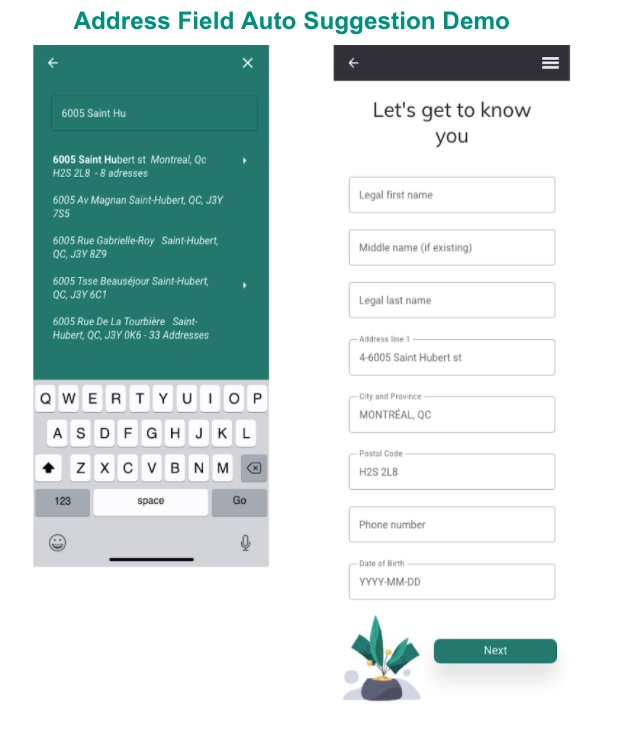
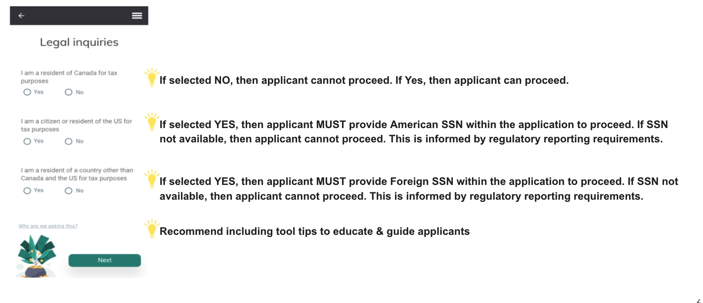
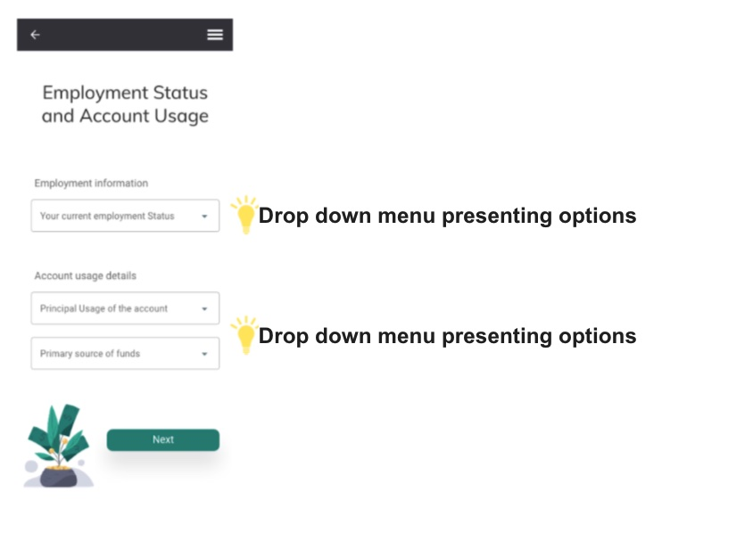
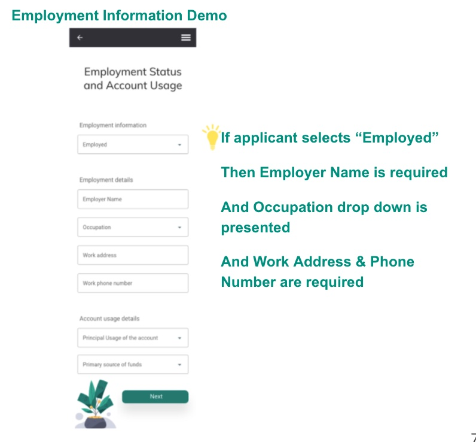
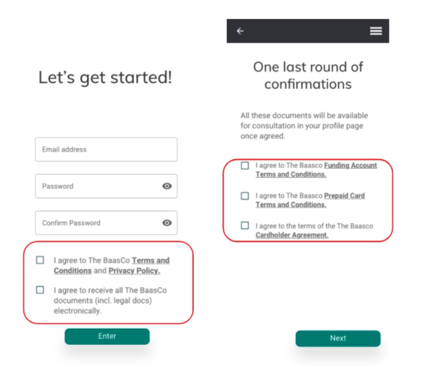

# Onboarding

## Summary

The following is an overview of the Tabasco Release of our Onboarding service.    Detail is provided from the customer journey to API specification and code documentation, providing a technical and non-technical overview.   Looking specifically at:   

1. Client Information
2. Digital ID Verification
3. Consents and Disclosures

The following is provided to support our partners in engaging and leveraging our services.

## Client Information Flow

The following are mandatory customer information data points required across four domains.

#### Personal

1. * Full Legal Name
     * Middle Name is Optional
     * Residential Address 
     * Date of Birth
     * Email Address
     * Phone Number

#### Tax Information

      * Canadian Tax Residency Status
      * US Tax Residency Status
      * Another Country Tax Residency Status

#### Professional Information

    * Employment Status
    * Employer Name
    * Employer Address
    * Employer Phone Number
    * Employed Since Date

#### Account Opening

      * Account Opening Purpose
      * Account Source of Funds

### Visualizing Mandatory Personal Information Requirements

### Validating Mandatory Tax Information Requirements

### Visualizing Mandatory Professional and Account Usage Information

#### Drop Down Menu Options

##### These dropdown items are provided by the "Reference Data API" which is queried to provide the values. (A link to the Reference Data API be provided when the API documentation is published)

##### Employment Status

1. Employed
2. Unemployed
3. Retired
4. Student-unemployed
5. Student-employed
6. Self-employed 
7. Homemaker

##### Primary Usage of Account

1. Everyday transactions
2. Paying for school
3. Travelling
4. Buying property/Renovations
5. Buying a car
6. Savings
7. Other

##### Primary Source of Funds

1. Employment Income (Salary / Self-employment Income) 
2. Sale of Assets/Capital Gains (House, Car, etc.)   
3. Trust / Inheritance/ Family income 
4. Loans
5. Government Payments / Social Assistance 
6. Support Payments 
7. Grants/Scholarships or Bursaries 
8. Work-Related Retirement or Disability Pension 
9. Rental Income 
10. Investment Income - Savings (Dividends / Interest) 
11. Royalty Income
12. Tips/Commissions
13. Gifts 
14. Insurance Claims / Payments 
15. Pension / Retirement Income 
16. Windfall (Lottery winnings, casino, etc.)

## Digital ID Verification

The digital identity verification stage, screens for bad actors, potential device level frauds and document and Live ID verification. 

### Digital ID Verification Flow

1. Acuant a Third-Party vendor will execute Applicant authentication
2. Applicant must use their Mobile device with a functional camera
3. Applicant must produce a valid & approved Canadian issued ID
4. The Credit File is validated for address & name only; not a complete Credit Check

#### Screen for Bad Actors

1. Sanction Lists
2. Blacklists
3. Other Watch lists
4. Device Level Fraud

#### Liveness Test

1. Approved and Valid ID Match
2. Face Match

#### Screen for Bad Actors

* Sanction Lists
* Blacklists 
* Other Watch Lists
* Device Level Fraud

#### Liveness Test

* Approved & Valid ID Match 
* Face Match

### Current list of acceptable IDs for digital ID Verification

Accepting valid Canadian issued IDs and recommend making applicant aware

#### Passport & Related Card Types

* Canadian passport Canada
* Permanent resident card Canada
* Citizenship card (issued prior to 2012) Canada
* Secure Certificate of Indian Status Canada

#### Drivers Licenses

* British Columbia Driver's License British Columbia, Canada
* Alberta Driver's License Alberta, Canada
* Saskatchewan Driver's License Saskatchewan, Canada
* Manitoba Driver's License Manitoba, Canada
* Ontario Driver's License Ontario, Canada
* Québec Driver's License Québec, Canada
* New Brunswick Driver's License New Brunswick, Canada
* Nova Scotia Driver's License Nova Scotia, Canada
* Prince Edward Island Driver's License Prince Edward Island, Canada
* Newfoundland and Labrador Driver's License Newfoundland & Labrador, Canada
* Yukon Driver's License Yukon, Canada
* Northwest Territories Driver's License Northwest Territories, Canada
* Nunavut Driver's License Nunavut, Canada
* DND 404 Driver's License Department of National Defense, Canada

#### Provincial & Territorial Services Card Types

* British Columbia Services Card British Columbia, Canada
* British Columbia Enhanced ID British Columbia, Canada
* Alberta Photo Identification Card Alberta, Canada
* Saskatchewan Non-driver photo ID Saskatchewan, Canada
* Manitoba Enhanced Identification Card Manitoba, Canada
* Ontario Photo Card Ontario, Canada
* New Brunswick Photo ID Card New Brunswick, Canada
* Nova Scotia Identification Card Nova Scotia, Canada
* Prince Edward Island Voluntary ID Prince Edward Island, Canada
* Newfoundland and Labrador Photo Identification Card Newfoundland and Labrador, Canada
* Northwest Territories General Identification Card Northwest Territories, Canada
* Nunavut General Identification Card Nunavut, Canada

#### Other identity documents

* Provincial Health Card Applicable for all provinces and territories
* except for Ontario, Manitoba, and Prince Edward Island

### Digital Identity Flow

## Consents and Disclosures

Regulatory and Legal obligations to be met prior to account opening, and during Mobile Application usage.

### Consents and Disclosure Flow

#### Applicant acceptance of the Mobile Application & Privacy Policy

1. App provider requirements
2. End User License Agreement
3. Terms of Use
4. Privacy Policy

#### Applicant acceptance of the Product related policies

1. Electronic Delivery of Documents
2. Product Disclosures - fees & interest including product features
3. Express Consent for Product
4. Consent to Product Terms & Conditions (Agreement)
5. Electronic Signature/Signature Card
6. Consent to Card Terms & Conditions

## Field Level Rules for Front End Design

The following is provided as a functional reference for the onboarding API Contract.   

### Error Messages

#### Error Messages and Information

1. HTTP Status Code 200 - OK
2. HTTP Status Code 301 - Permanent Redirect
3. HTTP Status Code 302 - Temporary Redirect
4. HTTP Status Code 404 - Not Found.
5. HTTP Status Code 410 - Gone
6. HTTP Status Code 500 - Internal Server Error
7. HTTP Status Code 503 - Service Unavailable
8. Customer Not Found – When the customer.Id is not valid
9. Customer with this email already exists
10. Customer with this:  
    1. Invalid phone number
    2. Invalid email address
    3. Invalid dob
    4. Messages around missing fields/incorrect data types/fields that exceed the character limit
    5. Invalid account purpose – when the sent value isn’t one of the accepted values
    6. Invalid source of funds – when the sent value isn’t one of the accepted values
    7. Address did not match an address in the Melissa database
    8. Catchall – Invalid value for X (enumerated field)

### .